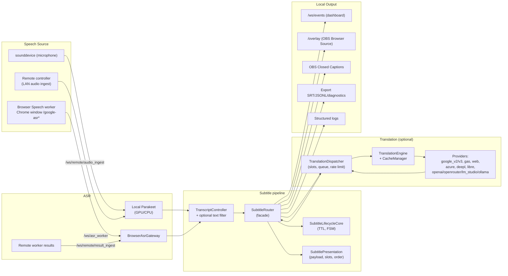
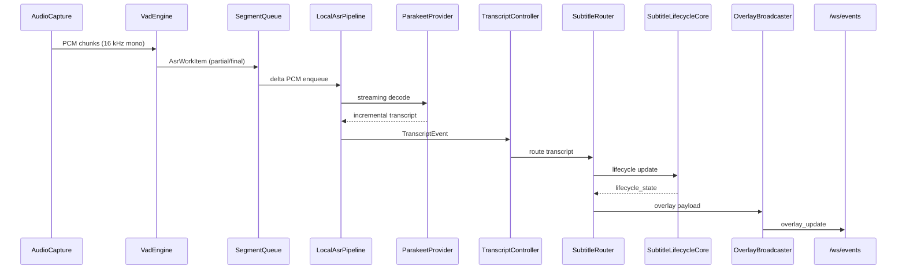
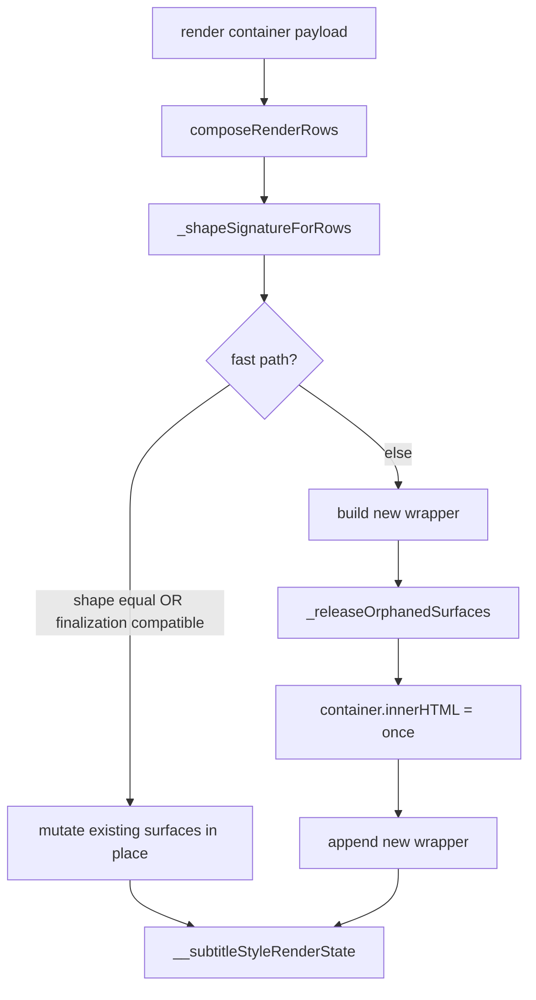
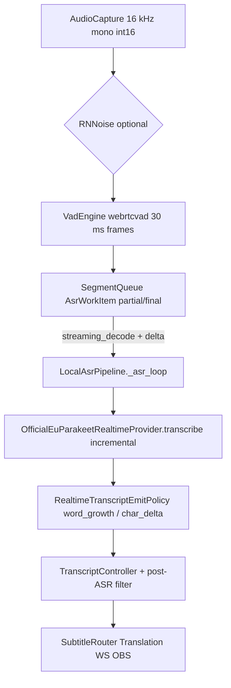

# SST Desktop 0.4.4 - Technical Architecture Document

Relevant for a code line where `backend/versioning.py` contains `PROJECT_VERSION = "0.4.4"`.

This document describes the actual project layout, API/WebSocket contract, domain schemas (Pydantic), configuration pipeline and data flow through runtime. The document is a **canonical full technical reference** (maximum detail on modules, invariants and hot path). README - short review of the product; CHANGELOG - release history; delta installer notes - `docs/DESKTOP_RELEASE_CHANGELOG_*.md`; public release binaries are published in [GitHub Releases](https://github.com/kiriuru/stream_sub_translator/releases).

**Maintenance Rule (Agents and Developers):** Any change to API/WS contracts, config schema, subtitle/translation lifecycle, frontend renderer, desktop bootstrap or browser ASR observability **updates the corresponding sections of this file in the same task**. Outdated formulations (removed modes, non-existent files, release-summary instead of architecture) are **removed or rewritten** rather than left “for history”.

## Contents

- [Related Documentation](#related-documentation)
- [Quick Reference](#quick-reference)
- [1. Purpose and boundaries of the system](#1-purpose-and-boundaries-of-the-system)
- [2. Technology stack](#2-technology-stack)
- [3. Top-level runtime scheme](#3-top-level-runtime-scheme)
- [4. Layout of the repository](#4-layout-of-the-repository)
- [5. Backend layout (details)](#5-backend-layout-details)
- [6. RuntimeOrchestrator: thin façade and lifecycle](#6-runtimeorchestrator-thin-faade-and-lifecycle)
- [7. Configuration and migrations](#7-configuration-and-migrations)
- [8. HTTP API (local)](#8-http-api-local)
- [9. WebSocket surface](#9-websocket-surface)
- [10. Logs, diagnostics, export](#10-logs-diagnostics-export)
- [11. Browser Speech: classic and experimental ways](#11-browser-speech-classic-and-experimental-ways)
- [12. Translation: lifecycle and invariants](#12-translation-lifecycle-and-invariants)
- [13. Subtitle styles (backend config + presets)](#13-subtitle-styles-backend-config-presets)
- [14. Desktop runtime and release](#14-desktop-runtime-and-release)
- [15. Storage and paths](#15-storage-and-paths)
- [16. Frontend (flat, no build-step)](#16-frontend-flat-no-build-step)
- [16.8 UI localization (i18n)](#168-ui-localization-i18n)
- [17. Local ASR: Official EU Parakeet Low Latency (NeMo)](#17-local-asr-official-eu-parakeet-low-latency-nemo)
- [18. Remote mode (frozen surface)](#18-remote-mode-frozen-surface)
- [19. Versioning and checking for updates](#19-versioning-and-checking-for-updates)
- [20. Testing](#20-testing)
- [21. Product invariants saved in 0.4.3](#21-product-invariants-saved-in-043)
- [21.1 Release line 0.4.4](#211-release-line-044)
- [22. Known Limitations & Technical Debt](#22-known-limitations-technical-debt)
- [23. Security & Privacy Model](#23-security-privacy-model)
- [24. Extension Points (How To Extend Safely)](#24-extension-points-how-to-extend-safely)
- [25. Performance Characteristics (Operational Expectations)](#25-performance-characteristics-operational-expectations)
- [26. Glossary](#26-glossary)

## Related Documentation

- User guide (RU): `docs/WIKI.ru.md`
- User guide (EN): `docs/WIKI.en.md`
- Changelog: `docs/CHANGELOG.md`
- Desktop release notes: `docs/DESKTOP_RELEASE_CHANGELOG_0.4.1.md`
- Generated config schema: `backend/data/config.schema.json`
- Config example: `backend/data/config.example.json`

## Quick Reference

### Startup and basic commands

```bash
start.bat
.\.venv\Scripts\python.exe -m unittest discover -s tests -p "test_*.py"
python -m backend.core.config_schema_export
```

### Key endpoints

| Endpoint | Destination |
| --- | --- |
| `POST /api/runtime/start` | Start runtime (optional with in-memory config snapshot) |
| `POST /api/runtime/stop` | Stopping runtime |
| `GET /api/runtime/status` | Current runtime status and diagnostics snapshot |
| `POST /api/settings/save` | Normalization + atomic preservation `config.json` |
| `GET /api/exports/diagnostics` | Redacted diagnostics ZIP |

### WebSocket channels

| Channel | Destination |
| --- | --- |
| `/ws/events` | Dashboard + event overlay (runtime/subtitle payload) |
| `/ws/asr_worker` | Browser Speech worker transport |
| `/ws/remote/*` | Remote controller/worker signaling and ingest |

### Key files

| File | Destination |
| --- | --- |
| `backend/versioning.py` | `PROJECT_VERSION` (single source of truth) |
| `backend/core/runtime_orchestrator.py` | Thin runtime façade |
| `backend/core/subtitle_lifecycle_core.py` | FSM/TTL/relevance for subtitle lifecycle |
| `backend/core/translation_dispatcher.py` | Slot-aware transfer queue + stale drop |
| `frontend/js/subtitle-style.js` | Common renderer for dashboard preview and overlay |

### GitHub sources vs build artifacts

| Surface | In the public repository (git) | Only after local build / runtime |
| --- | --- | --- |
| `backend/`, `frontend/`, `overlay/`, `tests/`, `docs/`, `fonts/` | yes | yes (inside managed runtime after bootstrap) |
| `desktop/` (launcher, bootstrap, `runtime_bootstrap`, payload helpers) | yes | yes (inside managed runtime) |
| `Stream Subtitle Translator*.spec`, `requirements.desktop.txt` | yes | — |
| `build-desktop.bat`, `build-bootstrap-launcher*.bat`, `publish-desktop-releases*.ps1` | **no** (local build scripts) | yes |
| Desktop packaging tests (`test_launcher.py`, `test_desktop_*.py`, `test_bootstrap_*.py`, …) | yes | — |
| PyInstaller output (`build/`, `dist/`), `payload.zip`, bootstrap **exe** | **no** (`.gitignore`) | yes |
| GitHub Releases: `Stream Subtitle Translator.exe`, `Only Web.exe` | release binaries | collected locally (`§14`, `§20`) |

The repository clone contains the sources **`desktop/`** and PyInstaller `.spec` - can be developed via `start.bat`. Scripts `build-*.bat` and `publish-desktop-releases*.ps1` are **not published** to git (remain on the build machine; see `.gitignore`). Git **doesn't** include PyInstaller artifacts (`build/`, `dist/`, exe) and custom `user-data/` / `logs/` / `.venv/`.

## 1. Purpose and boundaries of the system

`stream-sub-translator` is a local Windows desktop application for real-time subtitles:

- speech capture:
- local microphone (sounddevice + Parakeet);
- browser speech worker (separate Google Chrome window with address bar);
- optional chain remote controller → worker (LAN only, explicit launch profile).
- ASR:
- local AI runtime (Parakeet, GPU/CPU);
- receiving a stream from a browser speech worker via `/ws/asr_worker`.
- optional translation into 0..N target languages ​​with independent choice of provider per slot;
- unified routing of subtitle payload in dashboard, OBS overlay and OBS Closed Captions;
- export of sessions (SRT/JSONL/diagnostics) and local runtime/client diagnostics.

Hard boundaries (you can’t go beyond the limits):

- default runtime local-first and only localhost (`127.0.0.1`);
- without cloud backend, accounts, hosted database, SaaS-assumptions;
- frontend without Node.js/React/build-pipeline;
- dashboard, browser worker pages, overlay and remote bridge pages are served by FastAPI;
- remote mode - a separate explicit LAN scenario, not Internet-facing deployment.

## 2. Technology stack

- Python 3.11+;
- FastAPI + Uvicorn (HTTP/WebSocket);
- Pydantic v2 schemas (`backend/schemas/`);
- `httpx` for outgoing HTTP requests from translation providers and update checker;
- `sounddevice`, `numpy`, `webrtcvad`, optional RNNoise (CPU);
- Parakeet (NeMo) for local ASR (GPU-first, CPU fallback);
- frontend - plain HTML/CSS/JavaScript (ES modules), without a build step;
- desktop-shell - `pywebview` for splash-launcher with startup profile selection;
- bootstrap launcher in pure Python (PyInstaller one-file).

## 3. Top-level runtime scheme



### 3.1 Hot path: Microphone -> Overlay (Local Parakeet)



Key hot path invariants:

- `SegmentQueue` in the streaming path transmits PCM deltas (`audio_is_delta`), rather than the full segment buffer.
- `SubtitleLifecycleCore` does not remove completed translation on the first partial of a new phrase.
- `OverlayBroadcaster` keeps cooldown for `completed_only` so as not to fill the overlay with identical frames.

## 4. Layout of the repository

```
stream-sub-translator/
├── backend/
│   ├── app.py                    # FastAPI app + bootstrap + WebSocket handlers
│   ├── versioning.py             # PROJECT_VERSION + GitHub Releases helpers
│   ├── ws_manager.py             # WebSocket manager: snapshot, dead-socket cleanup
│ ├── preflight.py # starting diagnostics
│ ├── models.py # external pydantic API response models
│   ├── server_runtime.py
│   ├── run.py / run_controller.py / run_worker.py
│ ├── runtime_paths.py # shim over backend.core.paths
│   ├── install_asr_model.py
│ ├── api/ # thin HTTP routes
│ ├── asr/parakeet/ # local Parakeet runtime
│   ├── config/                   # defaults, normalizers, LocalConfigManager
│   ├── core/                     # bootstrap, runtime, subtitle, logging, cache, atomic IO
│ ├── core/runtime/ # explicit runtime controllers
│   ├── data/                     # bundled config.example.json + config.schema.json
│ ├── schemas/ # Pydantic schemas (config/runtime/asr/...)
│ ├── services/ # services for routes
│ └── translation/ # translation registry + providers
├── frontend/
│   ├── index.html                # dashboard
│   ├── google_asr.html           # classic browser worker
│   ├── google_asr_experimental.html
│   ├── remote_controller_bridge.html
│   ├── remote_worker_bridge.html
│   ├── css/
│   └── js/
│       ├── main.js, i18n.js, desktop.js
│       ├── i18n/                   # locales-bundle.js, dynamic-locales.js, locales/*.js (§16.8)
│       ├── browser-asr-session-manager.js
│       ├── browser-web-speech-recognition-policy.js
│       ├── browser-asr-audio-track-session-manager.js
│       ├── core/                 # store, api-client, ws-client, events, redaction
│       ├── dashboard/            # actions, helpers, logging, constants, desktop-profile-lock.js
│       ├── normalizers/          # pure normalization helpers
│       └── panels/               # translation, asr, runtime, style, overlay, diagnostics, ...
├── overlay/                      # overlay.html / overlay.css / overlay.js (OBS Browser Source)
├── tests/ # unittest (including desktop/bootstrap; see §20)
├── docs/                         # CHANGELOG, TECHNICAL_ARCHITECTURE, …
├── desktop/                      # pywebview shell, bootstrap launchers, runtime_bootstrap (§14)
├── fonts/                        # bundled project fonts
├── start.bat, start-remote-*.bat # default local / remote entrypoints
├── requirements*.txt           # backend / controller / desktop shell deps
├── Stream Subtitle Translator*.spec   # PyInstaller specs (§14)
└── user-data/, logs/ # local runtime data (not in git)

# Locally (not in git): build-desktop.bat, build-bootstrap-launcher*.bat,
# publish-desktop-releases*.ps1, build/, dist/, .venv/, payload.zip
```

## 5. Backend layout (details)

### 5.1 `backend/api/`

Fine transport. Each file contains only routes that delegate to services.

| File | Prefix | Destination |
| --- | --- | --- |
| `routes_runtime.py` | `/api` | `/runtime/start`, `/runtime/stop`, `/runtime/status`, `/obs/url` |
| `routes_settings.py` | `/api/settings` | `/load`, `/save` |
| `routes_devices.py` | `/api/devices` | `/audio-inputs` |
| `routes_profiles.py` | `/api/profiles` | CRUD profiles + structured API errors |
| `routes_exports.py` | `/api/exports` | list of exports + diagnostics ZIP |
| `routes_logs.py` | `/api/logs` | `/client-event` (best-effort write) |
| `routes_version.py` | `/api` | `GET /version` |
| `routes_updates.py` | `/api/updates` | `POST /check` (live polling GitHub Releases) |
| `routes_openai_models.py` | `/api/openai` | `recommended-models`, `models`, `usable-models` |
| `routes_remote.py` | `/api/remote` | state/pair/heartbeat + worker control surface |

### 5.2 `backend/services/`

The service layer is initialized centrally by `backend/core/app_bootstrap.py`.

- `runtime_service.py` - facade above `RuntimeOrchestrator` for routes: start/stop/status, OBS URL.
- `settings_service.py` - load/save config via `LocalConfigManager`, coordination with `ConfigStateService`.
- `config_state_service.py` — owner of the active in-memory snapshot config:
- metadata `source` (`loaded_from_disk`, `settings_saved`, `runtime_start_snapshot`), `persisted`, `hash`;
- explicit blocking for competitive runtime operations and settings;
- `update_active_updates_metadata(...)` - patch `updates.*` without erasing the start snapshot.
- `asr_service.py` - receiving audio chunks (microphone/remote), routing transcripts to `RuntimeOrchestrator`.
- `browser_asr_service.py` - accounting for identity browser worker (transport id, generation, session id), heartbeat, status, transfer of transcripts to `SubtitleRouter`.
- `translation_service.py` - facade above `TranslationEngine`/`TranslationDispatcher`.
- `diagnostics_service.py` - `health`, `version_info`, runtime metrics.
- `export_service.py` - building SRT/JSONL and diagnostics ZIP (with editing sensitive fields).
- `overlay_service.py` - building an overlay-URL according to the config/profile.
- `model_manager_service.py` - install/discover Parakeet local models.
- `update_service.py` - `check_now(force=...)`: polling GitHub Releases, saving `updates.latest_known_version` + `updates.last_checked_utc`, protecting `runtime_start_snapshot`.

### 5.3 `backend/core/` - general infrastructure and subtitle/translation pipeline

| Module | Destination |
| --- | --- |
| `app_bootstrap.py` | Raises `app.state.*`: paths, config_manager, ConfigStateService, ws_manager, audio devices, profile manager, cache_manager, dictionary_manager, structured/session loggers, RuntimeOrchestrator, all services (including UpdateService). |
| `paths.py` | `APP_PATHS`, `ensure_app_layout()` - roots runtime/data/logs/cache/temp/models/fonts. |
| `runtime_paths.py` (shim) | Compatible import of old `backend.runtime_paths`. |
| `logging_setup.py` | Configuration `backend.log` (rotating handler). |
| `api_errors.py` | Structured FastAPI errors. |
| `redaction.py` | Masking of sensitive fields (`token`, `secret`, `password`, `pair_code`, `api_key`, etc.) for logs/export. |
| `atomic_io.py` | Windows-safe atomic JSON writing via `os.replace()`. |
| `cache_manager.py` | In-memory LRU translation cache + debounce persistence to disk + quarantine of damaged `translation_cache.json`. |
| `config_migrations.py` | Version migrations (`config_version`, current `7` to `schemas/config_schema.py`): UI/translation_lines/display_order/parakeet provider/legacy ASR cleanup; new config fields are picked up through defaults + normalizers without a separate migrate step for each small section. |
| `source_text_replacement.py` | Post-ASR phrase replacement (regex, whole words, CI): merging native JSON and custom pairs, applied to text. |
| `config_schema_export.py` | `python -m backend.core.config_schema_export` - published by `backend/data/config.schema.json`. |
| `runtime_orchestrator.py` | Runtime façade (see §6). |
| `subtitle_router.py` | Publishing facade in overlay/WS + shim for legacy imports. |
| `subtitle_lifecycle_core.py` | Subtitle life cycle FSM, TTL/relevance, promotion/expiry. |
| `subtitle_presentation.py` | Payload assembly: order, style slots, merging partial and final. |
| `subtitle_style.py` | Style-presets, effects (`none`, `fade`, `subtle_pop`, `slide_up`, `zoom_in`, `blur_in`, `glow`). |
| `overlay_broadcaster.py` | Publishing overlay payload with sequence/created_at_ms. |
| `obs_caption_output.py` | OBS Closed Captions output (websocket to OBS). |
| `session_logger.py` | `SessionLogger` + `SessionLogManager` (best-effort JSONL recording of client events). |
| `structured_runtime_logger.py` | `runtime-events.log` - structured runtime log (compact text strings). |
| `structured_log_compact.py` | Value compression (truncate strings, summary of long lists, depth limitation). |
| `audio_capture.py`, `audio_devices.py`, `vad.py`, `segment_queue.py` | audio pipeline. |
| `asr_engine.py`, `asr_provider_selection.py`, `parakeet_provider.py` | local ASR layer. |
| `browser_asr_gateway.py` | Gateway for browser worker: identity, generation, heartbeat, transcript routing. |
| `translation_engine.py` | Preparation of translation requests (by slots), keep-alive `httpx.AsyncClient`, wrapper for readiness + retries. |
| `translation_dispatcher.py` | Transfer queue: per-provider concurrency/rate limit, slot-aware identity, drop stale jobs. |
| `font_catalog.py` | `GET /project-fonts.css` - directory of local fonts. |
| `exporter.py` | SRT/JSONL record. |
| `profile_manager.py` | Profiles (`user-data/profiles/`), payload normalization, default profile. |
| `dictionary_manager.py` | User dictionaries. |
| `remote_mode.py`, `remote_session.py`, `remote_signaling.py`, `remote_diagnostics.py` | Remote controller/worker support (frozen surface). |

### 5.4 `backend/core/runtime/` - explicit runtime controllers

`RuntimeOrchestrator` delegates logic to these controllers; the payload status form does not change when they are rearranged.

| Controller | Destination |
| --- | --- |
| `runtime_state_controller.py` | Coalescing/ordering of broadcast runtime status (defensive against duplicate updates storm). |
| `runtime_lifecycle_coordinator.py` | Deterministic start/stop order of key components. |
| `runtime_metrics_controller.py` | Accounting for runtime metrics (latency, ASR state, etc.). |
| `runtime_metrics_collector.py` | Collection of metrics. |
| `runtime_status_builder.py` | Assembling the status structure for WS/API. |
| `runtime_session_controller.py` | Session identity, sequence/generation, timestamps, export records. |
| `runtime_start_state_controller.py`, `runtime_stop_state_controller.py` | Narrow life cycle steps. |
| `runtime_reset_controller.py` | Agreed reset before each start. |
| `runtime_export_controller.py` | Attempt to export to stop + error capture. |
| `segment_state_controller.py` | Segment counter, active segment, partial coalescing. |
| `browser_worker_state_controller.py` | Browser worker connection/session/generation/signature state. |
| `remote_audio_state_controller.py` | Remote audio-ingest + queue lifecycle. |
| `speech_source.py`, `speech_source_factory.py` | Speech source abstraction + factory. |
| `browser_speech_source.py`, `local_parakeet_speech_source.py`, `remote_controller_speech_source.py`, `remote_worker_speech_source.py` | Specific sources of speech. |
| `speech_source_state_controller.py` | Select/clear active source. |
| `audio_capture_controller.py` | Life cycle of `AudioCapture`. |
| `processing_tasks_controller.py` | Life cycle of capture/ASR tasks. |
| `asr_mode_controller.py` | Allow and commit ASR mode/provider per session. |
| `asr_runtime_controller.py`, `audio_runtime_controller.py` | Narrow runtime helper controllers. |
| `translation_runtime_controller.py` | Life cycle `TranslationEngine` + `TranslationDispatcher`. |
| `translation_runtime_coordinator.py` | Cross-coordination of translation with runtime. |
| `transcript_controller.py` | Partial/final pipeline orchestration: optionally applies `source_text_replacement` before WS transcript, `SubtitleRouter`, OBS source events and `TranslationRuntimeController.submit_final()`. |
| `subtitle_presentation_controller.py` | Thin wrap over `SubtitleRouter`. |
| `output_fanout_controller.py`, `output_fanout_coordinator.py` | Fanout publications in WS dashboard/OBS. |
| `local_asr_pipeline.py` | Local capture/ASR loop (removed from orchestrator): `_capture_loop`, `_asr_loop`, streaming decode. |
| `local_asr_constants.py` | Common constants local ASR path (shared between pipeline/VAD/emit). |
| `local_asr_realtime_settings.py` | Latency preset tables + effective realtime profile for VAD/emit. |
| `local_asr_recognition_processing.py` | Preparing PCM for recognition (RNNoise, legacy key `experimental_noise_reduction_enabled`). |
| `local_asr_hallucination_filter.py` | Filter typical ASR hallucinations to partial/final. |
| `local_asr_vad_tuning.py` | Coordination of VAD timings with UI preset / subtitle lifecycle. |
| `local_parakeet_transcript_segment.py` | Pure builder `TranscriptSegment` for local Parakeet partial/final. |
| `segment_audio_enqueue.py` | Delta PCM enqueue (`slice_segment_audio_delta`, `audio_is_delta`). |
| `partial_emit_coordinator.py` | Coordination of partial emit + duplicate suppression with segment state. |
| `realtime_transcript_emit_policy.py` | Policy `word_growth` / `char_delta` for partial WS. |
| `asr_diagnostics_assembler.py` | Build `AsrDiagnostics` for runtime status (preset, streaming, emit mode). |
| `browser_worker_transcript_builders.py` | Pure builders transcript payload from browser worker ingress. |
| `runtime_orchestrator_lifecycle_mixin.py` | `start` / `stop` / reset orchestration (thin lifecycle glue). |
| `runtime_orchestrator_local_asr_mixin.py` | Local ASR: pipeline wiring, VAD, segment queue hooks. |
| `runtime_orchestrator_browser_worker_mixin.py` | Browser worker connect/disconnect, ingress, recovery policy hooks. |
| `runtime_orchestrator_remote_ingress_mixin.py` | Remote audio/result ingress (frozen surface, preserved). |
| `runtime_orchestrator_diagnostics_mixin.py` | Diagnostics assembly, status enrichment. |
| `runtime_orchestrator_state_metrics_mixin.py` | State/metrics helpers (`pcm16_rms_level`, browser mode checks). |

### 5.5 `backend/config/` - configuration

```
backend/config/
├── __init__.py            # LocalConfigManager + AppSettings + global settings
├── defaults.py            # build_default_config(prefer_gpu)
├── secrets.py # masking/normalizing secrets
└── normalizers/
├── asr.py # asr.*, including realtime and browser
    ├── browser.py         # asr.browser.* (worker_launch_browser etc.)
    ├── obs.py             # obs_closed_captions.*
    ├── remote.py          # remote.*
    ├── subtitles.py       # subtitle_output / subtitle_lifecycle
├── source_text_replacement.py # source_text_replacement.* (pairs, flags)
└── translation.py # translation.lines, provider_settings, cache, limits
```

`LocalConfigManager.load()/save()` ensures that any payload:

1. will go through `migrate_config()` (`backend/core/config_migrations.py`);
2. will pass domain normalizers + Pydantic validation (`ConfigSchema.model_validate`);
3. will be written atomically (Windows-safe `os.replace()`);
4. If the JSON is invalid, the source file goes to `config.json.corrupt-<timestamp>` and the application starts at defaults.

`normalize_profile_payload()` is used for save/load profiles and for runtime-start snapshot.

### 5.6 `backend/schemas/` - Pydantic circuits

| File | Destination |
| --- | --- |
| `config_schema.py` | Full configuration diagram (`CURRENT_CONFIG_VERSION = 7`); `SourceTextReplacementConfig` and others |
| `runtime_schema.py` | Runtime status payload (state, sequence, generation, metrics). |
| `asr_schema.py` | ASR-specific events and fields. |
| `translation_schema.py` | Translation events/items. |
| `overlay_schema.py` | Overlay payload + presentation slots. |
| `diagnostics_schema.py` | Diagnostics payload (latency, queue state, etc.). |
| `model_schema.py` | Description of models/catalogue. |

### 5.7 `backend/asr/parakeet/` - local ASR

```
backend/asr/parakeet/
├── runtime_loader.py # loading/checking NeMo environment
├── model_installer.py # download EU multilingual Parakeet, URL, integrity
├── device_diagnostics.py
├── mock_provider.py
└── providers/ # auxiliary installation artifacts (as the installer develops)
```

The main inference logic is **only** `official_eu_parakeet_low_latency` (streaming incremental decode) in `backend/core/parakeet_provider.py` (see §17). Legacy `official_eu_parakeet` (WAV + batch `transcribe` without partial) **removed from product**; `provider_preference` is normalized to low latency.

### 5.8 `backend/translation/` - registry + providers

```
backend/translation/
├── base.py # TranslationProviderInfo, BaseTranslationProvider, common HTTP layer
├── engine.py # engine contract wrappers
├── readiness.py # readiness checks for endpoints
├── registry.py    # build_default_provider_registry()
└── providers/
    ├── google_v2.py
    ├── google_v3.py
    ├── google_gas.py
    ├── experimental_google_web.py   # GoogleWebProvider + FreeWebTranslateProvider
    ├── azure.py
    ├── deepl.py
    ├── libretranslate.py
├── openai_compatible.py # used for openai, openrouter, lm_studio, ollama
    └── public_mirrors.py
```

`backend/core/translation_engine.py` remains a request preparation wrapper, sharing `httpx.AsyncClient` with keep-alive and binding to `CacheManager`. The provider implementations themselves live in `backend/translation/providers/`.

## 6. RuntimeOrchestrator: thin façade and lifecycle

`RuntimeOrchestrator` (`backend/core/runtime_orchestrator.py`, ~380 lines) - **thin façade** on top of explicit controllers and **mixin modules** in `backend/core/runtime/`. Decomposition (stages A–D: diagnostics assembler, partial/VAD, browser builders, lifecycle/remote/local/metrics mixins) is completed; runtime behavior has been preserved, public contracts `start`/`stop`/`status`/`obs_url` and the form `runtime_status` have not changed.

**MRO (order of succession):**

```
RuntimeOrchestrator(
  RuntimeOrchestratorStateMetricsMixin,
  RuntimeOrchestratorRemoteIngressMixin,
  RuntimeOrchestratorBrowserWorkerMixin,
  RuntimeOrchestratorDiagnosticsMixin,
  RuntimeOrchestratorLocalAsrMixin,
  RuntimeOrchestratorLifecycleMixin,
)
```

| mixin | Responsibility |
| --- | --- |
| `RuntimeOrchestratorLifecycleMixin` | `start` / `stop`, coordination `RuntimeLifecycleCoordinator`, reset/export hooks. |
| `RuntimeOrchestratorLocalAsrMixin` | Local Parakeet path: `LocalAsrPipeline`, VAD, `SegmentQueue`, partial coordinator. |
| `RuntimeOrchestratorBrowserWorkerMixin` | Browser worker lifecycle, ingress in `BrowserSpeechSource`, operational FSM/recovery advisory. |
| `RuntimeOrchestratorDiagnosticsMixin` | `AsrDiagnosticsAssembler`, enrichment status/diagnostics WS. |
| `RuntimeOrchestratorStateMetricsMixin` | Metrics, RMS, mode/provider helpers for status builder. |
| `RuntimeOrchestratorRemoteIngressMixin` | Remote audio/result ingress (frozen; no active development). |

Facade in `runtime_orchestrator.py`:

- stores links to controllers from §5.4 and creates `LocalAsrPipeline`, `PartialEmitCoordinator`, speech sources;
- provides API `start(device_id, config_payload)`, `stop()`, `status()`, `obs_url()`;
- delegates:
- selecting a specific `SpeechSource` (local Parakeet / browser / remote) without `SpeechSourceFactory` in the hot path;
- start/stop `AudioCapture` and processing tasks via `AudioCaptureController` / `ProcessingTasksController`;
- `TranslationRuntimeController` configuration (re-creation of `TranslationDispatcher` when changing settings);
- publication of status via `RuntimeStateController` + `OutputFanoutController`;
- payload assembly via `RuntimeStatusBuilder`;
- lifecycle reset via `RuntimeResetController` / `RuntimeStartStateController` / `RuntimeStopStateController`;
- export to stop via `RuntimeExportController`.

**Refactor invariant:** changes in orchestrator / partial-emission / overlay **do not weaken** translation lifecycle (§12.3): the old completed translation remains until the new phrase is finalized and enters the translation path. Regressions: `tests/test_subtitle_router.py`, `tests/test_subtitle_lifecycle_relevance.py`, `tests/test_translation_dispatcher.py`.

Contract `runtime_status` payload (simplified):

```
{
  "state": "stopped|listening|...",
  "asr_mode": "local|browser_google|browser_google_experimental",
  "asr_provider": "official_eu_parakeet_low_latency|...",
  "device_id": "...",
  "active_config_source": "loaded_from_disk|settings_saved|runtime_start_snapshot",
  "active_config_persisted": true|false,
  "active_config_hash": "...",
  "session_id": "...",
  "event_sequence": 1234,
  "metrics": { "latency_ms": ..., "queue": ..., ... },
  "browser_worker": { "session_id": ..., "generation_id": ..., "recognition_state": ..., ... },
  "translation": { "dispatch_state": ..., "providers": [...] },
  "subtitles": { ... }
}
```

## 7. Configuration and migrations

Main config path: `user-data/config.json`.

### 7.1 `CURRENT_CONFIG_VERSION = 7`

Current explicit migrations (`backend/core/config_migrations.py`):

| Stage | What does |
| --- | --- |
| `migrate_ui_and_config_shape` (v<2) | Normalizes `ui.language`, guarantees `translation.target_languages` from `targets`. |
| `migrate_parakeet_provider_name` (v<3) | `official_eu_parakeet_realtime` → `official_eu_parakeet_low_latency`. |
| `migrate_removed_legacy_asr_provider` (always) | Replaces unsupported ASR providers with `official_eu_parakeet_low_latency`, removes legacy ASR keys. |
| `migrate_translation_lines_and_display_order` (v<6) | Constructs `translation.lines` from `target_languages`, normalizes providers, converts `subtitle_output.display_order` from language codes to slot id (`translation_1..translation_5`). |

After version migrations, domain normalizers and Pydantic validation are performed via `ConfigSchema`. The `source_text_replacement` section does not require a separate `if version < 7`: if not present in the old JSON, it appears from `defaults.py` and `normalize_source_text_replacement_config()`.

### 7.2 Main sections of `ConfigSchema`

```
ConfigSchema
├── config_version: int (=7)
├── profile: str
├── ui: UiConfig
│   ├── language: "" | "en" | "ru" | "ja" | "ko" | "zh"
│   ├── theme: "dark" | "light"
│   └── palette: { accent, accent_secondary, accent_tertiary }
├── source_lang: str
├── targets: list[str] # compat mirror enabled translation lines
├── asr: AsrConfig
│   ├── mode: "local" | "browser_google" | "browser_google_experimental"
│ ├── desktop_profile_lock: "" | "browser_speech" # desktop quick start / Web Only; the normalizer keeps mode=browser_google
│ ├── provider_preference: normalized to "official_eu_parakeet_low_latency" (legacy "official_eu_parakeet" migrates)
│   ├── prefer_gpu, model_load_mode, model_revision, rnnoise_enabled, rnnoise_strength
│   ├── browser: AsrBrowserConfig
│   │   ├── recognition_language
│   │   ├── worker_launch_browser: "auto" | "google_chrome"
│   │   ├── interim_results, continuous_results
│   │   ├── force_finalization_enabled, force_finalization_timeout_ms
│   │   ├── minimum_reconnect_interval_ms, normal_restart_delay_ms,
│   │   │   no_speech_restart_delay_ms, network_reconnect_initial_ms, network_reconnect_max_ms,
│   │   │   stuck_stopping_timeout_ms
│   │   ├── max_browser_session_age_ms       (default 180000)
│   │   ├── prepare_cycle_before_ms          (default 15000)
│   │   ├── force_final_on_interruption, force_final_min_chars, force_final_min_stable_ms
│   │   └── experimental: { start_with_audio_track, fallback_to_default_start,
│   │                       keep_stream_alive, audio_track_constraints }
│   └── realtime: AsrRealtimeConfig (VAD/timings)
├── translation: TranslationConfig
│   ├── enabled, provider (default for new lines), target_languages (legacy compat)
│   ├── timeout_ms, queue_max_size, max_concurrent_jobs
│   ├── lines: list[TranslationLineConfig]
│   │   └── { slot_id (translation_1..5), enabled, target_lang, provider, label }
│   ├── provider_settings: TranslationProviderSettings
│   │   └── google_translate_v2 | google_cloud_translation_v3 | google_gas_url | google_web |
│   │       azure_translator | deepl | libretranslate |
│   │       openai | openrouter | lm_studio | ollama |
│   │       public_libretranslate_mirror | free_web_translate
│   ├── cache: { enabled, persist, max_entries (default 5000) }
│   └── provider_limits: dict[str, dict[str, Any]]
├── overlay: { preset: single|dual-line|stacked, compact }
├── obs_closed_captions:
│   ├── enabled, output_mode
│   ├── connection: { host, port, password }
│   ├── debug_mirror: { enabled, input_name, send_partials }
│   └── timing: { send_partials, partial_throttle_ms, min_partial_delta_chars,
│                final_replace_delay_ms, clear_after_ms, avoid_duplicate_text }
├── audio: { input_device_id }
├── remote: RemoteConfig
│   ├── enabled, role: disabled|controller|worker, session_id, pair_code
│   ├── lan: { bind_enabled, bind_host (default 0.0.0.0), port (default 8876) }
│   ├── controller: { worker_url, connect_timeout_ms, reconnect_delay_ms }
│   └── worker: { allow_unpaired, heartbeat_timeout_ms }
├── updates: UpdatesConfig
│   └── { enabled, provider: github_releases, github_repo, release_channel: stable|prerelease,
│         check_interval_hours, last_checked_utc, latest_known_version }
├── subtitle_output: { show_source, show_translations, max_translation_languages, display_order }
├── subtitle_style: dict (dynamic presets/slot overlaps)
├── subtitle_lifecycle:
│   ├── completed_block_ttl_ms, completed_source_ttl_ms, completed_translation_ttl_ms
│   ├── pause_to_finalize_ms, hard_max_phrase_ms
│   └── allow_early_replace_on_next_final, sync_source_and_translation_expiry,
│       keep_completed_translation_during_active_partial
└── source_text_replacement: # post-ASR word replacement (before translation and overlay)
├── enabled: bool # default false
    ├── include_builtin: bool       # JSON `backend/data/source_text_builtin_pairs.json`
    ├── case_insensitive: bool
├── whole_words: bool # boundaries \w in regex (Unicode-aware)
└── pairs: list[{ source, target }] # up to 100 user pairs; overlap builtin by key
```

JSON Schema is published to `backend/data/config.schema.json` through `python -m backend.core.config_schema_export`.

### 7.3 Normalization Pipeline

1. `load()`:
- JSON is read from `user-data/config.json` (if not, a default config is created);
- `migrate_config()` is executed;
- domain normalizers force sections to safe defaults and ranges;
- the result is validated via `ConfigSchema` and (if necessary) rewritten to disk.
2. `save()`:
- the input payload goes through the same pipeline;
- the already normalized `ConfigSchema` (mode="json") is written to disk atomically.
3. `POST /api/runtime/start`:
- dashboard can transfer `config_payload` snapshot (even unsaved);
- snapshot is normalized and applied only in memory, marked `active_config_source = runtime_start_snapshot`, `active_config_persisted = false`.
4. `POST /api/updates/check`:
- saves `updates.latest_known_version` + `updates.last_checked_utc` to `user-data/config.json`;
- if the active config is `runtime_start_snapshot`, the persisted file is updated, and the active snapshot is only patched in memory.

### 7.4 Post-ASR word replacement (`source_text_replacement`)

Purpose: **without changing ASR**, replace fragments of recognized text before it gets into subtitles, translation and OBS captions.

Flow:

1. `VadEngine` / `SegmentQueue` / Parakeet (or browser worker) form the “raw” `TranscriptEvent`.
2. `TranscriptController.handle_event()` (`backend/core/runtime/transcript_controller.py`) receives `config_getter` and calls `apply_to_transcript_event()` from `backend/core/source_text_replacement.py`.
3. All downstream calls contain the already changed `text` and `segment.text` (if there was a segment).

Rules for merging pairs:

- first custom `pairs`, then built-in from JSON (if `include_builtin`), without duplicate keys (`casefold` if `case_insensitive`);
- built-in JSON (`backend/data/source_text_builtin_pairs.json`) covers **English, Russian, Japanese, Korean, and Chinese** (Latin + CJK); the UI “built-in list” checkbox reflects all five languages;
- apply `source` length in descending order so that long phrases have priority;
- replacement via compiled regex; the replacement string is passed through `lambda` to `re.sub` so that `\` characters in the text are not interpreted as backreference.

UI: **Tools & Data** tab → “After recognition” block, `frontend/js/panels/source-text-replacement-panel.js` panel: “word / replacement”, “Add” fields, `pairs` list with selection checkboxes and one “Delete selected” button; the current config for runtime is picked up after saving the settings (`POST /api/settings/save` → `app.state.config`).

Regressions: `tests/test_source_text_replacement.py`, `tests/test_config_migrations.py` (presence of section after migration), `tests/test_browser_worker_contract.py` (replacement panel markup in `index.html`).

## 8. HTTP API (local)

| Method | Route | Destination |
| --- | --- | --- |
| GET | `/api/health` | Health check, `diagnostics_service.health()` |
| POST | `/api/runtime/start` | Start runtime with optional `config_payload` |
| POST | `/api/runtime/stop` | Stop runtime |
| GET | `/api/runtime/status` | Current runtime status |
| GET | `/api/obs/url` | Overlay URL for OBS |
| GET | `/api/settings/load` | Read current settings |
| POST | `/api/settings/save` | Saving settings (via `LocalConfigManager.save()`) |
| GET | `/api/devices/audio-inputs` | List of available microphones |
| GET | `/api/version` | Version + `sync` metadata (latest known/last checked) |
| POST | `/api/updates/check` | Live polling GitHub Releases (opt-in via `updates.enabled` + `github_repo`) |
| GET | `/api/profiles` | List of profiles |
| GET/POST/DELETE | `/api/profiles/{name}` | Profile Operations |
| GET | `/api/exports` | List of exports |
| GET | `/api/exports/diagnostics` | Diagnostics ZIP (see §10) |
| POST | `/api/logs/client-event` | Best-effort recording of a client event |
| GET | `/api/openai/recommended-models` | Curated shortlist (without accessing the OpenAI API from the browser) |
| POST | `/api/openai/models` | Listing of models using the provided key |
| POST | `/api/openai/usable-models` | Easy model testing via `/responses`, cache 10 minutes |

**OpenAI helper SSRF policy** (`backend/core/outbound_url_policy.py`): when bind is LAN-exposed (`app_host` is `0.0.0.0`/`::` or `SST_ALLOW_LAN=1`), `base_url` must not target loopback, RFC1918, link-local, or reserved/metadata hostnames. Default localhost bind still allows private URLs (local OpenAI-compatible servers). Translation provider outbound URLs are unchanged.

Remote endpoints:

- `/api/remote/state`
- `/api/remote/pair/create`
- `/api/remote/pair/verify`
- `/api/remote/heartbeat`
- `/api/remote/worker/settings/sync`
- `/api/remote/worker/runtime/start`
- `/api/remote/worker/runtime/stop`
- `/api/remote/worker/runtime/status`
- `/api/remote/worker/health`

Frontend pages (FastAPI static):

- `/`
- `/overlay`
- `/google-asr`
- `/google-asr-experimental`
- `/remote/controller-bridge`
- `/remote/worker-bridge`
- `/project-fonts.css` (dynamic CSS directory of local fonts)
- `/static/*`, `/overlay-assets/*`, `/project-fonts/*`

All these routes in desktop mode are sent with `Cache-Control: no-store, no-cache, must-revalidate` headers, so that regular refresh picks up edits without a hard reboot.

### 8.1 Events in `/ws/events`

The `/ws/events` route only accepts heartbeats from clients and sends:

- `runtime_update` (at the front it is normalized to `runtime_status`);
- `subtitle_payload_update` (at the front it is normalized to `overlay_update`);
- `overlay_update` (payload for overlay page with `created_at_ms`).

Each event contains monotonic `event_sequence`. Dashboard and overlay filter stale events by `event_sequence`/`created_at_ms`, otherwise the text may be “rolled back” after reconnection.

When connecting, the client receives `hello` + `replay_last(...)` for the listed types so that the UI is up to date.

## 9. WebSocket surface

| Route | Destination |
| --- | --- |
| `/ws/events` | Main event channel for dashboard and overlay |
| `/ws/asr_worker` | Browser worker channel (`/google-asr*`) |
| `/ws/remote/signaling` | Signaling between remote controller and worker |
| `/ws/remote/audio_ingest` | Transferring audio to worker |
| `/ws/remote/result_ingest` | Delivery of transcripts/translations back to controller |

`backend/ws_manager.py` (`/ws/events`, dashboard + overlay):

- snapshot of connections (`list(self._connections)`) before broadcast - iteration does not hold lock throughout the entire cycle;
- per-connection bounded `asyncio.Queue` (default 128) + separate sender-task per socket;
- **per-connection `asyncio.Lock` (`_send_locks`)** — all `send_json`s on one socket are serialized via `_send_json_locked`:
- sender-task queue;
  - `replay_last`;
- `send_direct` (bootstrap `hello` from `backend/app.py` for `/ws/events`);
- rare fallback broadcast without a queue.
Starlette/WebSocket **does not allow** concurrent `send_json` on one transport - without mutex, interleaved frames and “silent” breaks are possible.
- when the queue is full - drop-oldest, counter `ws_events_dropped_oldest`;
- after `disconnect` the socket is removed from `_out_queues` and `_send_locks` - repeated `_enqueue_to_connection` **no-op** (no growth of orphan queues);
- removal of dead sockets after `WebSocketDisconnect`, `RuntimeError`, `OSError`, `ConnectionResetError`, `BrokenPipeError`, `WinError 10022`;
- `_last_message_by_type` - global cache of the latest payload by `type` (does not hold references to sockets);
- `diagnostics()` — active connections, broadcast, send failures, dropped-oldest, max queue depth counters.

**`replay_last` (contract):** sends the latest cached message per type via `_send_json_locked` (bypassing the queue). This is the **best-effort snapshot bootstrap** when connecting; **can race** with simultaneous `broadcast`. **There is no FIFO guarantee** between replay and live stream - the client should not assume strict ordering without serializing it. Replay and live sender **do not block each other** at the mutex level (common queue for sending), but frames on wire are not mixed.

**`send_direct(websocket, message) -> bool`:** one-time sending outside `_last_message_by_type` and outside the broadcast queue (typically `{"type":"hello"}` when accepting `/ws/events`). In case of transport failure - disconnect + `False`.

`/ws/asr_worker` - separate transport (see below). Does not use `WebSocketManager` outbound queues.

### 9.1 `/ws/asr_worker` - transport and `BrowserAsrService`

`backend/services/browser_asr_service.py`:

- **two lock layers:**
  - `_lock` — identity transport/session/generation, snapshot worker state;
- `_send_lock` - serialization of **all** `send_json` to the active worker socket (`_send_json_to_active`): endpoint hello, `send_control`, future control messages. Concurrent coroutines cannot interleave JSON frame.
- `send_hello(websocket, transport_id)` — the first message after accept; in case of failure, calls `disconnect` (idempotent).
- `disconnect(transport_id)` - **idempotent**: calling again for the same transport (for example, `finally` after failed hello) does not duplicate `browser_asr_worker_disconnected`.
- `_accept_payload` - rejects **stale session rollback**: if `session_id` changes, but `generation_id` is not higher than the active one, payload is ignored (`stale_session`) so that old worker messages do not rollback the transport state.
- ingress further - `BrowserSpeechSource` + `BrowserAsrGateway` (§11.4): double gate session/generation on transport and speech_source.

`backend/app.py` `/ws/asr_worker`: `register_connection` → `send_hello` → loop; `finally` → `disconnect`.

## 10. Logs, diagnostics, export

| Flow | File |
| --- | --- |
| Backend stdout/stderr | `logs/backend.log` (rotating) |
| Structured runtime events | `logs/runtime-events.log` (via `StructuredRuntimeLogger`, fields are compressed by `structured_log_compact.compact_for_runtime_log`) |
| Client live events | `logs/session-latest.jsonl` (via `SessionLogger`, best-effort) |
| Desktop-launcher | `logs/desktop-launcher.log` (at startup, previous run → `desktop-launcher.old.log`) |
| Bootstrap-launcher | `logs/bootstrap-launcher.log` (at startup → `bootstrap-launcher.old.log`) |
| Browser worker (client) | `logs/session-latest.jsonl` (`channel=browser_worker`); separate `browser-recognition.log` is not created |

`GET /api/exports/diagnostics` collects local ZIP:

- `runtime_status.json`;
- `preflight_report.json`;
- `config_redacted.json` (via `redaction.redact_payload`);
- `latest_session.jsonl` (client-event log limited in volume);
- `runtime-events.log`;
- `backend.log` (with editing line by line);
- `environment.txt`;
- `diagnostics-manifest.json`.

The goal is that the user can send an archive to troubleshoot problems without revealing keys/tokens/passwords.

## 11. Browser Speech: classic and experimental ways

### 11.1 General model

- the desktop launcher always opens the worker in a separate Google Chrome window with an address bar and isolated `--user-data-dir` (classic and experimental are different profiles);
- `asr.browser.worker_launch_browser` ∈ `{auto, google_chrome}`; in a purely web dashboard (without desktop-shell), this switch is hidden, and `window.open` leads to the default browser of the OS;
- Chrome starts with:
  - `HIGH_PRIORITY_CLASS`;
- opt-out from `ProcessPowerThrottling` (`SetProcessInformation`, Windows 10/11);
  - `--disable-features=CalculateNativeWinOcclusion,HighEfficiencyModeAvailable,HeuristicMemorySaver,IntensiveWakeUpThrottling,GlobalMediaControls`;
  - `--disable-backgrounding-occluded-windows`, `--disable-renderer-backgrounding`, `--disable-background-timer-throttling`;
  - `--no-first-run`, `--no-default-browser-check`, `--disable-default-apps`, `--disable-session-crashed-bubble`;
- worker takes `navigator.wakeLock.request("screen")` while recognition is active and the window is visible;
- `asr.browser.max_browser_session_age_ms` default `180000` ms, window `prepare_cycle_before_ms = 15000` ms - this gives early controlled session rotation before Chrome's internal ~4 minute Web Speech kill.

### 11.2 Supervisor FSM

`frontend/js/browser-asr-session-manager.js` owns FSM recognition:

- states: `idle`, `starting`, `running`, `stopping`, `restarting`, `backoff`, `fatal`;
- `start()` is ignored/deferred if repeating `recognition.start()` is unsafe;
- `stop()` is idempotent and takes into account generation;
- `onend` never performs a synchronous unsafe restart;
- cooldown reason-aware: `normal_onend`, `settings_change`, `websocket_reconnect`, `watchdog_stall`, `no_speech`, `network`;
- duplicate partial/final suppression + late forced finals;
- network preflight (`https://www.google.com/generate_204`) after burst threshold `network` errors; if it fails, terminal `recognition_network_unreachable`;
- health signals: `mic_silent`, `mic_track_unavailable`, `web_speech_stalled`, `document_hidden`, `websocket_disconnected`, new `voice_below_recognition_threshold`.

### 11.3 Experimental path

`/google-asr-experimental` uses `frontend/js/browser-asr-audio-track-session-manager.js`:

- opens live `MediaStreamTrack`;
- called `SpeechRecognition.start(audioTrack)`;
- if the browser fails - fallback to the usual `recognition.start()`;
- subclass is synchronized with the base FSM (general `destroy()`/`pagehide` cleanup, general diagnostics).

`asr.browser.experimental.start_with_audio_track` controls the use of the experimental API; default is `true`.

### 11.4 Backend: Browser ASR observability (Domain A / L1–L5)

Implementation plan (internal): `docs/plans/browser_asr_observability_roadmap.md`. **Operating contracts for code and agents are in this document and in `AGENTS.md`.**

**Trace scope:** Domain A (browser ASR path + explicit hot-path points), not distributed tracing of the entire pipeline. Domains **A** (operational ASR), **B** (revision lineage on the segment), **C** (preview supersession) are connected only by **reference links** (`asr_operational_event_id`, `translation_preview_lineage_key`), not by a single causal graph.

**Time:**

- Heartbeat/detail sampling in `BrowserAsrGateway` - **`MonotonicClock`** (`backend/core/timekeeping.py`), not wall clock.
- `*_at_ms` fields from worker (`backend_received_at_ms`, `last_seen_at_ms`, client timestamps) - **correlation/diagnostics only**. **Do not use** for stale detection, cooldown, suppression or ordering; ordering - session/generation/`worker_message_sequence` + monotonic ingress (`basr_mono_ingress_at`).

**Authoritative ownership (current):**

| Concern | Source of Truth |
| --- | --- |
| Transport accept/reject (generation/session) | `BrowserAsrService` |
| Semantic ingress (overlap sequence, speech_source stale) | `BrowserSpeechSource` |
| Full snapshot `BrowserAsrDiagnostics` | `BrowserAsrGateway` |
| Coalescing signature / broadcast runtime status | `BrowserWorkerStateController` |
| Operational phase (FSM) | `BrowserAsrOperationalFsm` - **projection** for observability/policy; **not** replaces gateway for product diagnostics |
| Subtitle/translation relevance | `SubtitleRouter` + dispatcher hooks |

**Double gate session/generation** for transport and speech source - intentional separation of boundaries; when changing the rules, align both layers or remove the common predicate-helper, otherwise drift.

**Policy (`BrowserAsrRecoveryPolicy` + `BrowserAsrPolicyExecutor`):** logs suggested → accepted/rejected. `SEND_CONTROL` **accepted** now means “probe transport allowed”, **not** “control message sent”. Real IO - `BrowserAsrService.send_control` / orchestrator; policy remains **advisory**, not hidden by the transport executor. Probe (`set_browser_asr_transport_probe` in bootstrap) - **advice**, not a guarantee: transport may disappear immediately after probe.

**JSONL replay (`backend/core/runtime/browser_asr_replay.py`):** opt-in `SST_BROWSER_ASR_RECORD_JSONL`; replay — **causal** (order of events + `advance_mono`), not complete **temporal** replay heartbeat/detail windows until the stepped clock is sent to all consumers. Operational outcome (FSM phase, ingress rejects), not bit-identical runtime.

## 12. Translation: lifecycle and invariants

### 12.1 Slot identity

- translation identity is primarily based on `slot_id` (`translation_1..5`), and not on `target_lang`;
- duplicate target languages ​​are allowed if the slots are different;
- overlay/display order uses stable id slots;
- provider settings remain global in `translation.provider_settings`, each slot indicates which provider uses these settings.

### 12.2 TranslationDispatcher

- slot-aware queue, drop stale jobs if their segment is no longer relevant;
- per-provider concurrency + rate limit (protection from “bursts”);
- restart-safe: `stop()` does not “break” the dispatcher for the next sessions, `start()` resets the internal stop state.

**Preview supersession (Domain C):** with `submit_final`, the `TranslationPreviewLineage.lineage_key(segment_id, revision)` key increments generation; legacy jobs are not published in router.

- **Pre-provider skip:** sequence relevance and preview supersession are checked before `translate_target`; with skip - **no API call**, metric `translation_provider_skipped_before_call`, event `translation_provider_call_skipped`. Reduces amplification during fast speech; **does not cancel** already launched in-flight provider calls.
- **After compute:** additional checks before publish; superseded the result does not go to `SubtitleRouter`.
- **Observability:** Global dispatcher metrics (`translation_last_provider`, latency, etc.) may still reflect work abandoned **after** the provider call. Do not consider them an ideal control surface for throttling/auto-degradation until the “commit metrics only on accepted publish” is tightened.

### 12.3 Translation Lifecycle (critical invariant)

- previously finalized source and its translation remain active while the new source phrase is still only partial;
- the old translation can “catch up” later, while the new source has not yet been finalized;
- the old translation is replaced only when the new source phrase is finalized and actually enters the translation path;
- `subtitle_lifecycle.completed_source_ttl_ms` and `completed_translation_ttl_ms` are controlled separately (with option `sync_source_and_translation_expiry`);
- regression coverage: `tests/test_subtitle_router.py`, `tests/test_subtitle_lifecycle_relevance.py`, `tests/test_translation_dispatcher.py`.

### 12.4 CacheManager

`backend/core/cache_manager.py`:

- in-memory LRU with configurable `max_entries`;
- keys: `provider_name::source_lang::target_lang::source_text` (or without `provider_name` for legacy);
- debounce flush to disk via `threading.Timer` (default 2.0s);
- `atexit` guarantees final flush;
- broken `translation_cache.json` goes to backup `*.corrupt-<timestamp>.json` and is replaced by `{}`.

## 13. Subtitle styles (backend config + presets)

**Backend source of truth for presets and normalization:** `backend/core/subtitle_style.py` (+ `merge_style_presets`, `resolve_effective_subtitle_style` for API).

- slot-based styling for `source` + `translation_1..translation_5` (`line_slots` overrides);
- built-in presets (`_STYLE_PRESETS`): `clean_default`, `streamer_bold`, `dual_tone`, `compact_overlay`, `soft_shadow`, `meeting_soft`, `vlog_pastel`, `anime_stream`, `accessibility_high_contrast`, `dark_cinema`, `retro_terminal`, `fallout_pipboy`, `comic_burst`, `cyberpunk_neon`, `noir_typewriter`;
- legacy keys `jp_stream_single`, `jp_dual_caption` migrate to `anime_stream` via `_LEGACY_PRESET_MIGRATIONS`;
- the browser selects a font from the `font-family` chain glyphically: thematic Latin-first font + Cyrillic-safe fallback further down the chain (Comfortaa, Lato, Noto Sans, Open Sans);
- plate/background opacity: presets with “plate” keep `background_opacity >= 88` so as not to turn the text into a black blob;
- effect ∈ `{none, fade, subtle_pop, slide_up, zoom_in, blur_in, glow}` (normalization rejects unknowns to `none`);
- custom presets - `subtitle_style.custom_presets`, edited by Style editor;
- bundled Google Fonts in `fonts/`; directory for UI - `backend/core/font_catalog.py`, CSS - `GET /project-fonts.css`.

**Visual rendering (DOM, partial effects, reuse):** §16.7 - `frontend/js/subtitle-style.js`. Backend payload and translation lifecycle - §12.3, `SubtitlePresentation`, `SubtitleRouter`.

## 14. Desktop runtime and release

Sources **`desktop/`** and PyInstaller `.spec` **in public repository**; `build-*.bat` and `publish-desktop-releases*.ps1` - **local only** (not committed). PyInstaller artifacts (`build/`, `dist/`, compiled by bootstrap exe) and custom runtime (`.venv/`, `user-data/`, `logs/`) are not included in git. Build and publish - on the machine where the local scripts are located (§20); ready exe is attached to [GitHub Releases](https://github.com/kiriuru/stream_sub_translator/releases).

### 14.1 Files (sources in the repository)

- `desktop/launcher.py` - thin facade (re-export); **PyInstaller entrypoint** must include `if __name__ == "__main__": main()` (otherwise `.sst-runtime.exe` imports the module and exits immediately with code 0); `DesktopLauncher` / `main()` live in `desktop/launcher_bootstrap.py` (bootstrap, launch options, config, `run`/`shutdown`); mixins: `desktop/launcher_window.py` (`LauncherWindowMixin` - resize, `load_url`, splash DOM), `desktop/launcher_backend.py` (`LauncherBackendMixin` - subprocess/in-process backend, metrics monitor), `desktop/browser_worker_launcher.py` (`BrowserWorkerLauncherMixin`); constants/HTTP helpers and splash i18n (`_SPLASH_I18N`, `_splash_profile_hint`, UTF-8 literals) - `desktop/launcher_context.py`; pywebview API - `desktop/launcher_api.py`. Unit tests patching symbols inside `DesktopLauncher` should target `desktop.launcher_bootstrap` / `desktop.launcher_backend`, not only the `desktop.launcher` re-export.
  - pywebview splash with startup profile selection (or `--web-speech-only` / `LaunchContext.web_speech_only` without profile panel);
  - `_apply_startup_mode_to_config()` - writes/removes `asr.desktop_profile_lock` and `asr.mode` in `user-data/config.json`;
  - bootstrap local runtime via `RuntimeBootstrapper`;
  - **opening the dashboard (`0.4.0`):** `_wait_for_http_ok` on `GET /`, then `_navigate_to_dashboard()` - `window.location.replace` (fallback `load_url`); do not call `window.get_current_url()` from `loaded`-handler; after transition `_splash_shell_active = false` and splash `evaluate_js` is disabled; verify `/api/health` in background writes only to `desktop-launcher.log`; `_schedule_dashboard_resize()` by timer;
  - `webview.start(..., storage_path=runtime_root/pywebview-profile)` - Edge/WebView2 profile outside portable exe folder;
  - launching Chrome worker windows (classic and experimental profiles in different `user-data-dir`);
  - HIGH_PRIORITY + opt-out from EcoQoS;
  - migration `user-data/logs/` → `logs/`;
  - **log rotation:** `_rotate_log_file` at startup moves previous `desktop-launcher.log` to `desktop-launcher.old.log`, then creates empty live file. Dashboard/overlay/browser worker events go to `session-latest.jsonl` via `/api/logs/client-event`; obsolete empty legacy per-page logs deleted at startup when size is 0.
- `desktop/bootstrap_launcher.py` - public `Stream Subtitle Translator.exe`:
  - silent GitHub Releases check (HTTP timeout **2.5 s**);
  - rotation `bootstrap-launcher.log` → `bootstrap-launcher.old.log`;
  - Continue/Download dialog when update available;
  - extract managed runtime into `app-runtime/`;
  - `--repair`/`--reset-runtime`/maintenance buttons.
- `desktop/bootstrap_launcher_web_only.py` - public `Stream Subtitle Translator Only Web.exe` (always passes `--web-speech-only`).
- `desktop/runtime_bootstrap.py` - managed runtime + auto-detect install profile (CPU/NVIDIA); `_ensure_pip_available()` delegates to `backend/bootstrap_pip_pins.ensure_pip_bootstrap()` (reuse pip ≥24.0 without PyPI; else `ensurepip`, then pin `pip==24.3.1` - **not** `pip install --upgrade pip` to latest).
- `desktop/bootstrap_payload.py`, `desktop/build_bootstrap_payload.py` - bootstrap payload build.
- PyInstaller specs and local packaging scripts (§20).

### 14.2 Desktop launcher profiles

- `Quick Start (Browser Speech)` - skips installation of local AI runtime; sets `asr.desktop_profile_lock = browser_speech` and `asr.mode = browser_google`;
- **Only Web exe** — the same browser path without splash selection (fixed quick start + lock);
- `NVIDIA GPU (CUDA)` - raises the local CUDA PyTorch stack;
- `CPU-only` - raises the CPU-only PyTorch stack;
- `Remote Controller` - easy start, role=controller, without local AI;
- `Remote Worker` - local AI + LAN bind is enabled, without Browser Speech on worker.

The default behavior remains local-first; remote - explicit launch profile.

### 14.3 Startup scripts

- `start.bat` — default local startup; step `[4/7]` calls `python -m backend.bootstrap_pip_pins --ensure-pip` (same pip policy as desktop bootstrap).
- `start-remote-controller.bat` — controller bootstrap (`SST_REMOTE_BOOTSTRAP=1`);
- `start-remote-worker.bat` — worker bootstrap with LAN bind;
- `backend/run.py` - common runtime launcher with `--remote-role` and `--allow-lan`;
- `backend/run_controller.py`, `backend/run_worker.py` - wrappers.

## 15. Storage and paths

```
project-root/
├── user-data/
│   ├── config.json
│   ├── profiles/
│   ├── exports/
│   ├── models/
│   ├── cache/
│   │   └── translation_cache.json
│   ├── secrets/
│   └── debug/
├── logs/
│   ├── bootstrap-launcher.log
│   ├── desktop-launcher.log
│   ├── backend.log
│   ├── runtime-events.log
│   ├── session-latest.jsonl
│   └── session-latest.jsonl (dashboard / overlay / browser_worker channels)
└── fonts/   (project-local font assets)
```

- default bind address is `127.0.0.1`;
- LAN bind is enabled only in the `Remote Worker` profile;
- bundled scheme + example: `backend/data/config.schema.json`, `backend/data/config.example.json`;
- legacy `user-data/logs/` is migrated to the root `logs/` when the launcher/runtime starts.

## 16. Frontend (flat, no build-step)

### 16.1 Dashboard

`frontend/index.html` → `frontend/js/main.js`:

- **Start dashboard (`0.4.0`):** `main.js` mounts panels immediately; `loadDashboardHelpContent()` - in the background after mount; `DesktopBridge.getContext()` and `actions.loadInitialData()` - in the background (do not block the shell on `pywebviewready`). Modular structure: `frontend/js/core/`, `frontend/js/shell/`, `frontend/js/dashboard/actions/`, `frontend/js/panels/`, `frontend/partials/dashboard-help-topics.html`.
- **Compact layout (`0.4.0`):** `ui.layout` ∈ `{standard, compact}`; `frontend/css/compact-layout.css`, `frontend/js/layout/layout-controller.js` (icon rail, sticky chrome); desktop shell resizes the window when changing layout (standard ~1440×940, compact ~400×844).
- `frontend/js/i18n.js` - UI string catalogs (`en`, `ru`, `ja`, `ko`, `zh`); see **§16.8**;
- `frontend/js/desktop.js` — bridge web ↔ pywebview: `getContext()` returns `immediateDesktopContext()` without API; `scheduleContextRefresh()` loads `get_launch_context` and sends `sst:desktop-context`;
- `frontend/js/dashboard/desktop-profile-lock.js` — lock Local Parakeet (`syncRecognitionModeSelectLock` removes `<option value="local">`);
- `frontend/js/state.js`, `frontend/js/app.js`, `frontend/js/api.js`, `frontend/js/ws.js` - legacy compat (gradually being replaced by `core/`);
- `frontend/js/core/`:
- `store.js` - central snapshot state + `subscribe` / `subscribeSelector`:
- slice **`desktop`** + **`patchDesktopContext()`** - single desktop context source (mode, paths, launch metadata); `main.js` listens to `sst:desktop-context` once;
- `emit()` iterates a **snapshot** of listeners (`Array.from`) and isolates errors (`try/catch` per listener) so that failure of one panel does not stop the rest of the subscribers;
- synchronous emit remains on the WS/API hot path - panels do not have to do the heavy lifting in the listener.
- `dom.js` - `setInputValueIfChanged` / `setCheckedIfChanged`: idempotent render controls (does not overwrite focused text inputs, does not reset caret; checkboxes are updated only when the value changes).
  - `api-client.js`, `ws-client.js`, `events.js`, `redaction.js`;
- `panel-mount.js` - single lifecycle mount/render/dispose for panels.
- `frontend/js/dashboard/`:
  - `actions.js`, `helpers.js`, `logging.js`, `constants.js`;
- `frontend/js/panels/`:
  - `runtime-panel.js`, `asr-panel.js`, `translation-panel.js`, `overlay-panel.js`,
  - `diagnostics-panel.js`, `obs-captions-panel.js`, `style-editor-panel.js`,
  - `profiles-panel.js`, `remote-panel.js`, `model-manager-panel.js`, `source-text-replacement-panel.js`;
- `frontend/js/normalizers/`:
- `config-normalizer.js` — mirror backend defaults (including `asr.browser.continuous_results`: default **true**, normalization `!== false`);
- `parakeet-latency-presets.js` — preset tables ↔ Tuning sliders, coordinated with `local_asr_realtime_settings.py`;
  - `runtime-normalizer.js`, `diagnostics-normalizer.js`, `translation-normalizer.js`, `overlay-normalizer.js`, `model-normalizer.js`;
- `frontend/js/ui-theme.js` — UI theme/palette for dashboard and Browser Speech windows;
- subtitle renderer — §16.7 (`frontend/js/subtitle-style.js`).

### 16.2 Browser worker

- `frontend/google_asr.html` + `frontend/js/browser-asr-session-manager.js`;
- `frontend/google_asr_experimental.html` + `frontend/js/browser-asr-audio-track-session-manager.js`.

### 16.3 Remote bridge pages

- `frontend/remote_controller_bridge.html` + `frontend/js/remote-controller-bridge.js`;
- `frontend/remote_worker_bridge.html` + `frontend/js/remote-worker-bridge.js`;
- `frontend/js/remote-worker-audio-worklet.js`.

### 16.4 Overlay (OBS Browser Source)

Files: `overlay/overlay.html`, `overlay/overlay.css`, `overlay/overlay.js`.

- connects to `/ws/events`; stale filter via `frontend/js/core/ws-stale-guard-logic.js` (same algorithm as `WsClient`: timestamp-first when sequence resets after stop/start); reconnect with exponential backoff 1–10s; on disconnect the last frame stays visible until reconnect;
- at `overlay_update` / lifecycle payload fills `overlayState.completedItems`, `activePartialText`, `lifecycleState`, `hasOverlayLifecycle`;
- `buildPresentationPayload()` **must** forward `lifecycle_state` to the object for `SubtitleStyleRenderer` - otherwise the live partial in `visible_items[source]`, while the completed translation is visible, is not marked `transient` and the source is redrawn every frame (see §16.7);
- `render()` causes `SubtitleStyleRenderer.composeRenderRows` + `render(linesContainer, payload, { overlay: true })`;
- signature dedup (`lastRenderSignature`) skips extra DOM passes if the composed rows have not changed;
- opt-in debug: URL `?debug-subtitles=1` or `localStorage.sst_debug_subtitles=1` → `onRenderTrace` (ring `window.__sstOverlaySubtitleTrace`);
- legacy transcript path (`applyTranscript`) without overlay lifecycle remains for compatibility, but the product path is lifecycle payload with backend.

Full DOM rendering scheme, fast/slow path and carry-over state: **§16.7**.

### 16.5 Current state of UX (dashboard)

- Translation tab - stable `translation_1..translation_5` slot cards (drawn only for explicitly added lines);
- the provider settings editor follows the selected slot, you can switch manually;
- for OpenAI/compatible providers, the `model` field is filled in via the helper endpoint;
- Style tab - theme (light/dark) and accent gradient palette;
- appearance effects: `none`, `fade`, `subtle_pop`, `slide_up`, `zoom_in`, `blur_in`, `glow`;
- after `Tools & Data` - `Help` tab with local topic-tabs;
- in tuning - “feeling” sliders; precise timings / ASR gates - **ASR Advanced** tab (`data-tab-panel="asr_advanced"`);
- `experimental` status for experimental translation providers remains `experimental` (not `degraded`);
- UI language switches synchronously (no lazy locale fetch); header/settings change triggers `saveCurrentConfig()` → `ui.language` in `user-data/config.json` plus `localStorage` (`sst.ui.language`); see **§16.8**.

### 16.6 Stability of UI settings (post-0.4.1 hardening)

Panels use `createPanelMount`: render for every `store` update, but **DOM writes idempotent**:

| Panel/Area | Behavior |
| --- | --- |
| `diagnostics-panel` | `configJson` textarea - `setInputValueIfChanged` (does not overwrite JSON while the user is editing with a focused field). |
| `asr-panel` / `asr-panel-render` | realtime/TTL/RNNoise/checkbox — idempotent setters; Tuning sliders + preset row. |
| `obs-captions-panel`, `overlay-panel`, `translation-panel` | idempotent inputs/checkboxes; translation panel imports `getLineMap` from shared (fixed `ReferenceError`). |
| `overlay-panel` preview | `SubtitleStyleRenderer.render` to `#subtitle-output-preview`; **caller** clears `.subtitle-stage-note` and calls `disposeRenderContainer` when unmount/empty preview (§16.7). Idle placeholder (`buildPreviewPayload` in `action-helpers.js`) stays until **Start**, even when WS replay sends an empty `overlay_update` after Save. |
| `profiles-panel`, `remote-panel` | idempotent text fields; remote - without a second subscription to config (mount is already subscribed). |
| `asr-panel`, `obs-captions-panel` events | checkbox/select - **one** `change` handler (do not duplicate `input`+`change` on the same elements). |

Config is still: `actions.saveConfig()` / load API / runtime snapshot; `Start` can use in-memory snapshot without disk save (§16.1 / README).

### 16.6.1 ASR advanced — contextual field help (dashboard)

Tab **`asr_advanced`** (`frontend/index.html`, mounted via `frontend/js/panels/asr-panel.js`) holds fine-grained Parakeet realtime tuning (VAD, partial emit, segmentation, energy gate, Parakeet-only extras: latency preset, streaming decode, partial emit mode).

| Piece | File / keys | Behavior |
| --- | --- | --- |
| `?` button | `.field-help-btn[data-field-help-key]` | At the end of every field label (including checkbox rows). `aria-expanded`, `data-i18n-aria-label="tools.advanced.field_help.aria"`. |
| Popover | `frontend/js/ui/field-help-popover.js` | `position: fixed`; popover **bottom edge** aligns with the button bottom (grows upward). Text from `I18n.t(helpKey)`. Styles use `--bg-panel-elevated`, `--text-primary`, `--line-subtle`, `--shadow-panel` (light/dark via `data-ui-theme` and `ui-theme.js`). Toggle on same button; close on outside click, `Escape`, `resize`, panel unmount. |
| Recommended value | `tools.advanced.<field>.note` | Single right-side line (`.inline-field-note`): “Recommended: …” / localized prefix + value. Replaces old `def:… safer:…` hints. |
| Field help body | `tools.advanced.<field>.help` | Short plain-language explanation of what the setting does and how it affects ASR. |
| Latency preset copy | `tools.advanced.latency_preset.help/note` | Uses **localized** labels from `tuning.preset.ultra_low_latency` / `balanced` / `quality`, not English slugs in ja/ko/zh UI. |

| Layout | `.asr-advanced-fields-grid` | Two-column CSS grid in standard layout; **compact** forces a single column (`compact-layout.css`). Parakeet-only `#rt-tools-local-parakeet-extras` uses `display: contents`, hidden via `.is-hidden`. |

**Mount:** `mountFieldHelpButtons(document.querySelector('[data-tab-panel="asr_advanced"]'), t)` in `bindAsrEvents`; cleaned up on panel unmount.

**i18n:** all `tools.advanced.*.help` and `.note` keys in `frontend/js/i18n/locales/{en,ru,ja,ko,zh}.js`; bundle in `locales-bundle.js`. Batch CJK patch: `tools/patch_asr_advanced_i18n_cjk.py`. `tools.notes.*` keys removed (duplicated field help).

**Regressions:** `tests/test_field_help_popover.py` (buttons, en/ru keys, ja/ko/zh localization, localized preset names in help, note format, two-column layout without side notes).

**Compact layout:** `.inline-field-note` stays visible in compact mode (`tests/test_frontend_architecture.py`).

### 16.7 Subtitle renderer (`frontend/js/subtitle-style.js`)

Single vanilla renderer for **dashboard preview** (`frontend/js/panels/overlay-panel.js`) and **OBS overlay** (`overlay/overlay.js`). Public namespace: `window.SubtitleStyleRenderer`.

**Connection with backend lifecycle (§12.3):** renderer **doesn't** decide when to remove completed translation - it's `SubtitleLifecycleCore` + router. Renderer is obliged to **not break** the invariant: while the new phrase is only partial, the DOM completed source/translation remains stable; change only when finalizing and entering the translation path. The `lifecycle_state` field in payload is critical for the correct classification of partial vs completed at the front.

#### 16.7.1 Input payload and normalization

| Source | Normalization | Fields for renderer |
| --- | --- | --- |
| WebSocket `overlay_update` | `frontend/js/normalizers/overlay-normalizer.js` | `lifecycle_state`, `visible_items`, `active_partial_text`, `completed_block_visible`, `preset`, `compact`, `style` |
| Dashboard preview | `actions.getPreviewPayload()` + store | same fields as overlay |

`lifecycle_state` ∈ `{ idle, partial_only, completed_only, completed_with_partial }`. With `completed_with_partial`, the live partial often sits **inside** `visible_items[kind=source]` - `composeRenderRows` marks this entry `transient: true` so that the partial is updated in-place, and not as a new completed entry every frame.

`composeRenderRows(payload)` → array `{ rowSlot, entries[] }`, where each `entry` = `{ kind, lang, text, style_slot, transient? }`. Layout:

| `payload.preset` | Behavior |
| --- | --- |
| `single` | all visible entries in one physical row |
| `dual-line` | the first entry is the top row, the rest are the bottom row |
| `stacked` (default) | one entry per row |
| `compact` | stage scale ~0.88 (not a separate preset in compose) |

#### 16.7.2 DOM tree and CSS

Structure per frame (slow path recreates the wrapper; fast path reuses):

```
container (#overlay-lines | #subtitle-output-preview)
└── .subtitle-stage-shell[.is-overlay-shell]
    └── .subtitle-stage.layout-{preset}[.is-compact]
        └── .subtitle-line (per row)
            └── .subtitle-line__content
                └── .subtitle-line__surface.subtitle-slot-{slot}[.effect-*]
├── .subtitle-fragment-static (prefix already shown)
└── .subtitle-fragment-fresh (new characters + effect class)
```

- **Completed** surface: usually plain `textContent`, surface-level effect class only at the first appearance of a unique signature (`shouldAnimateEntry` + `renderEntrySignature`);
- **Transient** surface: surface `effect-none`; animation only on `.subtitle-fragment-fresh` (`frontend/css/subtitle-style.css`);
- after finalizing T→C: `_finalizeTransientSurfaceInPlace` merges spans into plain text, `effect-none` (the text was already visible).

#### 16.7.3 Per-container render state

`container.__subtitleStyleRenderState` (lives between calls to `render()` on the **same** DOM container):

| Field | Destination |
| --- | --- |
| `shapeSignature` | fingerprint rows × slots × transient/completed × completed text — gate fast path |
| `wrapper` | root `.subtitle-stage-shell` (WeakRef with browser support) |
| `entrySurfaces` | ordered list surface nodes (WeakRef[]) |
| `entryDescriptors` | `{ slot, kind, lang, transient, text }` for reuse/finalization |
| `partialBySlot` | last partial text by slot |
| `partialSurfaceBySlot` | persisted partial surface by slot (WeakRef map as plain object) |
| `entrySignatures` | completed signatures for dedup animation |
| `lastRenderedAt` | timing for `render_summary` debug |

**WeakRef (0.4.3+):** `entrySurfaces`, `partialSurfaceBySlot`, `wrapper` are saved as `WeakRef` (fallback: strong ref) so that detached nodes after a slow-path rebuild are not held until the next GC. Reading - `_derefSurfaceRef` / `_derefSurfaceList`.

**Metadata on surface:** `element.__sstAppliedStyleMap` - CSS variables cache; `_scrubSurfaceMetadata` is reset for orphans.

#### 16.7.4 Two ways `render()`



**Fast path** (does not cause `container.innerHTML`):

- `previousShape === shapeSignature` — pure extension partial, unchanged completed rows;
- **or** `_canFastPathFinalize` - the only change: `transient→completed` with the same text as `partialBySlot`;
- requires: `cachedWrapper.parentNode === container`, `previousEntrySurfaces.length === entry count;
- partial: `updateTransientSurfaceInPlace` (reuse static span, swap fresh span) or wipe children inside surface with revision/jump;
- finalization: `_finalizeTransientSurfaceInPlace`;
- completed unchanged: touch `textContent` only if drift.

**Slow path** (exactly **one** `container.innerHTML = ""` in the file - invariant against flicker):

- structural change: new translation row, change of preset layout, incompatible finalization;
- **reuse before wipe:**
  - partial slot: `previousPartialSurfaceBySlot` + `updateTransientSurfaceInPlace`;
- completed: partial→final text match **or** `reusableCompletedSurface` from `previousEntryDescriptors` (slot/kind/lang/text, `prev.transient === false`) - so that the source **doesn't** reanimate when the translation appears;
- before `innerHTML`: `_releaseOrphanedSurfaces(previousEntrySurfaces, keepSurfaces)` + scrub partial slots not in `nextEntrySurfaces`;
- translation rows: still fresh surface + animation (product solution 0.4.2).

#### 16.7.5 Helpers (export and domestic)

Public API (`window.SubtitleStyleRenderer`): `render`, `composeRenderRows`, `disposeRenderContainer`, `effectClassName`, `commonPrefixLength`, `classifyPartialTransition`, `updateTransientSurfaceInPlace`, `_shapeSignatureForRows`, `_canFastPathFinalize`, `_finalizeTransientSurfaceInPlace`, style normalize helpers.

`disposeRenderContainer(container)`:

- `_releaseAllSurfacesFromRenderState` (scrub metadata);
- `delete container.__subtitleStyleRenderState`;
- `replaceChildren()` or remove all children - **doesn't** leave the orphan state.

Called from `overlay-panel.js` when unmount preview and empty/placeholder preview.

#### 16.7.6 Dashboard preview: caller responsibilities

`renderPreview()` to `overlay-panel.js`:

- payload from `buildPreviewPayload()` — live `overlay.payload` only when runtime is **running** or the payload has renderable text; otherwise a style placeholder (“Source subtitle preview” / translation labels) for tuning before Start and after Save without ASR running;
- after `SubtitleStyleRenderer.render` deletes **all** `.subtitle-stage-note` siblings (fast path does not clean container - notes would be multiplied every partial frame);
- in the absence of payload / empty result - `disposeRenderContainer` before placeholder HTML;
- `mountOverlayPanel` destroy hook — `disposeRenderContainer(preview)`.

#### 16.7.7 Debug trace (opt-in)

| Switch | Behavior |
| --- | --- |
| `localStorage.sst_debug_subtitles=1` | dashboard `onRenderTrace` |
| overlay `?debug-subtitles=1` or the same localStorage | overlay trace |
| `SST_TRACE_SUBTITLE_RENDER=1` (env, backend UI trace path) | see `frontend/js/dashboard/ui-trace.js` |

Events: `partial_frame`, `completed_frame`, `render_summary` (`fast_path`, `finalized_in_place`, `reused_partial_surfaces`, `reused_completed_surface`, `anomalies` for revision/jump).

Rings: `window.__sstDashboardSubtitleTrace`, `window.__sstOverlaySubtitleTrace` (limit 200).

#### 16.7.8 Regressions

`tests/test_subtitle_style_effects.py` - static contracts on fast path gate, single innerHTML, fragment classes, lifecycle plumbing, WeakRef/dispose/orphan release, overlay-panel note cleanup.

Translation/router invariants - **not** replace `tests/test_subtitle_router.py`, `tests/test_subtitle_lifecycle_relevance.py`, `tests/test_translation_dispatcher.py`.

### 16.8 UI localization (i18n)

Flat vanilla i18n without Node/Webpack: dashboard, Browser Speech worker, overlay, and most hints go through `window.I18n.t(key)` or `data-i18n*` attributes. **No** separate HTTP locale loader - catalogs are preloaded by synchronous `<script>` tags before `i18n.js` so language changes are instant.

#### 16.8.1 Architecture evolution (0.4.4)

| Stage | State |
| --- | --- |
| Before 0.4.4 | Two embedded `ru`/`en` dictionaries inside `frontend/js/i18n.js`; `=== "ru"` branches in panels. |
| 0.4.4 | **Split locale files** + **dynamic layer** for late keys + **single bundle** for reliable load in embedded WebView2. |
| Invariant | One key → one catalog string; panels do not keep parallel translation copies. |

Why the change: (1) add **ja / ko / zh** without growing `i18n.js`; (2) avoid 404 races from per-locale script tags in desktop shell; (3) cover ~115 late keys (overlay hints, ASR empty states, `tools.advanced.*.note`, `{placeholder}` format strings) without hand-duplicating every locale for en/ru.

#### 16.8.2 Files and data layers

```
frontend/js/i18n/
├── locales/
│   ├── en.js, ru.js, ja.js, ko.js, zh.js   # window.__SST_I18N_LOCALES.<code>
├── locales-bundle.js                        # all locales (generated)
├── dynamic-locales.js                       # window.__SST_I18N_DYNAMIC { en, ru }
└── (runtime) ../i18n.js                     # merge + I18n API

desktop/ui_locale.py                         # normalize_ui_language() for splash/config
tools/build_i18n_locale_bundle.py            # locales/*.js → locales-bundle.js
tools/build_dynamic_i18n.py                  # refresh en/ru in dynamic-locales.js
tools/generate_i18n_locales.py               # ja/ko/zh from full en catalog
tools/fix_untranslated_cjk.py                # retry keys where locale text still equals en
```

| Layer | Content | Locales |
| --- | --- | --- |
| `locales/<code>.js` | Main dictionary (~697 keys on 0.4.4) | en, ru, ja, ko, zh |
| `dynamic-locales.js` | Keys added after static `en.js` stabilized | **only** `en` and `ru` in file; ja/ko/zh get the same keys via `generate_i18n_locales.py` into their `.js` |
| `i18n.js` | Merge + `t()` / `apply()` / `setLocale()` | all five |

**Catalog merge order** (`getCatalog(locale)` in `i18n.js`):

```
english = locales.en  ∪  dynamic.en
catalog[locale] = english  ∪  locales[locale]  ∪  dynamic[locale]   # locale ≠ en
catalog[en]     = english  ∪  dynamic.en                          # en
```

If a key exists only in `dynamic.en` and is **missing** from `ja.js`, Japanese UI falls back to the **English** string from the base english catalog. After CJK generation, run `fix_untranslated_cjk.py` for keys where machine translation returned unchanged English.

#### 16.8.3 Page script order

Required order (`frontend/index.html`, `overlay/overlay.html`, `frontend/google_asr*.html`):

1. `locales-bundle.js` - fills `window.__SST_I18N_LOCALES`
2. `dynamic-locales.js` - fills `window.__SST_I18N_DYNAMIC`
3. `i18n.js` - builds catalogs, initial `apply(document)`
4. ES modules (`main.js`, etc.) - import `t` / `getCurrentLocale` from `dashboard/helpers.js`

Query `?v=…` on i18n scripts is **mandatory** on release: embedded WebView2 caches `/static/js/…` aggressively. Without a bump, users keep an old bundle (typical symptom: English overlay hints while ja is selected).

`main.js` loads as a module and does **not** block i18n parse; panels mount after `I18n` is ready.

#### 16.8.4 Public API and persistence

`window.I18n`:

| Method / field | Purpose |
| --- | --- |
| `t(key, variables?)` | Translate; `{name}` placeholders; missing key → humanized last segment |
| `setLocale(code)` | Sync switch + `apply(document)` + `CustomEvent("sst:locale-changed")` |
| `getLocale()` | Current code |
| `apply(root?)` | Walk `data-i18n`, `data-i18n-placeholder`, `data-i18n-title`, `data-i18n-aria-label` |
| `supported` | `["en","ru","ja","ko","zh"]` |

**Startup language sources:**

1. `localStorage["sst.ui.language"]` when ∈ `supported`;
2. else `navigator.language` → `resolveBrowserLocale()`.

**Config:** `ui.language` in `ConfigSchema` / `backend/data/config.schema.json` - enum `"" | en | ru | ja | ko | zh`. Normalizers: `frontend/js/normalizers/config-normalizer.js` and `desktop/ui_locale.py`.

**UI change path:** `frontend/js/shell/locale-switcher.js` → `actions.setUiLanguage()` (`config-actions.js`): `I18n.setLocale`, `draft.ui.language`, `saveCurrentConfig()` (no extra Save click for language).

#### 16.8.5 `sst:locale-changed` and panels

`I18n.setLocale` dispatches native `window` event `sst:locale-changed` (not dashboard `events` `locale:changed`).

Panels must **re-render** dynamic DOM not covered by `data-i18n`:

| Module | Behavior |
| --- | --- |
| `translation-panel.js` | Reset `lastResultsRenderKey`, re-run `renderTranslationResults`; `resultsKey` includes `getCurrentLocale()` |
| `asr-panel.js`, `style-editor-panel.js`, `layout-controller.js` | Refresh labels / compact nav |
| `field-help-popover.js` (ASR advanced) | Refresh open popover text on `sst:locale-changed` |
| `main.js` | Sync `#ui-language-select` and `store.ui.uiLanguage` |
| `shell/help-topics.js` | Reload help topics |
| `overlay/overlay.js`, `google_asr*.html` | Re-`I18n.apply` |

ES modules: `import { t, getCurrentLocale } from "../dashboard/helpers.js"`. **0.4.4 regression:** missing `t` import in `style-editor-panel-render.js` caused `ReferenceError` on mount.

#### 16.8.6 What stays English

| Area | Policy |
| --- | --- |
| Runtime/deep diagnostics in UI | `helpers.js` - English-only tokens for deep diagnostic labels (all UI locales) |
| Technical tokens in hints | Latin enum/slug values in `<select>` (`word_growth`, `char_delta`) are OK; user-facing preset help/note uses `tuning.preset.*` labels |
| Desktop splash before dashboard | `desktop/launcher_context.py` - `_SPLASH_I18N` still **en/ru** on pywebview splash; CJK splash out of 0.4.4 scope |
| Backend logs / JSONL traces | No i18n |

#### 16.8.7 Maintainer workflow

1. New UI string → key in `frontend/js/i18n/locales/en.js` (and `ru.js`).
2. Late overlay/ASR/tools keys → also `tools/build_dynamic_i18n.py` / `dynamic-locales.js` for en+ru.
3. `python tools/generate_i18n_locales.py` - refresh `ja.js`, `ko.js`, `zh.js` from full en catalog (en.js ∪ dynamic.en).
4. `python tools/fix_untranslated_cjk.py` - retry keys still identical to English.
5. `python tools/build_i18n_locale_bundle.py` - rebuild `locales-bundle.js`.
6. Bump `?v=` on i18n scripts in all HTML entrypoints.
7. Tests: `tests/test_i18n_locales.py`, `tests/test_i18n_dynamic_locales.py`, `tests/test_ui_locale.py`, `tests/test_field_help_popover.py` (ASR advanced note/help).

Coverage check: `python tools/_list_cjk_same_as_en.py`.

#### 16.8.8 Regressions (0.4.4)

- `test_index_eager_loads_locale_bundle_before_i18n` - script order in `index.html`;
- `test_cjk_locale_files_cover_full_english_catalog` - ja/ko/zh key parity with merged en;
- `test_cjk_user_facing_strings_use_target_script` - sample strings use target script;
- `test_dynamic_keys_merged_at_build_time` - merge contract;
- `test_ui_locale.py` - Python normalization (`ja-JP` → `ja`, etc.).

## 17. Local ASR: Official EU Parakeet Low Latency (NeMo)

### 17.1 Mode surface

| `asr.mode` | Capture on backend | ASR engine |
| --- | --- | --- |
| `local` | Yes (`sounddevice` through `AudioCaptureController`) | **Official EU Parakeet Low Latency** (`official_eu_parakeet_low_latency`) |
| `browser_google` / `browser_google_experimental` | No (microphone in Chrome worker window) | Google Web Speech → `BrowserAsrGateway` |

User choice of “second” local Parakeet provider (`official_eu_parakeet` without streaming) **removed from product** (`0.4.1+`): `provider_preference` is normalized to `official_eu_parakeet_low_latency`. The implementation with **WAV + `model.transcribe` without partial** has been removed from `parakeet_provider.py`; `backend/asr/parakeet/providers/official.py` remains a **compatible alias** to `OfficialEuParakeetRealtimeProvider` for older imports.

### 17.2 Pipeline “microphone → text” (local)



1. **`AudioCapture`** (`backend/core/audio_capture.py`) returns raw PCM chunks of a given size.
2. **`RNNoiseRecognitionProcessor`** — optional according to `asr.rnnoise_*`; in browser mode, RNNoise is disabled diagnostically.
3. **`VadEngine`** (`backend/core/vad.py`): `webrtcvad`, frame **30 ms**, `vad_mode` 0..3; timings from an **effective** realtime profile. Additionally: **speech attack** (consecutive admitted-speech frames before the start of the segment), **pre-roll** ring buffer before speech (softens the trimming of the beginning of a word/positive words), **EMA + median** for adaptive RMS floor in a quiet environment.
4. **`SegmentQueue`**: coalescing / priority finals; with `streaming_decode`, **delta** PCM goes into the queue (`slice_segment_audio_delta`, `audio_is_delta` on `AsrWorkItem`) instead of completely recalculating the segment for each partial.
5. **`LocalAsrPipeline`** (`backend/core/runtime/local_asr_pipeline.py`): `_capture_loop` / `_asr_loop`, moved from `RuntimeOrchestrator` for readability.
6. **`OfficialEuParakeetRealtimeProvider`**: NeMo streaming (`StreamingBatchedAudioBuffer`, encoder + RNNT greedy `loop_labels=True`); **cumulative** partial text from the beginning of the phrase (without tail-only crop).
7. **`RealtimeTranscriptEmitPolicy`**: `word_growth` mode (minimum new words + interval) or legacy `char_delta`; controls how often partial is sent to `TranscriptController`/WebSocket.
8. **`OverlayBroadcaster`**: 1s time-dedup is not applied for `partial_only` / `completed_with_partial`; for `completed_only` cooldown signatures are shortened (~0.45s) so that the stable final frame is less likely to “stick” relative to the dashboard.
9. **`TranscriptController`** → `SubtitleRouter` (lifecycle of translations **did not change**).

**Additional implementation details (`0.4.1+`):**

- `PartialEmitCoordinator`: order **mark partial emitted → duplicate check** (otherwise false duplicate suppress on repeated text).
- `local_asr_recognition_processing.prepare_recognition_audio_bytes`: same legacy fallback `experimental_noise_reduction_enabled` as `apply_recognition_processing_settings` (type guard on config dict).
- `backend/core/parakeet_provider.py`: the GPU name from `nvidia-smi` is cached after the first blocking subprocess query (do not run an event loop on each status/diagnostics).
- `backend/core/translation_dispatcher.py`: type import `PreparedTranslationLine` from `translation_engine` (static typing only).

### 17.3 Realtime configuration (`asr.realtime`)

| Key | Destination |
| --- | --- |
| `latency_preset` | `ultra_low_latency` \| `balanced` \| `quality` \| `custom` - table in `local_asr_realtime_settings.py`; UI Tuning + Tools. |
| `streaming_decode` | On incremental NeMo decode (default `true`). |
| `partial_emit_mode` | `word_growth` (recommended) or `char_delta`. |
| `partial_min_new_words` | Minimum of new words between partial WS (often `1`). |
| `partial_emit_interval_ms`, `silence_hold_ms`, `finalization_hold_ms`, … | VAD/cadence; synchronized with `subtitle_lifecycle.pause_to_finalize_ms` via normalizer/UI. |

The diagnostic snapshot (`AsrDiagnostics` in `runtime/status` and `diagnostics_update`) additionally gives: `active_latency_preset`, `streaming_decode`, `partial_emit_mode`, `partial_min_new_words`, `true_streaming` (the actual streaming engine).

### 17.4 Relationship between VAD timings and subtitles

`LocalConfigManager` after normalization forcibly sets:

- `asr.realtime.finalization_hold_ms = subtitle_lifecycle.pause_to_finalize_ms`
- `asr.realtime.max_segment_ms = subtitle_lifecycle.hard_max_phrase_ms`

This way, the custom “how long to wait for phrase ending” and “hard phrase length ceiling” sliders remain consistent between the VAD engine and the subtitle lifecycle.

### 17.5 Browser Speech (summary)

Details - §11 (frontend FSM) and §11.4 (backend observability). Transcripts arrive as `TranscriptEvent` with text already filled in; the further path through `TranscriptController` is the same as the local ASR (including §7.4). Preview lineage at the finals - §12.2.

## 18. Remote mode (frozen surface)

Remote mode is enabled only by explicit user choice (opt-in).

Controller/worker artifacts are saved and not deleted:

- `backend/api/routes_remote.py`;
- `backend/core/remote_mode.py`, `remote_session.py`, `remote_signaling.py`, `remote_diagnostics.py`;
- `backend/run_controller.py`, `backend/run_worker.py`;
- `frontend/js/remote.js`, `remote-controller-bridge.js`, `remote-worker-bridge.js`, `remote-worker-audio-worklet.js`;
- `frontend/remote_controller_bridge.html`, `frontend/remote_worker_bridge.html`;
- `start-remote-controller.bat`, `start-remote-worker.bat`, `requirements.controller.txt`.

Restrictions:

- remote worker should not work in browser speech mode;
- remote worker synchronization secures the local AI path, preventing browser worker providers from leaving.

Operator procedure:

1. Launch worker (`Remote Worker` or `start-remote-worker.bat`).
2. Launch controller (`Remote Controller` or `start-remote-controller.bat`).
3. Set `Worker Base URL` on the controller and execute `Check Worker Health`.
4. Create/check pairing, update remote state.
5. Synchronize worker settings before preparing to launch.
6. Prepare a remote launch, launch/check the runtime worker, keep the bridge windows open.
7. Run runtime of the controller dashboard to capture the microphone and stream of remote audio/results.

## 19. Versioning and checking for updates

- `backend/versioning.py::PROJECT_VERSION = "0.4.4"` — single source of truth.
- `GET /api/version` gives the current version + `sync` metadata (`provider`, `enabled`, `github_repo`, `release_channel`, `latest_known_version`, `last_checked_utc`, `update_available`, `check_supported`, `message`).
- `POST /api/updates/check` (via `UpdateService`):
- checks `updates.enabled` and the presence of `github_repo`;
  - polling `https://api.github.com/repos/{repo}/releases?per_page=20`;
- selects latest stable/prerelease by `release_channel`;
- saves `updates.latest_known_version` and `updates.last_checked_utc`;
- does not overwrite `runtime_start_snapshot` (only updates-metadata in persisted-payload is merged).
- the bootstrap launcher quietly polls GitHub Releases at startup and shows the dialog only if there is an update (Continue / Download).

## 20. Testing

`tests/` - Python `unittest`, Windows-safe, without Node/browser-build infrastructure. Full run:

```
.\.venv\Scripts\python.exe -m unittest discover -s tests -p "test_*.py"
```

Typical run on a repository clone (including desktop/bootstrap tests):

```
.\.venv\Scripts\python.exe -m unittest discover -s tests -p "test_*.py"
```

- full `discover` collects backend + frontend contract + desktop packaging tests;
- known pre-existing loader issue: `tests/test_browser_asr_observability.py` (import `tests.test_translation_dispatcher`) - when calculating OK, exclude or repair separately;
- CI/clone without `desktop/` installed as a Python path still **imports** `tests/test_launcher.py`, etc., if the files are in the repository - you need a separate venv with `requirements.desktop.txt` to import `desktop.*` in tests that touch the launcher.

Extended desktop **release** verification (requires Windows + PyInstaller + optional CUDA stack):

- `python -m compileall backend desktop tests`
- `cmd /c build-desktop.bat`, `build-bootstrap-launcher.bat`, `build-bootstrap-launcher-web-only.bat`
- `publish-desktop-releases.ps1`, `publish-desktop-releases-web-only.ps1`
- desktop-only: `test_launcher.py`, `test_bootstrap_launcher.py`, `test_bootstrap_payload.py`, `test_runtime_bootstrap.py`, `test_desktop_profile_lock.py`, `test_desktop_launcher_startup.py`, `test_desktop_launcher_config.py`, `test_desktop_bootstrap_payload.py`
- local Parakeet / orchestrator refactor: `test_local_asr_pipeline.py`, `test_local_asr_realtime_settings.py`, `test_local_asr_recognition_processing.py`, `test_local_asr_hallucination_filter.py`, `test_local_parakeet_transcript_segment.py`, `test_partial_emit_and_vad_tuning.py`, `test_realtime_transcript_emit_policy.py`, `test_segment_audio_enqueue.py`, `test_parakeet_realtime_streaming.py`, `test_browser_worker_transcript_builders.py`, `test_asr_diagnostics_assembler_browser_status.py`, `test_overlay_broadcaster.py`, `test_parakeet_latency_preset_ui_alignment.py`
- WebSocket / browser transport: `test_ws_manager.py` (send mutex, `send_direct`, queue backpressure), `test_browser_asr_service.py` (send lock, `send_hello`, idempotent disconnect, stale session)
- frontend contracts: `test_frontend_modular_vanilla.py`, `test_ws_stale_guard.py`, `test_frontend_architecture.py`
- UI i18n (0.4.4): `test_i18n_locales.py`, `test_i18n_dynamic_locales.py`, `test_ui_locale.py` - bundle load order, CJK catalog parity, merge contract, `normalize_ui_language`
- packaged release folders (after publish): `dist/desktop-releases/v0.4.4/` (`01-bootstrap-onefile/`, `01-bootstrap-web-only-onefile/`, `02-managed-app-onefolder/`, `03-installers-both/`)

Coverage focuses on:

- backend architecture and path contracts (`test_backend_architecture.py`, `test_paths_release_contracts.py`);
- migrations and export of config schema (`test_config_migrations.py`, `test_config_schema_export.py`);
- browser worker, gateway and observability contracts (`test_browser_worker_contract.py`, `test_browser_asr_gateway.py`, `test_browser_asr_service.py`, `test_browser_asr_observability.py`);
- runtime controllers (`test_runtime_metrics_controller.py`, `test_runtime_session_controller.py`, `test_segment_state_controller.py`, `test_browser_worker_state_controller.py`, `test_runtime_lifecycle_coordinator.py`, `test_runtime_non_remote_controllers.py`, `test_runtime_event_coalescing.py`, `test_runtime_event_sequence_monotonic.py`);
- subtitle lifecycle and router (`test_subtitle_router.py`, `test_subtitle_lifecycle_relevance.py`, `test_subtitle_style_effects.py`);
- translation queues and providers (`test_translation_dispatcher.py`, `test_translation_engine.py`, `test_openai_compatible_provider.py`, `test_config_translation_providers.py`, `test_cache_manager.py`);
- update-service (`test_update_service_check_now.py`, `test_update_service_persistence.py`);
- OpenAI helper endpoints (`test_openai_models_route.py`, `test_outbound_url_policy.py`);
- logging and sessions (`test_logging_and_session.py`, `test_structured_log_compact.py`, `test_structured_runtime_logger.py`, `test_session_logger.py`);
- API/WebSocket (`test_api_and_websockets.py`, `test_ws_manager.py`, `test_runtime_status_contract.py`);
- ASR provider and parameters (`test_asr_provider_contract.py`, `test_asr_provider_selection.py`, `test_parakeet_lifecycle.py`, `test_parakeet_model_installer_manifest.py`, `test_vad_engine.py`, `test_segment_queue.py`, `test_rnnoise_processor.py`, `test_source_text_replacement.py`).

Launcher/bootstrap: `test_launcher.py`, `test_launcher_module_layout.py`, `test_bootstrap_*.py`, `test_desktop_profile_lock.py`, `test_desktop_launcher_*.py`, `test_run_bind_policy.py`, `test_bootstrap_pip_pins.py` - sources in `tests/`, import modules from tracked `desktop/`.

## 21. Product invariants saved in 0.4.3

- starting desktop by default remains local-first (`127.0.0.1`, `SST_REMOTE_ROLE=disabled` in default `start.bat`);
- Browser Speech is still available (`browser_google`, `browser_google_experimental`);
- local Parakeet remains available (single UI provider: **Official EU Parakeet Low Latency**);
- **translation lifecycle** (§12.3) + frontend renderer (§16.7): completed block is not removed as the first partial of a new phrase; `lifecycle_state` and fast/slow path do not reanimate the stable completed source when the translation row appears;
- the visual layout of the dashboard has not been replaced by a wizard or a new UI stack;
- overlay remains a separate light page for OBS;
- the Node.js/bundler/frontend framework stack has not been introduced;
- remote surface - explicit LAN-only exception and frozen.

**0.4.3 engineering hardening (without changing public API contracts):**

- `RuntimeOrchestrator` - thin facade + mixins (§6), hot paths in `backend/core/runtime/`;
- WebSocket `/ws/events` — per-connection send mutex; `/ws/asr_worker` — `BrowserAsrService._send_lock` + idempotent disconnect;
- dashboard UI — isolated store listeners + idempotent panel render (§16.6);
- desktop/bootstrap logs — rotation to `.old.log` at startup (§10, §14.1);
- Parakeet integrity SHA-256 — module-level cache in `model_installer.py` (§17.x); idle-latency `/api/runtime/status` drops from 3–10 s to milliseconds on fresh installations;
- bootstrap install/repair (`desktop/bootstrap_payload.py`) clears stale `app-runtime/` before extracting a new payload - drop-in replacement of exe gives a clean managed runtime;
- vendored `antlr4-python3-runtime==4.9.3` wheel (`vendor/python-wheels/`) + `backend/bootstrap_pip_pins.py` - antlr4 pin before NeMo; since 0.4.4 also `ensure_pip_bootstrap()` / `--ensure-pip` (§21.1);
- subtitle styles (backend): §13 — themed presets, bundled `fonts/`, font catalog merge on save;
- subtitle renderer (frontend): §16.7 — incremental fragment effects, shape-signature fast path, slow-path completed-surface reuse, WeakRef carry-over, `disposeRenderContainer`;
- compact layout: hide rules exclude `data-tab-panel="recognition|tuning|asr_advanced"` - Parakeet technical tips are visible in compact mode;
- opt-in deep diagnostics: `backend/core/diagnostic_flags.py` + `SST_DEEP_DIAGNOSTICS` / `SST_TRACE_*` — JSONL-traces and `runtime_lifecycle.*` are disabled by default; backbone logs (`backend.log`, `runtime-events.log`, `session-latest.jsonl`) as in 0.4.1 baseline.

The orchestrator decomposition (stages A–D) is completed; see §6 and `backend/core/runtime/`.

### 21.1 Release line 0.4.4

**Backlog (public CHANGELOG):** SSRF guard for OpenAI helper routes (`outbound_url_policy.py`); `store.js` desktop slice + `patchDesktopContext()`; overlay WS stale/reconnect via `ws-stale-guard-logic.js`; split `desktop/launcher.py` into modules; dashboard bootstrap-errors banner; `escapeHtml` in compact nav; bind/profile tests (`resolve_bind_host`, `ProfileManager.resolve`); **UI i18n** - ja/ko/zh locales, bundle+dynamic architecture, synchronous language switch (§16.8); **ASR Advanced** - field help `?`, two-column grid, recommended hints (§16.6.1); **idle dashboard preview** - placeholder until Start after Save (§16.7.6).

**Bootstrap/runtime maintenance (TECH only, not product changelog):**

- **PyInstaller entrypoint:** `desktop/launcher.py` must include `if __name__ == "__main__": main()` — otherwise frozen `.sst-runtime.exe` exits immediately without splash (`test_launcher_module_layout.py`).
- **Splash i18n:** `_SPLASH_I18N["ru"]` and `_splash_profile_hint()` live in `desktop/launcher_context.py` as UTF-8 literals.
- **Pip bootstrap policy:** `backend/bootstrap_pip_pins.py` — `BOOTSTRAP_PIP_MIN_VERSION=(24,0)`, `BOOTSTRAP_PIP_INSTALL_VERSION="24.3.1"`, `ensure_pip_bootstrap()` + CLI `--ensure-pip`. Used from `desktop/runtime_bootstrap.py` and `start.bat` step `[4/7]`. Not `pip install --upgrade pip` to latest.

Invariants from §21 (0.4.3) and §12.3 / §16.7 **preserved**.

## 22. Known Limitations & Technical Debt

### 22.1 Current restrictions

- Remote mode remains frozen surface (§18): support is retained, but is not an active development direction.
- Browser Speech path depends on the browser/OS energy saving policy; hardening reduces the risk of degradation, but does not provide an absolute guarantee on all OEM Windows configurations.
- Local Parakeet requires noticeable resources (GPU-first); On weak hardware, degraded behavior and increased latency are expected.
- Overlay subtitle trace (`?debug-subtitles=1` / `localStorage.sst_debug_subtitles=1`) remains a developer-facing tool without a separate UI-toggle in the panel.

### 22.2 Technical debt (non-blocking)

- `backend/runtime_paths.py` remains shim over `backend/core/paths.py` for backward compatibility of imports.
- `frontend/js/state.js` and `frontend/js/app.js` are supported as a legacy compatibility layer in parallel to `frontend/js/core/*`.
- `translation.provider_limits` is present in the circuit as an extensible structure; the current runtime uses it limitedly and not as a full-fledged policy-DSL.

## 23. Security & Privacy Model

### 23.1 Local-first model

- By default, the service is bound to `127.0.0.1`; LAN bind is only enabled for explicit remote worker scenarios.
- The product does not require a cloud backend, accounts or mandatory external telemetry.
- User data, logs, cache and profiles live locally (`user-data/`, `logs/`).

### 23.2 Secrets and diagnostics

- Config and provider settings are stored locally; diagnostics export goes through editing sensitive fields (`backend/core/redaction.py`).
- `GET /api/exports/diagnostics` generates a redacted archive (config/logs without raw secret in the standard stream).
- When JSON files are damaged, the quarantine approach (`*.corrupt-<timestamp>.json`) is used instead of the dangerous silent truncate/delete.

### 23.3 Browser worker and desktop bootstrap

- Browser Speech worker runs in a separate window with an isolated `user-data-dir`, separate from the main user profile.
- WebSocket transport hardening includes bounded queues and serialization of `send_json` per socket (`/ws/events`, `/ws/asr_worker`).
- Desktop bootstrap retrieves managed runtime locally next to the launcher; the operation requires write access to the install-directory.

### 23.4 Remote (LAN) security assumptions

- Remote surface is designed for a trusted LAN environment and explicit opt-in.
- Do not consider the remote scenario as internet-facing deployment; access control and firewall remain the responsibility of the local infrastructure/OS.

## 24. Extension Points (How To Extend Safely)

### 24.1 Add a new translation provider

1. Implement provider in `backend/translation/providers/` via `BaseTranslationProvider`.
2. Register in `backend/translation/registry.py`.
3. Expand `TranslationProviderSettings` into `backend/schemas/config_schema.py` and normalizers into `backend/config/normalizers/translation.py`.
4. Connect UI settings in `frontend/js/panels/translation-panel.js`.
5. Add/update tests: provider unit tests + `tests/test_translation_dispatcher.py` (lifecycle/relevance contracts).

### 24.2 Add a new subtitle effect

1. Add CSS effect to `frontend/css/subtitle-style.css`.
2. Allow effect in backend in `backend/core/subtitle_style.py`.
3. Synchronize validation/normalization on the front in `frontend/js/normalizers/overlay-normalizer.js`.
4. Add option to style editor (`frontend/js/panels/style-editor-panel.js`).
5. Be sure to update `tests/test_subtitle_style_effects.py`.

### 24.3 Add new ASR mode/source

1. Implement speech source in `backend/core/runtime/`.
2. Register mode in `speech_source_factory.py` and/or `asr_mode_controller.py`.
3. Update schema/normalization (`backend/schemas/asr_schema.py`, `backend/config/normalizers/asr.py`).
4. Update UI selector in `frontend/js/panels/asr-panel.js`.
5. Add runtime ingress/status tests + make sure that translation/subtitle lifecycle invariants are not violated.

## 25. Performance Characteristics (Operational Expectations)

### 25.1 What to count as baseline

- The document captures architectural expectations and relative performance rather than hardware-independent SLAs.
- Actual latency/CPU/GPU values ​​depend on the mode (`local`, `browser_google`, `browser_google_experimental`), model, selected translation providers and hardware.
- For diagnostics use `runtime_status`, `diagnostics_update`, `runtime-events.log`, `session-latest.jsonl`.

### 25.2 Practical Expectations by Mode

- `local` + Parakeet (GPU): minimum end-to-end latency and best UX on supported CUDA configuration.
- `local` + CPU fallback: functionally supported, but perceived as degraded mode in terms of latency/throughput.
- Browser Speech modes: latency depends on the browser engine and network conditions; Stability is improved by supervisor FSM and restart policy.
- Translation adds asynchronous delay on top of ASR; dispatcher reduces noise through stale drop and supersession checks.

### 25.3 Bottlenecks and observability

- Hot path: audio capture -> VAD -> segment queue -> decode -> subtitle router -> overlay fanout.
- Peak load is usually associated with local ASR compute + parallel network calls to translation providers.
- When analyzing drawdowns, use a combination of: `event_sequence`, runtime diagnostics, browser worker generation/session and dispatcher observability.

## 26. Glossary

- **Partial**: intermediate recognition result before finalizing the phrase.
- **Final**: finalized phrase, which may already be included in the translation path.
- **Slot**: translation line identifier (`translation_1..translation_5`), independent of the language code.
- **Generation**: monotonic browser worker session identifier to protect against stale messages.
- **Coalescing**: suppression/merging of frequent similar status update events.
- **TTL**: lifetime of a completed block in lifecycle.
- **FSM**: subtitle life cycle state machine.
- **Hot path**: critical data path that affects end-to-end latency.
- **Idempotent DOM update**: UI update without unnecessary focus/caret reset and without unnecessary redrawing.
- **Quarantine**: Move corrupted JSON file to `*.corrupt-<timestamp>.json` instead of unconditionally deleting.
