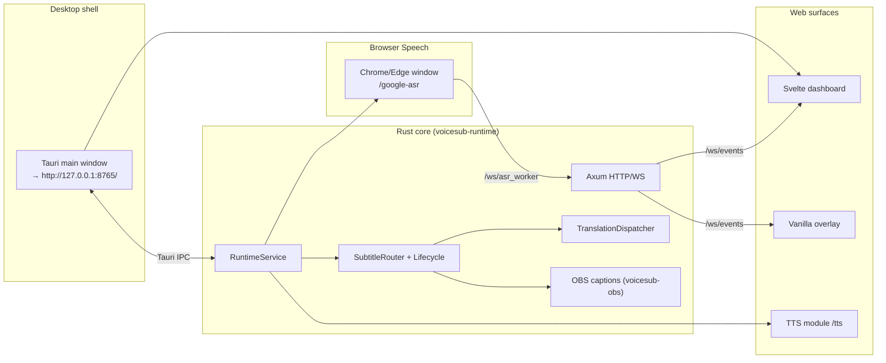

# VoiceSub 0.5.0 — Технический документ

Актуально для линии кода, где `voicesub-types::PROJECT_VERSION = "0.5.0"`.

Этот документ описывает реальный layout проекта VoiceSub, контракт HTTP/WebSocket/Tauri IPC, схему конфигурации, поток данных через Rust runtime и поверхности frontend. Документ — **канонический полный technical reference** для активной разработки. README — короткий обзор продукта; CHANGELOG — история релизов; инженерный контракт — `docs/VOICESUB_ENGINEERING_CONTRACT.ru.md`; roadmap — `docs/plans/voicesub_roadmap.ru.md`.

**Предшественник:** SST Desktop `0.4.4` (`F:\AI\stream-sub-translator`) — read-only reference для parity-порта. SST tech doc **не обновляется**; канон для VoiceSub — **этот файл**.

**Правило сопровождения:** любое изменение контрактов API/WS/IPC, config schema, subtitle/translation lifecycle, renderer overlay, browser worker или NSIS installer bundle **обновляет соответствующие разделы в той же задаче**. Устаревшие формулировки удаляют или переписывают, а не оставляют «для истории».

## Оглавление

- [Related Documentation](#related-documentation)
- [Quick Reference](#quick-reference)
- [1. Назначение и границы системы](#1-назначение-и-границы-системы)
- [2. Технологический стек](#2-технологический-стек)
- [3. Верхнеуровневая схема рантайма](#3-верхнеуровневая-схема-рантайма)
- [4. Layout репозитория](#4-layout-репозитория)
- [5. Rust workspace (crates)](#5-rust-workspace-crates)
- [6. RuntimeService: orchestration и lifecycle](#6-runtimeservice-orchestration-и-lifecycle)
- [7. Конфигурация и миграции](#7-конфигурация-и-миграции)
- [8. HTTP API (локальный)](#8-http-api-локальный)
- [9. WebSocket-поверхность](#9-websocket-поверхность)
- [10. Tauri IPC](#10-tauri-ipc)
- [11. Логи, диагностика, экспорт](#11-логи-диагностика-экспорт)
- [12. Browser Speech worker](#12-browser-speech-worker)
- [13. Перевод: lifecycle и инварианты](#13-перевод-lifecycle-и-инварианты)
- [14. Subtitle lifecycle и presentation](#14-subtitle-lifecycle-и-presentation)
- [15. Стили субтитров и overlay](#15-стили-субтитров-и-overlay)
- [16. OBS Closed Captions](#16-obs-closed-captions)
- [17. TTS-модуль](#17-tts-модуль)
- [18. Desktop runtime и NSIS release](#18-desktop-runtime-и-nsis-release)
- [19. Хранилище и пути](#19-хранилище-и-пути)
- [20. Frontend: dashboard (Svelte)](#20-frontend-dashboard-svelte)
- [21. Frontend: overlay (vanilla)](#21-frontend-overlay-vanilla)
- [22. Frontend: browser worker (Svelte)](#22-frontend-browser-worker-svelte)
- [23. UI localization (i18n)](#23-ui-localization-i18n)
- [24. Архивные возможности (legacy/)](#24-архивные-возможности-legacy)
- [25. Версионирование и проверка обновлений](#25-версионирование-и-проверка-обновлений)
- [26. Тестирование](#26-тестирование)
- [27. Продуктовые инварианты](#27-продуктовые-инварианты)
- [28. Known Limitations & Technical Debt](#28-known-limitations--technical-debt)
- [29. Security & Privacy Model](#29-security--privacy-model)
- [30. Extension Points](#30-extension-points)
- [31. Glossary](#31-glossary)

## Related Documentation

| Документ | Назначение |
| --- | --- |
| `docs/WIKI.ru.md` | Пользовательский гайд (RU) |
| `docs/WIKI.en.md` | Пользовательский гайд (EN) |
| `docs/VOICESUB_ENGINEERING_CONTRACT.ru.md` | Инженерный контракт (обязателен для агентов) |
| `docs/plans/voicesub_roadmap.ru.md` | Roadmap фаз 0.5.0+ |
| `docs/CHANGELOG.md` | История изменений (наследие SST + VoiceSub) |
| `AGENTS.md` | Краткая политика для агентов |
| SST reference | `F:\AI\stream-sub-translator\docs\TECHNICAL_ARCHITECTURE.md` (frozen 0.4.4) |

## Quick Reference

### Запуск и сборка (разработка)

```bash
# Rust tests
cargo test --workspace

# Frontend build (dashboard + worker + TTS)
npm run build

# NSIS release (Windows)
build-release-msi.bat   # → build-release.ps1
```

Tauri dev: embedded HTTP на `http://127.0.0.1:8765`; main webview открывает dashboard по этому URL.

### Ключевые URL (default bind)

| URL | Назначение |
| --- | --- |
| `http://127.0.0.1:8765/` | Svelte dashboard |
| `http://127.0.0.1:8765/overlay` | OBS Browser Source |
| `http://127.0.0.1:8765/google-asr?autostart=1` | Browser Speech worker |
| `http://127.0.0.1:8765/google-asr-edge` | Тот же worker (Edge smoke) |
| `http://127.0.0.1:8765/tts` | TTS module UI |

### Ключевые API endpoint-ы

| Endpoint | Назначение |
| --- | --- |
| `POST /api/runtime/start` | Старт сессии + launch Chrome worker |
| `POST /api/runtime/stop` | Остановка worker, translation, OBS |
| `GET /api/runtime/status` | Runtime snapshot + diagnostics |
| `GET /api/settings/load` | Загрузка config + presets + fonts |
| `POST /api/settings/save` | Нормализация + сохранение `config.toml` |
| `GET /api/exports/diagnostics` | Redacted diagnostics ZIP |
| `GET /api/obs/url` | `{ overlay_url }` для OBS |

### WebSocket каналы

| Channel | Назначение |
| --- | --- |
| `/ws/events` | Dashboard, overlay, runtime/subtitle события |
| `/ws/asr_worker` | Browser Speech worker transport |

### Ключевые файлы

| Файл | Назначение |
| --- | --- |
| `crates/voicesub-types/src/version.rs` | `PROJECT_VERSION` |
| `crates/voicesub-runtime/src/service.rs` | Orchestration, start/stop |
| `crates/voicesub-runtime/src/http/router.rs` | Все HTTP/WS routes |
| `crates/voicesub-subtitle/src/lifecycle.rs` | Subtitle FSM/TTL |
| `crates/voicesub-translation/src/dispatcher.rs` | Translation queue + stale drop |
| `src-tauri/src/lib.rs` | Tauri shell + IPC |
| `bin/overlay/shared/js/subtitle-style.js` | Общий renderer overlay |

## 1. Назначение и границы системы

**VoiceSub** — локальное Windows-first desktop-приложение для субтитров в реальном времени:

- захват речи через **Browser Speech worker** (отдельное окно Chrome/Edge с видимой адресной строкой, Web Speech API);
- опциональный перевод на 0..5 целевых языков с независимым выбором провайдера на слот;
- единая маршрутизация subtitle payload в Svelte dashboard, vanilla OBS overlay и OBS Closed Captions;
- опциональный **TTS-модуль** (озвучка субтитров, Twitch chat TTS);
- экспорт diagnostics ZIP и client-side trace logs.

**Core 0.5.0 не включает:** локальный Parakeet ASR, Remote mode, experimental browser routes — код архивирован в `legacy/`, не поднимается active runtime.

Жёсткие границы:

- рантайм local-first, default bind `127.0.0.1:8765`;
- без cloud backend, accounts, hosted database;
- **Node.js запрещён в shipped runtime**; Vite/Node — только на машине разработчика/сборки;
- dashboard и worker — Svelte (compile-time bundle); overlay — **vanilla HTML/JS** (без Svelte);
- **WebView2 Runtime** — обязателен для Tauri shell (`VoiceSub.exe`, dashboard, `/tts`); NSIS installer может поставить bootstrapper.
- Chrome — отдельная system dependency для Web Speech worker; core installer не тянет Python/torch/Node.

## 2. Технологический стек

| Слой | Технологии |
| --- | --- |
| Core runtime | Rust 1.75+, Tokio, Axum 0.8 |
| Desktop shell | Tauri 2 → `VoiceSub.exe` (NSIS `setup.exe`) |
| Dashboard UI | Svelte 5 + Vite → `bin/dashboard/` |
| Browser worker | Svelte 5 + Vite → `bin/worker/` |
| TTS UI | Svelte 5 + Vite → `bin/tts/` |
| OBS overlay | Vanilla HTML/CSS/JS → `bin/overlay/` |
| Config | TOML (`user-data/config.toml`), JSON-shaped document inside |
| HTTP client (providers) | `reqwest` + rustls |
| Logging | `tracing` + rotating files + opt-in JSONL |
| TTS sidecar | Embedded Python exe в `bin/modules/tts/runtime/` (не в core Rust) |

**Запрещено в active tree:** React, Webpack, Electron, pywebview, FastAPI runtime, in-process NeMo/torch.

## 3. Верхнеуровневая схема рантайма



**Hot path:** `external_asr_update` (WS) → transcript controller → subtitle lifecycle → translation dispatcher → `subtitle_payload_update` / `overlay_update` (WS) → dashboard + overlay.

## 4. Layout репозитория

```
F:\AI\VoiceSub\
├── Cargo.toml                  # workspace members, workspace.dependencies
├── Cargo.lock
├── package.json                # Vite/Svelte build scripts
├── vite.config.ts              # → bin/dashboard/
├── vite.worker.config.ts       # → bin/worker/
├── vite.tts.config.ts          # → bin/tts/
├── build-release-msi.bat       # back-compat → build-release.ps1
├── build-release.ps1           # NSIS release pipeline
├── build/release.config.json   # release_root для setup.exe copy
│
├── crates/                     # Rust domain + adapters (см. §5)
├── src-tauri/                  # Tauri binary shell (тонкий)
├── src/                        # Svelte dashboard sources
├── src-worker/                 # Svelte browser worker sources
├── src-tts/                    # Svelte TTS module sources
│
├── bin/                        # Shipped static assets (в NSIS resources)
│   ├── dashboard/              # Vite build output
│   ├── worker/                 # Worker bundle
│   ├── tts/                    # TTS UI bundle
│   ├── overlay/                # Vanilla OBS overlay
│   ├── fonts/                  # Project fonts
│   └── modules/                # Sidecar modules (tts, parakeet later)
│
├── tests/
│   ├── golden/                 # SST fixture port
│   └── integration/
│
├── legacy/                     # Archived SST code (read-only reference)
├── docs/
├── user-data/                  # runtime (gitignored)
└── logs/                       # runtime (gitignored)
```

### Исходники vs артефакты сборки

| Поверхность | В git | После `npm run build` / installer |
| --- | --- | --- |
| `crates/`, `src/`, `src-worker/`, `src-tts/` | да | компилируется в exe + static |
| `bin/dashboard`, `bin/worker`, `bin/tts` | build output (tracked или CI) | в NSIS `resources/bin/` |
| `bin/overlay/` | да | в installer |
| `user-data/`, `logs/` | нет | создаётся при runtime |

## 5. Rust workspace (crates)

Workspace members (`Cargo.toml`): 14 crates + `src-tauri` + `xtask`.

### Граф зависимостей (упрощённо)

```
voicesub-types (Layer 0: DTO, WS types, errors)
    ↑
voicesub-config, voicesub-subtitle, voicesub-translation, voicesub-browser,
voicesub-ws, voicesub-logging, voicesub-export, voicesub-obs, voicesub-audio,
voicesub-tts, voicesub-twitch (Layer 1–2)
    ↑
voicesub-runtime (Layer 3: wiring, HTTP router, orchestration)
    ↑
src-tauri (Layer 4: IPC, window, bundle only)
```

### Crate reference

| Crate | Назначение |
| --- | --- |
| `voicesub-types` | `PROJECT_VERSION`, WS envelope types, ASR event DTO |
| `voicesub-config` | TOML store, defaults, SST JSON import, paths, bind policy |
| `voicesub-subtitle` | `SubtitleLifecycleCore`, `SubtitleRouter`, presentation, overlay contract |
| `voicesub-translation` | `TranslationDispatcher`, `TranslationEngine`, 13 providers |
| `voicesub-browser` | Chrome supervisor, worker launch flags, FSM port |
| `voicesub-ws` | `/ws/events` hub, `/ws/asr_worker` hub, event sequence |
| `voicesub-http` | Re-export `voicesub-runtime::http` (thin) |
| `voicesub-logging` | `tracing` backbone, rotation, session JSONL, deep trace flags |
| `voicesub-export` | Diagnostics ZIP, config redaction |
| `voicesub-obs` | OBS WebSocket closed captions client |
| `voicesub-audio` | WinAPI audio routing helpers (TTS) |
| `voicesub-tts` | TTS service, queue, Twitch IRC, OAuth bridge |
| `voicesub-twitch` | Twitch chat pipeline (emotes, filters, replacements) |
| `voicesub-runtime` | `RuntimeService`, HTTP router, transcript controller, session wiring |

**Правило:** бизнес-логика не живёт в `src-tauri/`; Tauri — IPC + lifecycle hooks only.

## 6. RuntimeService: orchestration и lifecycle

**Файл:** `crates/voicesub-runtime/src/service.rs`

`RuntimeService` — единая точка wiring:

1. **Старт** (`POST /api/runtime/start`):
   - merge optional inline `config_payload`;
   - apply live settings (translation, OBS, subtitle, logging);
   - launch Chrome worker → `{base}/google-asr?autostart=1[&locale=…]`;
   - start translation dispatcher, OBS captions, browser speech ingest;
   - broadcast `preflight_update`, `runtime_update`.

2. **Стоп** (`POST /api/runtime/stop`):
   - send `browser_asr_control` stop на `/ws/asr_worker`;
   - kill Chrome process tree (`taskkill /T /F` on Windows);
   - stop translation, OBS; reset subtitle state/metrics.

3. **Tauri shutdown** (`src-tauri/src/lib.rs`):
   - TTS shutdown → `POST /api/runtime/stop` → runtime handle drop.

Embedded HTTP server: dedicated Tokio runtime в Tauri process; bind из `AppConfig` + `VOICESUB_ALLOW_LAN`.

## 7. Конфигурация и миграции

### Хранение

- **Путь:** `{project_root}/user-data/config.toml`
- **Формат:** JSON-shaped document, сериализованный как TOML (`voicesub-config::store`)
- **Текущая версия:** `config_version = 8` (`defaults.rs`)

### Top-level keys

| Key | Роль |
| --- | --- |
| `config_version` | Schema version (migrate on load) |
| `profile` | Active profile name |
| `ui` | `language`, `layout`, `theme`, `palette`, `show_remote_tools`, `show_translation_results` |
| `source_lang` | ASR source (`auto` default) |
| `targets` | Legacy target list (import compatibility) |
| `asr` | `mode` + `browser` tuning |
| `overlay` | `preset`, `compact` |
| `obs_closed_captions` | OBS WebSocket CC settings |
| `translation` | Provider, lines (до 5), cache, limits, `provider_settings` |
| `subtitle_output` | Source/translation display order |
| `subtitle_lifecycle` | TTL, finalize timing, sync flags |
| `source_text_replacement` | Find/replace pairs для ASR текста |
| `logging` | `full_enabled` — master switch deep diagnostics |

### ASR mode (VoiceSub 0.5.0)

| `asr.mode` | Статус |
| --- | --- |
| `browser_google` | **Active default** |
| `browser_google_edge` | Сохраняется при import; тот же worker, другой page URL |
| SST `local`, `browser_google_experimental*` | Import → `browser_google` + `import_hint` |

### SST JSON import

`ConfigStore::import_sst_json_file` / load с `config_version < 8`:

1. `migrate_sst_payload` — version steps, build `translation.lines` from legacy `targets`
2. `apply_voicesub_import_rules` — strip SST-only keys (`remote`, RNNoise, model fields, …)
3. `repair_legacy_keep_completed_false` + `normalize_config_payload`

Удалённые providers (например `mymemory`) → fallback `google_translate_v2`.

### Profiles

`user-data/profiles/{name}.toml` — named snapshots via `/api/profiles/*`.

## 8. HTTP API (локальный)

**Router:** `crates/voicesub-runtime/src/http/router.rs`  
**Default bind:** `127.0.0.1:8765` (`voicesub-config::paths`)  
**LAN:** `VOICESUB_ALLOW_LAN=1` → bind `0.0.0.0`

Global middleware: CSP header, `Cache-Control: no-store`.

### Health / Version

| Method | Path | Назначение |
| --- | --- | --- |
| GET | `/api/health` | Liveness + WS connections + worker connected |
| GET | `/api/version` | Product metadata + `sync` (updates config, `update_available`, `latest_known_version`) |

### Devices / OpenAI helpers

| Method | Path | Назначение |
| --- | --- | --- |
| GET | `/api/devices/audio-inputs` | Empty list (browser ASR uses `getUserMedia`) |
| GET | `/api/openai/recommended-models` | Static recommended models |
| POST | `/api/openai/models` | Static list (key not used yet) |
| POST | `/api/openai/usable-models` | Alias |

### Settings / Profiles

| Method | Path | Назначение |
| --- | --- | --- |
| GET | `/api/settings/load` | Config + subtitle presets + font catalog |
| POST | `/api/settings/save` | Merge/save + live apply |
| GET/POST/DELETE | `/api/profiles`, `/api/profiles/{name}` | Profile CRUD |

### Runtime / OBS

| Method | Path | Назначение |
| --- | --- | --- |
| POST | `/api/runtime/start` | Start session (`device_id?`, `config_payload?`) |
| POST | `/api/runtime/stop` | Stop session |
| GET | `/api/runtime/status` | Full runtime snapshot |
| GET | `/api/obs/url` | `{ overlay_url }` |

### Logging / Exports

| Method | Path | Назначение |
| --- | --- | --- |
| POST | `/api/logs/client-event` | Client → `session-latest.jsonl` |
| POST | `/api/logs/ui-trace` | UI render trace → `ui-trace.jsonl` |
| GET | `/api/exports` | List export bundles |
| GET | `/api/exports/diagnostics` | Diagnostics ZIP |

### TTS / Twitch OAuth

| Method | Path | Назначение |
| --- | --- | --- |
| GET | `/api/tts/google` | Google Translate TTS proxy |
| GET | `/api/tts/python` | TTS via embedded Python module |
| GET | `/api/tts/python/status` | Python runtime probe |
| POST | `/api/tts/twitch/oauth-open` | Open Twitch OAuth in system browser |
| GET | `/api/tts/twitch/oauth-pending` | Poll pending token |
| POST | `/api/tts/twitch/oauth-complete` | Store OAuth token |

### Updates

| Method | Path | Назначение |
| --- | --- | --- |
| POST | `/api/updates/check` | Poll GitHub Releases (`force` on dashboard bootstrap); persists `updates.latest_known_version`, `last_checked_utc` |

### HTML pages

| Method | Path | Handler |
| --- | --- | --- |
| GET | `/` | `bin/dashboard/index.html` |
| GET | `/overlay` | `bin/overlay/overlay.html` |
| GET | `/google-asr` | `bin/worker/index.html` |
| GET | `/google-asr-edge` | Same worker bundle |
| GET | `/tts` | `bin/tts/index.html` |
| GET | `/project-fonts.css` | Generated `@font-face` from `bin/fonts/` |

### Static mounts

| URL prefix | Disk path |
| --- | --- |
| `/overlay-assets` | `bin/overlay/` |
| `/static` | `bin/overlay/shared/` (legacy shared assets) |
| `/worker-assets` | `bin/worker/` |
| `/assets` | `bin/dashboard/assets/` |
| `/tts-assets` | `bin/tts/` |
| `/project-fonts` | `bin/fonts/` |

`bin/` resolved via `ProjectPaths::locate_bin_dir()` — workspace `bin/` или Tauri NSIS `resources/bin/`.

## 9. WebSocket-поверхность

### `/ws/events` — dashboard + overlay

**Реализация:** `crates/voicesub-ws/src/events.rs`

- Клиент receive-only (inbound text ignored)
- On connect: `hello` (`type: "hello"`, `message: "connected"`)
- Replay last: `runtime_update`, `subtitle_payload_update`, `overlay_update`
- Bounded per-socket queue (default 128), dedupe by `type`

**Envelope:** `{ "type": "<channel>", "payload": {…} }`  
Payload enrichment: `event_sequence`, `created_at_ms`, `event_type` (`WsEventPublisher`).

| `type` | Назначение |
| --- | --- |
| `hello` | Handshake |
| `runtime_update` | Phase, ASR/worker state, metrics |
| `preflight_update` | `{ running: bool }` during start/stop |
| `diagnostics_update` | ASR diagnostics snapshot |
| `model_status_update` | Model/ASR readiness |
| `transcript_update` | ASR partial/final events |
| `transcript_segment_event` | Segment-level duplicate channel |
| `subtitle_payload_update` | Subtitle presentation (replay on connect) |
| `overlay_update` | Overlay render body (replay on connect) |
| `translation_update` | Per-sequence translation results |
| `twitch_chat_message` | Twitch chat for TTS |
| `twitch_connection_update` | Twitch connection state |

**Stale guard:** dashboard (`src/lib/ws.ts`) и overlay (`overlay.js` + `ws-stale-guard-logic.js`) отбрасывают устаревшие события после stop/start (timestamp-first при reset sequence).

### `/ws/asr_worker` — browser worker

**Реализация:** `crates/voicesub-ws/src/asr_worker.rs`

**Server → worker:**

| `type` | Поля | Назначение |
| --- | --- | --- |
| `hello` | `message: "browser_asr_worker_connected"`, `transport_id` | Handshake |
| `browser_asr_control` | `action`, `reason?`, `issued_at_ms`, `transport_id` | Control (e.g. `stop`) |

**Worker → server:**

| `type` | Handler |
| --- | --- |
| `external_asr_update` | ASR text ingest (partial/final, generation guards) |
| `browser_asr_status` | Worker state snapshot |
| `browser_asr_heartbeat` | Same as status |
| `hello` | Recognized, no special handling |

## 10. Tauri IPC

**Регистрация:** `src-tauri/src/lib.rs` → `tauri::generate_handler!`

### Shell commands

| Command | Назначение |
| --- | --- |
| `voicesub_version` | Returns `PROJECT_VERSION` |
| `set_dashboard_layout` | Compact (390×844) vs standard (1280×900) window |
| `launch_browser_worker` | Launch Chrome to worker URL without full runtime start |

### TTS commands (`src-tauri/src/tts.rs`)

| Command | Назначение |
| --- | --- |
| `tts_get_config` | Load TTS config |
| `tts_set_provider` / `tts_set_enabled` | Provider toggle |
| `tts_set_audio_device` / `tts_set_channel_audio_device` | Speech / Twitch audio output |
| `tts_set_playback_mode` | `native` (Rust/cpal) vs `browser` (HTMLAudioElement) |
| `tts_play_audio` / `tts_stop_channel` | Native MP3 playback per channel |
| `tts_list_output_devices` | WASAPI enumeration (label-first for native) |
| `tts_get_audio_routing` / `tts_bind_window_audio` | Legacy WinAPI per-process routing (single device) |
| `tts_update_speech_settings` / `tts_update_voice_settings` | Speech params |
| `tts_plan_subtitle_speech` / `tts_reset_subtitle_planner` | Subtitle-driven queue |
| `tts_enqueue` | Enqueue speech text |
| `tts_twitch_*` | Twitch connect/disconnect/status/settings |
| `tts_sync_source_text_replacement` | Sync replacement rules |
| `tts_open_window` | Open/focus `/tts` webview |
| `tts_open_system_url` | Open validated Twitch OAuth URL externally |
| `open_external_https_url` | Open GitHub release page (update banner **Download**) in system browser |

**Lifecycle:** main webview → `http://{bind_addr}/` on setup; on close → TTS shutdown → runtime stop.

## 11. Логи, диагностика, экспорт

**Директория:** `{project_root}/logs/`

### Backbone (всегда)

| File | Назначение |
| --- | --- |
| `core.log` | `tracing` backbone (+ stderr); rotate → `core.old.log` on startup |
| `runtime-events.log` | Compact structured events (5 MB rotation) |
| `session-latest.jsonl` | Client events from `/api/logs/client-event` (max 5000 lines) |

### Opt-in JSONL traces

Master switch: `logging.full_enabled` in config **или** `VOICESUB_DEEP_DIAGNOSTICS` / `SST_DEEP_DIAGNOSTICS`.

| File | Enable env |
| --- | --- |
| `subtitle-trace.jsonl` | `VOICESUB_TRACE_SUBTITLE` |
| `tts-trace.jsonl` | `VOICESUB_TRACE_TTS` |
| `browser-trace.jsonl` | `VOICESUB_TRACE_BROWSER` |
| `obs-trace.jsonl` | `VOICESUB_TRACE_OBS` |
| `ui-trace.jsonl` | `VOICESUB_TRACE_UI` |
| `ws-trace.jsonl` | `VOICESUB_TRACE_WS` |
| `pipeline-trace.jsonl` | `VOICESUB_TRACE_PIPELINE` |
| `session-lifecycle.json` | всегда (маркер сессии); шаги shutdown/panic дублируются в `pipeline-trace.jsonl` при deep diagnostics |

Disable: same vars `=0` / `false`.  
Verbose runtime-events: `VOICESUB_TRACE_RUNTIME_EVENTS_VERBOSE`.

При `logging.full_enabled` шаги закрытия (`shutdown_begin`, `shutdown_step`, `shutdown_complete`) пишутся в `core.log` (`voicesub.lifecycle`) и `pipeline-trace.jsonl`. `session-lifecycle.json` обновляется всегда: `running` → `graceful` или `panic`. Если при старте остался `running`, в `core.log` — `previous session exited without graceful shutdown` (даже в compact-режиме).

### Другие env vars

| Variable | Назначение |
| --- | --- |
| `VOICESUB_ALLOW_LAN` | Bind `0.0.0.0` |
| `RUST_LOG` | `tracing` filter override |
| `VOICESUB_TTS_PER_PROCESS_ROUTING` | WinAPI TTS audio routing |
| `VOICESUB_TTS_ALLOW_SYSTEM_PYTHON` | Allow system Python for TTS fetcher |

### Diagnostics ZIP

`GET /api/exports/diagnostics` bundles: `runtime_status.json`, `config_redacted.json`, `environment.txt`, `latest_session.jsonl`, `core.log`, `runtime-events.log`.

## 12. Browser Speech worker

### URL и launch

| Constant | Value |
| --- | --- |
| `WORKER_PATH` | `/google-asr` |
| Edge alias | `/google-asr-edge` |
| Launch URL | `{base}/google-asr?autostart=1[&locale={ui.language}]` |

`worker_launch_browser`: `auto` | `google_chrome` (unknown → `auto`).

### Chrome launch invariants

- **Отдельное окно** Chrome/Edge с **видимой адресной строкой**
- Isolated `--user-data-dir`: `{user-data}/browser-worker-profile-classic-{engine}/`
- Edge: `--disable-sync`, `--allow-browser-signin=false`; **never** `--disable-extensions` / `--bwsi`
- **No** `--app`, hidden windows, in-tab worker
- Anti-throttling Chrome flags + Windows EcoQoS opt-out (port from SST `browser_worker_launcher.py`)
- Detached high-priority process; stop via `taskkill /T /F`

### Worker frontend (`src-worker/`)

| Module | Роль |
| --- | --- |
| `worker-controller.ts` | Autostart, recognition lifecycle |
| `socket-bridge.ts` | `/ws/asr_worker` connect, `browser_asr_control` |
| `session-manager.ts` | Session age, reconnect, watchdog |
| `web-speech-policy.ts` | Strip on-device hints, overlap policy |

**Defaults:** lang `ru-RU`, interim/continuous on, force-finalization 1600ms, max session age 180s.

## 13. Перевод: lifecycle и инварианты

**Crate:** `voicesub-translation`  
**Entry:** `TranslationDispatcher` (`dispatcher.rs`)

### Providers (13)

`SUPPORTED_PROVIDERS` in `providers/mod.rs`:

| ID | Group |
| --- | --- |
| `google_translate_v2` | API (default) |
| `google_cloud_translation_v3` | API |
| `google_gas_url` | API |
| `google_web` | experimental |
| `azure_translator` | API |
| `deepl` | API |
| `libretranslate` | API/self-hosted |
| `openai` | llm |
| `openrouter` | llm |
| `lm_studio` | local_llm |
| `ollama` | local_llm |
| `public_libretranslate_mirror` | API |
| `free_web_translate` | experimental |

До **5 translation lines** (`translation_1`…`translation_5`). Test stub `stub` — не в production registry.

### Critical lifecycle invariant (non-negotiable)

- Completed subtitle block **остаётся на экране** до финализации **новой** фразы
- Late translations **разрешены** (не drop по wall-clock stale на browser path)
- Preview supersession по `(segment_id, revision)`
- Stale drop для устаревших **in-flight** jobs при новом segment/revision

## 14. Subtitle lifecycle и presentation

**Crate:** `voicesub-subtitle`

| Component | Файл | Роль |
| --- | --- | --- |
| `SubtitleLifecycleCore` | `lifecycle.rs` | FSM, TTL, relevance, expiry scheduling |
| `SubtitleRouter` | `router.rs` | Transcript + translation → presentation events |
| `SubtitlePresentation` | `presentation.rs` | Payload assembly |
| Overlay contract | `tests/overlay_contract.rs` | Golden parity |

**Config keys (`subtitle_lifecycle`):**

- `completed_block_ttl_ms` (default 4500, min 500)
- `completed_source_ttl_ms`, `completed_translation_ttl_ms`
- `pause_to_finalize_ms`, sync flags

**Router actor** (`router_actor.rs`) — async publish path с `subtitle_payload_update` + `overlay_update` fanout.

## 15. Стили субтитров и overlay

### Backend config

Subtitle style presets загружаются через `/api/settings/load` together with config. Font catalog from `bin/fonts/` + `project-fonts.css`.

### Overlay presets

`overlay.preset`: `single` | `dual-line` | `stacked` | `compact`  
Query param override: `?preset=…&compact=1&profile=…&debug=…`

### Shared renderer

`bin/overlay/shared/js/subtitle-style.js` — fast/slow path invariants ported from SST. Dashboard preview uses same payload shape via WS (not necessarily same JS file).

### OBS overlay URL (VoiceSub 0.5.0)

```
http://127.0.0.1:8765/overlay
```

**Обратная совместимость SST query-params не гарантируется.** Пользователи обновляют Browser Source в OBS вручную.

### Empty-state cleanup (caller responsibility)

После fast-path оптимизаций рендерер держит DOM/state между кадрами. При пустом payload (TTL expiry, Stop, `lifecycle_state: idle`) caller **обязан** вызвать `disposeRenderContainer`:

| Surface | Caller |
| --- | --- |
| Dashboard preview | `src/lib/components/OverviewSection.svelte` |
| OBS overlay | `bin/overlay/overlay.js` — после `render()`, если `result?.empty` |

Без cleanup последний кадр может остаться в OBS. Контракт: `crates/voicesub-subtitle/tests/overlay_contract.rs` → `overlay_disposes_renderer_when_payload_is_empty`.

## 16. OBS Closed Captions

**Crate:** `voicesub-obs`  
**Config:** `obs_closed_captions` in config

- OBS WebSocket v5 client (`host`, `port`, `password`)
- `output_mode`: `disabled` | …
- `debug_mirror` — optional debug input
- `timing` — partial throttle, final replace delay, clear after ms

Enabled only when `obs_closed_captions.enabled = true` and connection succeeds.

## 17. TTS-модуль

Shipped as **module** under `bin/modules/tts/` + Svelte UI at `/tts`.

### Manifest

`bin/modules/tts/module.toml` — `entry_url_path = "/tts"`, requires core `>=0.5.0`.

### Components

| Layer | Path |
| --- | --- |
| UI | `src-tts/` → `bin/tts/` |
| Rust service | `crates/voicesub-tts/` |
| Native playback | `crates/voicesub-audio/src/playback.rs` (`PlaybackHub`) |
| Twitch | `crates/voicesub-twitch/` |
| Python sidecar | `bin/modules/tts/runtime/win-x64/google_tts_fetch.exe` |

### UI tabs

`speech` | `twitch` (`src-tts/lib/types.ts`)

### Dual sink (speech + twitch)

Два независимых канала озвучивания с отдельными очередями и устройствами:

| Канал | Источник | JS engine | Config device fields |
| --- | --- | --- | --- |
| `speech` | `subtitle_payload` → `tts_plan_subtitle_speech` | `speechEngine` | root `audio_output_device_*` |
| `twitch` | `twitch_chat` (WS) | `twitchEngine` | `[twitch].audio_output_device_*` |

Очередь и prefetch MP3 остаются в `src-tts/lib/speech-engine.ts` + `google-tts.ts`. Rust `SpeechQueue` / `tts_enqueue` — legacy prototype, не участвуют в playback.

### Playback modes (`playback_mode` in `user-data/modules/tts/config.toml`)

| Mode | Механизм | Когда |
| --- | --- | --- |
| `browser` (default) | `HTMLAudioElement` + `setSinkId` | Fallback, регрессия |
| `native` | `PlaybackHub` (rodio/cpal), IPC `tts_play_audio` | Production dual sink |

Событие Tauri: `playback-finished` `{ channel, item_id, ok, error? }` — завершение клипа на native path.

Устройства в native mode: **label-first** (WASAPI friendly name → `cpal::Device`). Список — `tts_list_output_devices`.

### Legacy audio routing

- WinAPI per-process routing: `VOICESUB_TTS_PER_PROCESS_ROUTING` + `tts_bind_window_audio` — один device на процесс WebView; **не использовать** для dual sink (см. `docs/plans/tts_dual_sink_native_playback.ru.md`).

## 18. Desktop runtime и NSIS release

### Tauri config

`src-tauri/tauri.conf.json`:

- `productName`: VoiceSub
- `identifier`: `com.voicesub.app`
- `frontendDist`: `../bin/dashboard`
- `beforeBuildCommand`: `npm run build`
- Bundle: **NSIS** (`targets: ["nsis"]`, `installMode: currentUser`, languages en/ru/ja/ko/zh)
- NSIS template: `src-tauri/windows/installer.nsi`, hooks: `src-tauri/windows/hooks.nsh`
- WebView2: `downloadBootstrapper` (silent=false)
- Resources: `bin/dashboard`, `overlay`, `worker`, `tts`, `fonts`, `modules`

Legacy WiX `src-tauri/wix/main.wxs` — **не используется** (reference only).

### Release pipeline

```
build-release-msi.bat          # back-compat entry
  → build-release-msi.ps1
  → build-release.ps1
    1. npm run build (+ build:tts)
    2. bin\modules\tts\build_runtime.bat (if google_tts_fetch.exe missing)
    3. node scripts/validate-nsis-i18n.mjs
    4. cargo tauri build (NSIS)
    5. Copy VoiceSub_{version}_x64-setup.exe → release_root/v{version}/
```

Default `release_root`: `F:\AI\VoiceSub - release\v{version}\`

### Install layout

- Per-user install (`currentUser`) — typically `%LOCALAPPDATA%\Programs\VoiceSub\`
- `user-data/` и `logs/` — рядом с install dir / project root (`ProjectPaths`)

### Dev workflow

- `npm run dev` — Vite dashboard on port 5173 (optional; production path uses embedded server)
- Tauri loads `http://127.0.0.1:8765` (Axum serves built dashboard)

**End user install:** NSIS `setup.exe` only. No Python/Node/torch in core installer. Chrome — system dependency для Web Speech.

## 19. Хранилище и пути

| Path | Назначение |
| --- | --- |
| `user-data/config.toml` | Main config |
| `user-data/profiles/` | Named profiles |
| `user-data/browser-worker-profile-classic-*/` | Chrome isolated profiles |
| `user-data/translation-cache/` | Persistent translation cache |
| `logs/` | Runtime logs |
| `bin/` | Shipped static (workspace or NSIS resources) |

`ProjectPaths::discover(project_root)` resolves all paths relative to project root or Tauri resource dir.

## 20. Frontend: dashboard (Svelte)

**Sources:** `src/`  
**Build:** `vite.config.ts` → `bin/dashboard/` (`base` implicit `/`)

### Navigation

Single-page **tab switch** (no SvelteKit router):

| Tab ID | Panel |
| --- | --- |
| `translation` | `TranslationPanel.svelte` |
| `subtitles` | `SubtitlesPanel.svelte` |
| `style` | `StylePanel.svelte` |
| `theme` | `ThemePanel.svelte` |
| `obs` | `ObsPanel.svelte` |
| `replacement` | `ReplacementPanel.svelte` |
| `tools` | `ToolsPanel.svelte` |
| `settings` | `SettingsPanel.svelte` |
| `help` | `HelpPanel.svelte` |

Compact layout adds pane `"live"` (overview).

### Key libs

| File | Роль |
| --- | --- |
| `src/lib/api.ts` | REST client |
| `src/lib/ws.ts` | `/ws/events` + stale guard |
| `src/lib/stores/app.ts` | App state |
| `src/lib/config-*.ts` | Config normalize/save |

### Layout IPC

`set_dashboard_layout` Tauri command — compact vs standard window sizes.

### Idle subtitle preview (до Start)

**Файлы:** `src/lib/preview-payload.ts`, `src/lib/components/OverviewSection.svelte`

Пока runtime в фазе `idle`, dashboard показывает **placeholder preview** (`preview.source_line`, labels переводов) вместо live `overlay_update` с WS. Пустой `overlay_update` после Save **не затирает** preview. При `running=true` preview переключается на live payload (`subtitle_payload_update` / `overlay_update`). Тест: `src/lib/preview-payload.test.ts`.

## 21. Frontend: overlay (vanilla)

**Path:** `bin/overlay/`

| File | Роль |
| --- | --- |
| `overlay.html` | Shell |
| `overlay.js` | WS consumer, render loop; `disposeRenderContainer` on empty |
| `overlay.css` | Styles |
| `shared/js/subtitle-style.js` | Renderer |
| `shared/js/core/ws-stale-guard-logic.js` | Stale filter |
| `shared/js/i18n/` | Overlay i18n bundle |

**WS:** `ws(s)://{host}/ws/events` — handles `transcript_update`, `overlay_update`.  
**Reconnect:** exponential backoff 1s → 10s max; last frame preserved on disconnect (OBS UX).  
**Empty payload:** `disposeRenderContainer(linesContainer)` when render returns `empty: true` (TTL / Stop / idle). Idle TTL также требует `hasVisibleRenderedFrame()` — иначе очистка state без `render()` оставляет последний кадр в OBS. Cache-bust: `overlay.html` → `overlay.js?v=20260610b`.

## 22. Frontend: browser worker (Svelte)

**Sources:** `src-worker/`  
**Build:** `vite.worker.config.ts` → `bin/worker/` (`base: "/worker-assets/"`)

Entry: `main.ts` → `WorkerApp.svelte`  
Autostart: `?autostart=1` query param.

## 23. UI localization (i18n)

**Locales:** `en`, `ru`, `ja`, `ko`, `zh`

| Surface | Catalog location |
| --- | --- |
| Dashboard | `src/lib/i18n/locales/{locale}.json` + `tts-{locale}.json` |
| Overlay | `bin/overlay/shared/js/i18n/` |
| Worker | via `locale` query param + worker i18n |

Merge: `src/lib/i18n/index.ts` — main + TTS catalogs per locale.  
Export pipeline: `npm run i18n:export` → `scripts/export-i18n.mjs`.  
Config key: `ui.language` (empty = browser default).

## 24. Архивные возможности (legacy/)

Не импортируются active crates. Reference only.

| Path | Содержимое |
| --- | --- |
| `legacy/remote/` | SST remote controller/worker → future module |
| `legacy/experimental-browser/` | Experimental worker routes |
| `legacy/modules-source/parakeet/` | Parakeet Python until `bin/modules/parakeet` |

Active HTTP server **не** поднимает `/ws/remote/*`, experimental routes, in-process Parakeet.

## 25. Версионирование и проверка обновлений

- **Single source (interim):** `voicesub-types::PROJECT_VERSION` = `"0.5.0"`
- Workspace `Cargo.toml` `[workspace.package].version` = `0.5.0`
- `package.json`, `tauri.conf.json` — aligned `0.5.0`
- `GET /api/version`, `POST /api/updates/check` — GitHub Releases poll (`voicesub-runtime/src/http/update_service.rs`, `voicesub-types::version`)
- Config `updates.*` — defaults in `voicesub-config::defaults`; legacy configs merge via `normalize_updates_config`
- Dashboard banner: `UpdateBanner.svelte`; download → Tauri `open_external_https_url` (`src-tauri/src/shell.rs`)

## 26. Тестирование

### Policy

- **No new Rust module without tests** in same task
- Golden fixtures from SST `tests/` in `tests/golden/`
- `cargo test --workspace` required before done

### Levels

| Level | Where | What |
| --- | --- | --- |
| Unit | `crates/*/src/**` | FSM, stale drop, normalization |
| Golden | `tests/golden/` + crate `tests/golden_*.rs` | Payload parity |
| Integration | `tests/integration/`, `voicesub-http/tests/` | HTTP/WS smoke |
| Frontend | `npm run test:frontend` (Vitest) | i18n, normalizers, worker |

### Key test files

- `voicesub-subtitle/tests/golden_subtitle.rs`, `golden_ttl_lifecycle.rs`
- `voicesub-translation/tests/golden_translation.rs`, `golden_stale_translation.rs`
- `voicesub-http/tests/http_ws_smoke.rs`
- `voicesub-browser/tests/worker_svelte_contract.rs`
- `voicesub-subtitle/tests/overlay_contract.rs` — overlay lifecycle + empty cleanup

## 27. Продуктовые инварианты

1. **Local-first:** default localhost bind; no cloud assumptions.
2. **Browser worker visibility:** separate window, visible URL bar, no hidden/throttled-to-death modes.
3. **Subtitle lifecycle:** completed block persists until new phrase finalized; late translations allowed on browser path.
4. **Translation parity:** 13 providers, full dispatcher semantics from SST 0.4.4.
5. **Overlay separation:** vanilla HTML for OBS; not bundled in dashboard Vite chunk.
6. **No Node in runtime:** only compile-time frontend toolchain.
7. **Config semantics:** SST import preserves user intent except explicitly removed modes.

## 28. Known Limitations & Technical Debt

### 28.1 Текущие ограничения

- GitHub update **check + dashboard banner** реализованы; авто-скачивание installer — нет (только ссылка на release page)
- Golden full parity / formal Phase 1 DoD — **deferred** (roadmap §12)
- `POST /api/openai/models` — static list; live OpenAI model fetch deferred
- Audio input enumeration empty (by design for browser ASR)
- SST dashboard field-by-field UI parity — **not a gate** (own Svelte layout)

### 28.2 Технический долг

- `PROJECT_VERSION` scattered across Cargo/package/tauri — migrate to crate-only source of truth
- Parakeet module not yet in `bin/modules/parakeet/`
- Remote module not started

## 29. Security & Privacy Model

- **Bind policy:** localhost default; LAN only via explicit `VOICESUB_ALLOW_LAN=1`
- **CSP** on all HTTP responses (restrictive `default-src 'self'`)
- **Diagnostics export:** config redaction before ZIP
- **No telemetry** to vendor servers by default
- Translation provider API keys stored locally in `config.toml` / `provider_settings`
- Twitch OAuth tokens stored locally in TTS bridge
- Browser worker uses isolated Chrome profile (no sync)

## 30. Extension Points

### Safe extension

| Extension | How |
| --- | --- |
| New translation provider | Add to `voicesub-translation/src/providers/`, register in `mod.rs`, golden tests |
| New WS event type | Add to `voicesub-ws`, document in §9, update dashboard/overlay consumers |
| New config key | `voicesub-config` defaults + migrate + normalize + TECH_ARCH §7 |
| New module | `bin/modules/{name}/module.toml` + sidecar; no import from `legacy/` |
| Dashboard panel | New `src/lib/panels/*.svelte` + tab in `TabNav.svelte` |

### Unsafe (forbidden without contract update)

- Changing subtitle lifecycle semantics
- Adding Node.js to runtime
- Reintroducing remote/experimental routes in core HTTP server
- Business logic in `src-tauri/`

## 31. Glossary

| Term | Meaning |
| --- | --- |
| **ASR** | Automatic Speech Recognition |
| **Browser worker** | Chrome/Edge window running Web Speech at `/google-asr` |
| **Completed block** | Finalized subtitle segment shown until next phrase finalizes |
| **Golden test** | Fixture-based regression test ported from SST |
| **Overlay** | Vanilla OBS Browser Source page at `/overlay` |
| **Segment / revision** | Translation supersession identity `(segment_id, revision)` |
| **Sidecar module** | Optional feature (TTS, future Parakeet) under `bin/modules/` |
| **Stale drop** | Discarding in-flight translation superseded by newer segment |
| **VoiceSub** | Product name for 0.5.0+ line (successor to SST) |
