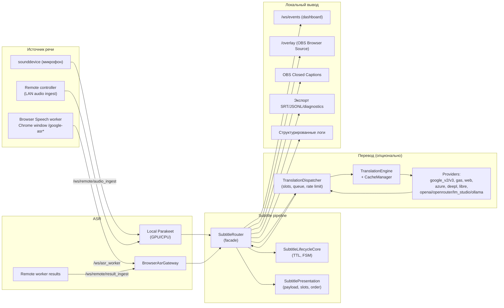

# SST Desktop 0.3.1 — Технический документ

Актуально для линии кода, где `backend/versioning.py` содержит `PROJECT_VERSION = "0.3.1"`.

Этот документ описывает реальный layout проекта, контракт API/WebSocket, доменные схемы (Pydantic), конфигурационный pipeline и поток данных через рантайм. Документ — основной reference: README — короткий обзор продукта, CHANGELOG — история изменений, а здесь зафиксирована именно архитектура.

## 1. Назначение и границы системы

`stream-sub-translator` — локальное Windows desktop-приложение для субтитров в реальном времени:

- захват речи:
  - локальный микрофон (sounddevice + Parakeet);
  - browser speech worker (отдельное окно Google Chrome с адресной строкой);
  - опциональная цепочка remote controller → worker (только LAN, явный профиль запуска).
- ASR:
  - локальный AI runtime (Parakeet, GPU/CPU);
  - приём потока от browser speech worker через `/ws/asr_worker`.
- опциональный перевод на 0..N целевых языков с независимым выбором провайдера на слот;
- единая маршрутизация subtitle payload в dashboard, OBS overlay и OBS Closed Captions;
- экспорт сессий (SRT/JSONL/diagnostics) и локальные runtime/client diagnostics.

Жёсткие границы (за пределы выходить нельзя):

- рантайм по умолчанию local-first и только localhost (`127.0.0.1`);
- без cloud backend, accounts, hosted database, SaaS-assumptions;
- frontend без Node.js/React/build-pipeline;
- dashboard, browser worker pages, overlay и remote bridge pages обслуживаются FastAPI;
- remote mode — отдельный explicit LAN-сценарий, не интернет-facing deployment.

## 2. Технологический стек

- Python 3.11+;
- FastAPI + Uvicorn (HTTP/WebSocket);
- Pydantic v2 schemas (`backend/schemas/`);
- `httpx` для исходящих HTTP-запросов провайдеров перевода и update-чекера;
- `sounddevice`, `numpy`, `webrtcvad`, опциональный RNNoise (CPU);
- Parakeet (NeMo) для локального ASR (GPU-first, CPU fallback);
- frontend — plain HTML/CSS/JavaScript (ES modules), без шага сборки;
- desktop-shell — `pywebview` для splash-launcher с выбором startup-профиля;
- bootstrap-лаунчер на чистом Python (PyInstaller one-file).

## 3. Верхнеуровневая схема рантайма



## 4. Layout репозитория

```
stream-sub-translator/
├── backend/
│   ├── app.py                    # FastAPI app + bootstrap + WebSocket handlers
│   ├── versioning.py             # PROJECT_VERSION + GitHub Releases helpers
│   ├── ws_manager.py             # WebSocket manager: snapshot, dead-socket cleanup
│   ├── preflight.py              # стартовая диагностика
│   ├── models.py                 # внешние pydantic-модели ответа API
│   ├── server_runtime.py
│   ├── run.py / run_controller.py / run_worker.py
│   ├── runtime_paths.py          # shim над backend.core.paths
│   ├── install_asr_model.py
│   ├── api/                      # тонкие HTTP-маршруты
│   ├── asr/parakeet/             # локальный Parakeet runtime
│   ├── config/                   # defaults, normalizers, LocalConfigManager
│   ├── core/                     # bootstrap, runtime, subtitle, logging, cache, atomic IO
│   ├── core/runtime/             # явные runtime-контроллеры
│   ├── data/                     # bundled config.example.json + config.schema.json
│   ├── schemas/                  # Pydantic-схемы (config/runtime/asr/...)
│   ├── services/                 # сервисы для маршрутов
│   └── translation/              # реестр перевода + провайдеры
├── frontend/
│   ├── index.html                # dashboard
│   ├── google_asr.html           # classic browser worker
│   ├── google_asr_experimental.html
│   ├── remote_controller_bridge.html
│   ├── remote_worker_bridge.html
│   ├── css/
│   └── js/
│       ├── main.js, app.js, api.js, ws.js, state.js, i18n.js, desktop.js
│       ├── browser-asr-session-manager.js
│       ├── browser-asr-audio-track-session-manager.js
│       ├── core/                 # store, api-client, ws-client, events, redaction
│       ├── dashboard/            # actions, helpers, logging, constants
│       ├── normalizers/          # pure normalization helpers
│       └── panels/               # translation, asr, runtime, style, overlay, diagnostics, ...
├── overlay/                      # overlay.html / overlay.css / overlay.js (OBS Browser Source)
├── desktop/
│   ├── launcher.py               # pywebview splash + startup profile + Chrome worker
│   ├── bootstrap_launcher.py     # one-file public launcher (.exe)
│   ├── runtime_bootstrap.py
│   ├── bootstrap_payload.py
│   ├── build_bootstrap_payload.py
│   └── assets/
├── tests/                        # unittest suite (283 теста)
├── docs/                         # CHANGELOG, TECHNICAL_ARCHITECTURE, release notes
├── start.bat, start-remote-*.bat
├── build-desktop.bat, build-bootstrap-launcher.bat, publish-desktop-releases.ps1
├── *.spec                        # PyInstaller spec файлы
├── requirements.*.txt
└── user-data/, logs/, fonts/     # локальные runtime-данные
```

## 5. Backend layout (детально)

### 5.1 `backend/api/`

Тонкий транспорт. Каждый файл — только маршруты, делегирующие в сервисы.

| Файл | Префикс | Назначение |
| --- | --- | --- |
| `routes_runtime.py` | `/api` | `/runtime/start`, `/runtime/stop`, `/runtime/status`, `/obs/url` |
| `routes_settings.py` | `/api/settings` | `/load`, `/save` |
| `routes_devices.py` | `/api/devices` | `/audio-inputs` |
| `routes_profiles.py` | `/api/profiles` | CRUD профилей + структурированные API-ошибки |
| `routes_exports.py` | `/api/exports` | список экспортов + diagnostics ZIP |
| `routes_logs.py` | `/api/logs` | `/client-event` (best-effort write) |
| `routes_version.py` | `/api` | `GET /version` |
| `routes_updates.py` | `/api/updates` | `POST /check` (live polling GitHub Releases) |
| `routes_openai_models.py` | `/api/openai` | `recommended-models`, `models`, `usable-models` |
| `routes_remote.py` | `/api/remote` | state/pair/heartbeat + worker control surface |

### 5.2 `backend/services/`

Сервисный слой, инициализируется централизованно `backend/core/app_bootstrap.py`.

- `runtime_service.py` — фасад над `RuntimeOrchestrator` для маршрутов: start/stop/status, OBS URL.
- `settings_service.py` — load/save config через `LocalConfigManager`, координация с `ConfigStateService`.
- `config_state_service.py` — owner активного in-memory snapshot конфига:
  - метаданные `source` (`loaded_from_disk`, `settings_saved`, `runtime_start_snapshot`), `persisted`, `hash`;
  - явная блокировка для конкурентных операций рантайма и настроек;
  - `update_active_updates_metadata(...)` — патч `updates.*` без перетирания снимка старта.
- `asr_service.py` — приём аудиочанков (микрофон/remote), маршрутизация транскриптов в `RuntimeOrchestrator`.
- `browser_asr_service.py` — учёт identity browser worker (transport id, generation, session id), heartbeat, статус, передача транскриптов в `SubtitleRouter`.
- `translation_service.py` — фасад над `TranslationEngine`/`TranslationDispatcher`.
- `diagnostics_service.py` — `health`, `version_info`, runtime-метрики.
- `export_service.py` — построение SRT/JSONL и diagnostics ZIP (с редактированием чувствительных полей).
- `overlay_service.py` — построение overlay-URL по конфигу/профилю.
- `model_manager_service.py` — установка/обнаружение локальных моделей Parakeet.
- `update_service.py` — `check_now(force=...)`: polling GitHub Releases, сохранение `updates.latest_known_version` + `updates.last_checked_utc`, защита `runtime_start_snapshot`.

### 5.3 `backend/core/` — общая инфраструктура и subtitle/translation pipeline

| Модуль | Назначение |
| --- | --- |
| `app_bootstrap.py` | Поднимает `app.state.*`: paths, config_manager, ConfigStateService, ws_manager, audio devices, profile manager, cache_manager, dictionary_manager, structured/session loggers, RuntimeOrchestrator, все сервисы (включая UpdateService). |
| `paths.py` | `APP_PATHS`, `ensure_app_layout()` — корни runtime/data/logs/cache/temp/models/fonts. |
| `runtime_paths.py` (shim) | Совместимый импорт старого `backend.runtime_paths`. |
| `logging_setup.py` | Конфигурация `backend.log` (rotating handler). |
| `api_errors.py` | Структурированные ошибки FastAPI. |
| `redaction.py` | Маскировка чувствительных полей (`token`, `secret`, `password`, `pair_code`, `api_key`, и т.п.) для логов/экспорта. |
| `atomic_io.py` | Windows-safe атомарная запись JSON через `os.replace()`. |
| `cache_manager.py` | In-memory LRU кеш перевода + дебаунс-персист на диск + карантин повреждённого `translation_cache.json`. |
| `config_migrations.py` | Версионные миграции (`config_version`, текущая `6`): UI/translation_lines/display_order/parakeet provider/legacy ASR cleanup. |
| `config_schema_export.py` | `python -m backend.core.config_schema_export` — публикует `backend/data/config.schema.json`. |
| `runtime_orchestrator.py` | Фасад рантайма (см. §6). |
| `subtitle_router.py` | Фасад публикации в overlay/WS + shim для legacy-импортов. |
| `subtitle_lifecycle_core.py` | FSM жизненного цикла субтитров, TTL/релевантность, promotion/expiry. |
| `subtitle_presentation.py` | Сборка payload: порядок, слоты стилей, слияние partial и финала. |
| `subtitle_style.py` | Style-presets, эффекты (`none`, `fade`, `subtle_pop`, `slide_up`, `zoom_in`, `blur_in`, `glow`). |
| `overlay_broadcaster.py` | Публикация overlay payload c sequence/created_at_ms. |
| `obs_caption_output.py` | OBS Closed Captions output (websocket к OBS). |
| `session_logger.py` | `SessionLogger` + `SessionLogManager` (best-effort JSONL запись клиентских событий). |
| `structured_runtime_logger.py` | `runtime-events.log` — структурированный рантайм-лог (компактные текстовые строки). |
| `structured_log_compact.py` | Сжатие значений (truncate строк, summary длинных списков, ограничение глубины). |
| `audio_capture.py`, `audio_devices.py`, `vad.py`, `segment_queue.py` | аудиоконвейер. |
| `asr_engine.py`, `asr_provider_selection.py`, `parakeet_provider.py` | локальный ASR layer. |
| `browser_asr_gateway.py` | Шлюз для browser worker: identity, generation, heartbeat, маршрутизация транскриптов. |
| `translation_engine.py` | Подготовка запросов перевода (по слотам), keep-alive `httpx.AsyncClient`, обёртка для readiness + retries. |
| `translation_dispatcher.py` | Очередь перевода: per-provider concurrency/rate limit, slot-aware identity, drop stale jobs. |
| `font_catalog.py` | `GET /project-fonts.css` — каталог локальных шрифтов. |
| `exporter.py` | Запись SRT/JSONL. |
| `profile_manager.py` | Профили (`user-data/profiles/`), нормализация payload, default profile. |
| `dictionary_manager.py` | Пользовательские словари. |
| `remote_mode.py`, `remote_session.py`, `remote_signaling.py`, `remote_diagnostics.py` | Remote controller/worker support (frozen surface). |

### 5.4 `backend/core/runtime/` — явные контроллеры рантайма

`RuntimeOrchestrator` делегирует логику в эти контроллеры; форма payload статуса не меняется при их перестановке.

| Контроллер | Назначение |
| --- | --- |
| `runtime_state_controller.py` | Coalescing/упорядочивание broadcast статуса рантайма (defensive против шторма duplicate updates). |
| `runtime_lifecycle_coordinator.py` | Детерминированный порядок start/stop ключевых компонентов. |
| `runtime_metrics_controller.py` | Учёт метрик рантайма (latency, ASR state, и т.п.). |
| `runtime_metrics_collector.py` | Сбор метрик. |
| `runtime_status_builder.py` | Сборка структуры статуса для WS/API. |
| `runtime_session_controller.py` | Идентичность сессии, sequence/generation, метки времени, записи экспорта. |
| `runtime_start_state_controller.py`, `runtime_stop_state_controller.py` | Узкие шаги жизненного цикла. |
| `runtime_reset_controller.py` | Согласованный reset перед каждым стартом. |
| `runtime_export_controller.py` | Попытка экспорта на stop + захват ошибок. |
| `segment_state_controller.py` | Счётчик сегментов, активный сегмент, partial coalescing. |
| `browser_worker_state_controller.py` | Состояние подключения/сессии/generation/signature browser worker-а. |
| `remote_audio_state_controller.py` | Удалённый аудио-ingest + queue lifecycle. |
| `speech_source.py`, `speech_source_factory.py` | Абстракция источника речи + фабрика. |
| `browser_speech_source.py`, `local_parakeet_speech_source.py`, `remote_controller_speech_source.py`, `remote_worker_speech_source.py` | Конкретные источники речи. |
| `speech_source_state_controller.py` | Выбор/очистка активного источника. |
| `audio_capture_controller.py` | Жизненный цикл `AudioCapture`. |
| `processing_tasks_controller.py` | Жизненный цикл capture/ASR тасков. |
| `asr_mode_controller.py` | Разрешение и фиксация режима/провайдера ASR на сессию. |
| `asr_runtime_controller.py`, `audio_runtime_controller.py` | Узкие helper-контроллеры рантайма. |
| `translation_runtime_controller.py` | Жизненный цикл `TranslationEngine` + `TranslationDispatcher`. |
| `translation_runtime_coordinator.py` | Кросс-координация перевода с рантаймом. |
| `transcript_controller.py` | Оркестрация конвейера partial/final транскриптов. |
| `subtitle_presentation_controller.py` | Тонкая обёртка над `SubtitleRouter`. |
| `output_fanout_controller.py`, `output_fanout_coordinator.py` | Fanout публикации в WS дашборда/OBS. |

### 5.5 `backend/config/` — конфигурация

```
backend/config/
├── __init__.py            # LocalConfigManager + AppSettings + global settings
├── defaults.py            # build_default_config(prefer_gpu)
├── secrets.py             # маскирование/нормализация секретов
└── normalizers/
    ├── asr.py             # asr.*, включая realtime и browser
    ├── browser.py         # asr.browser.* (worker_launch_browser etc.)
    ├── obs.py             # obs_closed_captions.*
    ├── remote.py          # remote.*
    ├── subtitles.py       # subtitle_output / subtitle_lifecycle
    └── translation.py     # translation.lines, provider_settings, кэш, лимиты
```

`LocalConfigManager.load()/save()` гарантирует, что любой payload:

1. пройдёт через `migrate_config()` (`backend/core/config_migrations.py`);
2. пройдёт доменные normalizers + Pydantic validation (`ConfigSchema.model_validate`);
3. будет записан атомарно (Windows-safe `os.replace()`);
4. при невалидном JSON исходный файл уезжает в `config.json.corrupt-<timestamp>` и приложение поднимается на дефолтах.

`normalize_profile_payload()` используется для save/load профилей и для runtime-start snapshot.

### 5.6 `backend/schemas/` — Pydantic-схемы

| Файл | Назначение |
| --- | --- |
| `config_schema.py` | Полная схема конфига (текущая `CURRENT_CONFIG_VERSION = 6`); содержит ConfigSchema, UiConfig, AsrConfig, TranslationConfig, SubtitleLifecycleConfig, RemoteConfig, UpdatesConfig и т.д. |
| `runtime_schema.py` | Runtime status payload (state, sequence, generation, метрики). |
| `asr_schema.py` | ASR-специфические события и поля. |
| `translation_schema.py` | Translation events/items. |
| `overlay_schema.py` | Overlay payload + presentation slots. |
| `diagnostics_schema.py` | Diagnostics payload (latency, queue state, и т.п.). |
| `model_schema.py` | Описание моделей/каталога. |

### 5.7 `backend/asr/parakeet/` — локальный ASR

```
backend/asr/parakeet/
├── runtime_loader.py
├── model_installer.py
├── device_diagnostics.py
├── mock_provider.py
└── providers/   # (заполняется при установке runtime AI)
```

### 5.8 `backend/translation/` — реестр + провайдеры

```
backend/translation/
├── base.py        # TranslationProviderInfo, BaseTranslationProvider, общий HTTP-слой
├── engine.py      # обёртки контракта engine
├── readiness.py   # readiness-проверки endpoint-ов
├── registry.py    # build_default_provider_registry()
└── providers/
    ├── google_v2.py
    ├── google_v3.py
    ├── google_gas.py
    ├── experimental_google_web.py   # GoogleWebProvider + FreeWebTranslateProvider
    ├── azure.py
    ├── deepl.py
    ├── libretranslate.py
    ├── openai_compatible.py         # используется для openai, openrouter, lm_studio, ollama
    └── public_mirrors.py
```

`backend/core/translation_engine.py` остаётся обёрткой подготовки запросов, общим `httpx.AsyncClient` с keep-alive и связыванием с `CacheManager`. Сами реализации провайдеров живут в `backend/translation/providers/`.

## 6. RuntimeOrchestrator: фасад и lifecycle

`RuntimeOrchestrator` (`backend/core/runtime_orchestrator.py`) теперь — фасад, который:

- хранит ссылки на контроллеры из `backend/core/runtime/`;
- предоставляет API `start(device_id, config_payload)`, `stop()`, `status()`, `obs_url()`;
- делегирует:
  - выбор/инициализацию `SpeechSource` через `SpeechSourceFactory`;
  - запуск/останов AudioCapture и processing tasks через соответствующие контроллеры;
  - конфигурацию `TranslationRuntimeController` (включая пересоздание `TranslationDispatcher` при изменении настроек);
  - публикацию статуса через `RuntimeStateController` (coalescing) + `OutputFanoutController`;
  - сборку payload статуса через `RuntimeStatusBuilder`;
  - lifecycle reset через `RuntimeResetController`/`Start/StopStateController`;
  - попытку экспорта на stop через `RuntimeExportController`.

Контракт `runtime_status` payload (упрощённо):

```
{
  "state": "stopped|listening|...",
  "asr_mode": "local|browser_google|browser_google_experimental",
  "asr_provider": "official_eu_parakeet_low_latency|...",
  "device_id": "...",
  "active_config_source": "loaded_from_disk|settings_saved|runtime_start_snapshot",
  "active_config_persisted": true|false,
  "active_config_hash": "...",
  "session_id": "...",
  "event_sequence": 1234,
  "metrics": { "latency_ms": ..., "queue": ..., ... },
  "browser_worker": { "session_id": ..., "generation_id": ..., "recognition_state": ..., ... },
  "translation": { "dispatch_state": ..., "providers": [...] },
  "subtitles": { ... }
}
```

## 7. Конфигурация и миграции

Главный config path: `user-data/config.json`.

### 7.1 `CURRENT_CONFIG_VERSION = 6`

Текущие явные миграции (`backend/core/config_migrations.py`):

| Стадия | Что делает |
| --- | --- |
| `migrate_ui_and_config_shape` (v<2) | Нормализует `ui.language`, гарантирует `translation.target_languages` из `targets`. |
| `migrate_parakeet_provider_name` (v<3) | `official_eu_parakeet_realtime` → `official_eu_parakeet_low_latency`. |
| `migrate_removed_legacy_asr_provider` (always) | Заменяет неподдерживаемые ASR провайдеры на `official_eu_parakeet_low_latency`, удаляет legacy ASR ключи. |
| `migrate_translation_lines_and_display_order` (v<6) | Строит `translation.lines` из `target_languages`, нормализует провайдеров, конвертирует `subtitle_output.display_order` из кодов языков в slot id (`translation_1..translation_5`). |

После версионных миграций выполняются доменные нормализаторы и Pydantic validation через `ConfigSchema`.

### 7.2 Основные секции `ConfigSchema`

```
ConfigSchema
├── config_version: int (=6)
├── profile: str
├── ui: UiConfig
│   ├── language: "" | "en" | "ru"
│   ├── theme: "dark" | "light"
│   └── palette: { accent, accent_secondary, accent_tertiary }
├── source_lang: str
├── targets: list[str]                       # compat-зеркало enabled translation lines
├── asr: AsrConfig
│   ├── mode: "local" | "browser_google" | "browser_google_experimental"
│   ├── provider_preference: "official_eu_parakeet" | "official_eu_parakeet_low_latency"
│   ├── prefer_gpu, model_load_mode, model_revision, rnnoise_enabled, rnnoise_strength
│   ├── browser: AsrBrowserConfig
│   │   ├── recognition_language
│   │   ├── worker_launch_browser: "auto" | "google_chrome"
│   │   ├── interim_results, continuous_results
│   │   ├── force_finalization_enabled, force_finalization_timeout_ms
│   │   ├── minimum_reconnect_interval_ms, normal_restart_delay_ms,
│   │   │   no_speech_restart_delay_ms, network_reconnect_initial_ms, network_reconnect_max_ms,
│   │   │   stuck_stopping_timeout_ms
│   │   ├── max_browser_session_age_ms       (default 180000)
│   │   ├── prepare_cycle_before_ms          (default 15000)
│   │   ├── force_final_on_interruption, force_final_min_chars, force_final_min_stable_ms
│   │   └── experimental: { start_with_audio_track, fallback_to_default_start,
│   │                       keep_stream_alive, audio_track_constraints }
│   └── realtime: AsrRealtimeConfig (VAD/timings)
├── translation: TranslationConfig
│   ├── enabled, provider (default for new lines), target_languages (legacy compat)
│   ├── timeout_ms, queue_max_size, max_concurrent_jobs
│   ├── lines: list[TranslationLineConfig]
│   │   └── { slot_id (translation_1..5), enabled, target_lang, provider, label }
│   ├── provider_settings: TranslationProviderSettings
│   │   └── google_translate_v2 | google_cloud_translation_v3 | google_gas_url | google_web |
│   │       azure_translator | deepl | libretranslate |
│   │       openai | openrouter | lm_studio | ollama |
│   │       public_libretranslate_mirror | free_web_translate
│   ├── cache: { enabled, persist, max_entries (default 5000) }
│   └── provider_limits: dict[str, dict[str, Any]]
├── overlay: { preset: single|dual-line|stacked, compact }
├── obs_closed_captions:
│   ├── enabled, output_mode
│   ├── connection: { host, port, password }
│   ├── debug_mirror: { enabled, input_name, send_partials }
│   └── timing: { send_partials, partial_throttle_ms, min_partial_delta_chars,
│                final_replace_delay_ms, clear_after_ms, avoid_duplicate_text }
├── audio: { input_device_id }
├── remote: RemoteConfig
│   ├── enabled, role: disabled|controller|worker, session_id, pair_code
│   ├── lan: { bind_enabled, bind_host (default 0.0.0.0), port (default 8876) }
│   ├── controller: { worker_url, connect_timeout_ms, reconnect_delay_ms }
│   └── worker: { allow_unpaired, heartbeat_timeout_ms }
├── updates: UpdatesConfig
│   └── { enabled, provider: github_releases, github_repo, release_channel: stable|prerelease,
│         check_interval_hours, last_checked_utc, latest_known_version }
├── subtitle_output: { show_source, show_translations, max_translation_languages, display_order }
├── subtitle_style: dict (динамические пресеты/перекрытия слотов)
└── subtitle_lifecycle:
    ├── completed_block_ttl_ms, completed_source_ttl_ms, completed_translation_ttl_ms
    ├── pause_to_finalize_ms, hard_max_phrase_ms
    └── allow_early_replace_on_next_final, sync_source_and_translation_expiry,
        keep_completed_translation_during_active_partial
```

JSON Schema публикуется в `backend/data/config.schema.json` через `python -m backend.core.config_schema_export`.

### 7.3 Pipeline нормализации

1. `load()`:
   - читается JSON из `user-data/config.json` (если нет — создаётся дефолтный конфиг);
   - выполняется `migrate_config()`;
   - доменные normalizers приводят секции к безопасным дефолтам и диапазонам;
   - результат валидируется через `ConfigSchema` и (при необходимости) перезаписывается на диск.
2. `save()`:
   - входной payload проходит тот же pipeline;
   - на диск пишется уже нормализованный `ConfigSchema` (mode="json") атомарно.
3. `POST /api/runtime/start`:
   - dashboard может передать `config_payload` snapshot (даже несохранённый);
   - snapshot нормализуется и применяется только в памяти, помечается `active_config_source = runtime_start_snapshot`, `active_config_persisted = false`.
4. `POST /api/updates/check`:
   - сохраняет `updates.latest_known_version` + `updates.last_checked_utc` в `user-data/config.json`;
   - если активный конфиг — `runtime_start_snapshot`, обновлятся persisted-файл, а активный снимок только патчится в памяти.

## 8. HTTP API (локальный)

| Метод | Маршрут | Назначение |
| --- | --- | --- |
| GET | `/api/health` | Health-чек, `diagnostics_service.health()` |
| POST | `/api/runtime/start` | Старт рантайма с опциональным `config_payload` |
| POST | `/api/runtime/stop` | Стоп рантайма |
| GET | `/api/runtime/status` | Текущий статус рантайма |
| GET | `/api/obs/url` | Overlay URL для OBS |
| GET | `/api/settings/load` | Чтение текущих настроек |
| POST | `/api/settings/save` | Сохранение настроек (через `LocalConfigManager.save()`) |
| GET | `/api/devices/audio-inputs` | Список доступных микрофонов |
| GET | `/api/version` | Версия + `sync` метаданные (latest known/last checked) |
| POST | `/api/updates/check` | Live polling GitHub Releases (опт-ин через `updates.enabled` + `github_repo`) |
| GET | `/api/profiles` | Список профилей |
| GET/POST/DELETE | `/api/profiles/{name}` | Операции с профилем |
| GET | `/api/exports` | Список экспортов |
| GET | `/api/exports/diagnostics` | Diagnostics ZIP (см. §10) |
| POST | `/api/logs/client-event` | Best-effort запись клиентского события |
| GET | `/api/openai/recommended-models` | Курируемый shortlist (без обращения к OpenAI API из браузера) |
| POST | `/api/openai/models` | Листинг моделей по предоставленному ключу |
| POST | `/api/openai/usable-models` | Лёгкая проба моделей через `/responses`, кэш 10 минут |

Remote endpoints:

- `/api/remote/state`
- `/api/remote/pair/create`
- `/api/remote/pair/verify`
- `/api/remote/heartbeat`
- `/api/remote/worker/settings/sync`
- `/api/remote/worker/runtime/start`
- `/api/remote/worker/runtime/stop`
- `/api/remote/worker/runtime/status`
- `/api/remote/worker/health`

Frontend pages (FastAPI static):

- `/`
- `/overlay`
- `/google-asr`
- `/google-asr-experimental`
- `/remote/controller-bridge`
- `/remote/worker-bridge`
- `/project-fonts.css` (динамический CSS-каталог локальных шрифтов)
- `/static/*`, `/overlay-assets/*`, `/project-fonts/*`

Все эти маршруты в desktop-режиме отдаются с заголовками `Cache-Control: no-store, no-cache, must-revalidate`, чтобы обычный refresh подхватывал правки без жёсткой перезагрузки.

### 8.1 События в `/ws/events`

Маршрут `/ws/events` принимает только heartbeat от клиентов и отправляет:

- `runtime_update` (на фронте нормализуется в `runtime_status`);
- `subtitle_payload_update` (на фронте нормализуется в `overlay_update`);
- `overlay_update` (payload для overlay-страницы с `created_at_ms`).

Каждое событие содержит monotonic `event_sequence`. Dashboard и overlay фильтруют stale события по `event_sequence`/`created_at_ms`, иначе после реконнекта могут «откатывать» текст.

При подключении клиент получает `hello` + `replay_last(...)` для перечисленных типов, чтобы UI поднимался актуальным.

## 9. WebSocket-поверхность

| Маршрут | Назначение |
| --- | --- |
| `/ws/events` | Главный канал событий для dashboard и overlay |
| `/ws/asr_worker` | Канал browser worker (`/google-asr*`) |
| `/ws/remote/signaling` | Сигналлинг между remote controller и worker |
| `/ws/remote/audio_ingest` | Передача аудио в worker |
| `/ws/remote/result_ingest` | Доставка транскриптов/переводов обратно в controller |

`backend/ws_manager.py`:

- снимок подключений перед broadcast;
- удаление мёртвых сокетов после `WebSocketDisconnect`, `RuntimeError`, `OSError`, `ConnectionResetError`, `BrokenPipeError`, `WinError 10022`;
- терпимость к ошибкам disconnect/close/send;
- без изменения множества подключений во время итерации.

`/ws/asr_worker` использует `BrowserAsrGateway` для подавления устаревших generation worker-ов, типизации сообщений (`external_asr_update`, `browser_asr_status`, `browser_asr_heartbeat`) и экспонирования диагностики worker в статус рантайма.

## 10. Логи, диагностика, экспорт

| Поток | Файл |
| --- | --- |
| Backend stdout/stderr | `logs/backend.log` (rotating) |
| Структурированные события рантайма | `logs/runtime-events.log` (через `StructuredRuntimeLogger`, поля сжимаются `structured_log_compact.compact_for_runtime_log`) |
| Клиентские live-события | `logs/session-latest.jsonl` (через `SessionLogger`, best-effort) |
| Desktop-launcher | `logs/desktop-launcher.log` |
| Bootstrap-launcher | `logs/bootstrap-launcher.log` |
| Browser worker | `logs/browser-recognition.log` |

`GET /api/exports/diagnostics` собирает локальный ZIP:

- `runtime_status.json`;
- `preflight_report.json`;
- `config_redacted.json` (через `redaction.redact_payload`);
- `latest_session.jsonl` (ограниченный по объёму client-event лог);
- `runtime-events.log`;
- `backend.log` (с редактированием по строкам);
- `environment.txt`;
- `diagnostics-manifest.json`.

Цель — пользователь может отправить архив для разбора проблем, не раскрывая ключи/токены/пароли.

## 11. Browser Speech: классический и experimental пути

### 11.1 Общая модель

- desktop-лаунчер всегда открывает worker в отдельном окне Google Chrome с адресной строкой и изолированным `--user-data-dir` (классический и experimental — разные профили);
- `asr.browser.worker_launch_browser` ∈ `{auto, google_chrome}`; в чисто веб-дашборде (без desktop-shell) этот переключатель скрыт, и `window.open` ведёт в браузер по умолчанию ОС;
- Chrome запускается с:
  - `HIGH_PRIORITY_CLASS`;
  - opt-out из `ProcessPowerThrottling` (`SetProcessInformation`, Windows 10/11);
  - `--disable-features=CalculateNativeWinOcclusion,HighEfficiencyModeAvailable,HeuristicMemorySaver,IntensiveWakeUpThrottling,GlobalMediaControls`;
  - `--disable-backgrounding-occluded-windows`, `--disable-renderer-backgrounding`, `--disable-background-timer-throttling`;
  - `--no-first-run`, `--no-default-browser-check`, `--disable-default-apps`, `--disable-session-crashed-bubble`;
- worker берёт `navigator.wakeLock.request("screen")` пока распознавание активно и окно видимо;
- `asr.browser.max_browser_session_age_ms` по умолчанию `180000` мс, окно `prepare_cycle_before_ms = 15000` мс — это даёт раннюю контролируемую ротацию сессии до Chrome-внутреннего ~4-минутного убийства Web Speech.

### 11.2 Supervisor FSM

`frontend/js/browser-asr-session-manager.js` владеет FSM распознавания:

- состояния: `idle`, `starting`, `running`, `stopping`, `restarting`, `backoff`, `fatal`;
- `start()` игнорируется/откладывается, если повторный `recognition.start()` небезопасен;
- `stop()` идемпотентен и учитывает generation;
- `onend` никогда не выполняет синхронный небезопасный перезапуск;
- cooldown reason-aware: `normal_onend`, `settings_change`, `websocket_reconnect`, `watchdog_stall`, `no_speech`, `network`;
- duplicate partial/final suppression + поздние принудительные финалы;
- network preflight (`https://www.google.com/generate_204`) после burst-порога `network` ошибок; при провале — терминальный `recognition_network_unreachable`;
- health-сигналы: `mic_silent`, `mic_track_unavailable`, `web_speech_stalled`, `document_hidden`, `websocket_disconnected`, новый `voice_below_recognition_threshold`.

### 11.3 Experimental путь

`/google-asr-experimental` использует `frontend/js/browser-asr-audio-track-session-manager.js`:

- открывается живой `MediaStreamTrack`;
- вызывается `SpeechRecognition.start(audioTrack)`;
- при отказе браузера — fallback на обычный `recognition.start()`;
- subclass синхронизирован с базовым FSM (общий `destroy()`/`pagehide` cleanup, общая диагностика).

`asr.browser.experimental.start_with_audio_track` контролирует использование experimental API; по умолчанию `true`.

## 12. Перевод: lifecycle и инварианты

### 12.1 Идентичность слотов

- идентичность перевода в первую очередь по `slot_id` (`translation_1..5`), а не по `target_lang`;
- дубликаты целевых языков допускаются, если слоты разные;
- порядок overlay/отображения использует стабильные id слотов;
- настройки провайдера остаются глобальными в `translation.provider_settings`, каждый слот указывает, какой провайдер эти настройки использует.

### 12.2 TranslationDispatcher

- очередь slot-aware, drop stale jobs если их сегмент больше не релевантен;
- per-provider concurrency + rate limit (защита от «пачек»);
- restart-safe: `stop()` не «ломает» диспетчер для следующих сессий, `start()` сбрасывает внутреннее состояние остановки.

### 12.3 Lifecycle перевода (критический инвариант)

- previously finalized source и его translation остаются активными, пока новая фраза source ещё только partial;
- старый перевод может «догнать» позже, пока новый source ещё не финализирован;
- старый перевод заменяется только когда новая фраза source финализируется и реально входит в translation path;
- `subtitle_lifecycle.completed_source_ttl_ms` и `completed_translation_ttl_ms` контролируются раздельно (с опцией `sync_source_and_translation_expiry`);
- regression coverage: `tests/test_subtitle_router.py`, `tests/test_subtitle_lifecycle_relevance.py`, `tests/test_translation_dispatcher.py`.

### 12.4 CacheManager

`backend/core/cache_manager.py`:

- in-memory LRU с конфигурируемым `max_entries`;
- ключи: `provider_name::source_lang::target_lang::source_text` (либо без `provider_name` для legacy);
- дебаунс-флаш на диск через `threading.Timer` (по умолчанию 2.0s);
- `atexit` гарантирует финальный flush;
- битый `translation_cache.json` уезжает в backup `*.corrupt-<timestamp>.json` и заменяется на `{}`.

## 13. Стили субтитров

`backend/core/subtitle_style.py`:

- slot-based styling для `source` + `translation_1..translation_5`;
- встроенные пресеты: `clean_default`, `streamer_bold`, `dual_tone`, `compact_overlay`, `soft_shadow`, `jp_stream_single` и т.д.;
- effect ∈ `{none, fade, subtle_pop, slide_up, zoom_in, blur_in, glow}`;
- custom presets хранятся в `subtitle_style.custom_presets` и пересоздаются через UI;
- проектные шрифты подключаются через `/project-fonts.css` (`backend/core/font_catalog.py`).

## 14. Desktop runtime и release

### 14.1 Файлы

- `desktop/launcher.py` — основной desktop entrypoint:
  - pywebview splash с выбором startup-профиля;
  - bootstrap локального runtime через `RuntimeBootstrapper`;
  - запуск Chrome worker-окна (классический и experimental профили в разных `user-data-dir`);
  - HIGH_PRIORITY + opt-out из EcoQoS;
  - migration `user-data/logs/` → `logs/`.
- `desktop/bootstrap_launcher.py` — публичный `Stream Subtitle Translator.exe`:
  - тихая проверка GitHub Releases;
  - диалог Continue/Download при наличии обновления;
  - extract managed runtime в `app-runtime/`;
  - `--repair`/`--reset-runtime`/maintenance кнопки.
- `desktop/runtime_bootstrap.py` — managed runtime + auto-detect install profile (CPU/NVIDIA).
- `desktop/bootstrap_payload.py`, `desktop/build_bootstrap_payload.py` — построение payload bootstrap-лаунчера.
- `Stream Subtitle Translator.spec`, `Stream Subtitle Translator Bootstrap.spec` — PyInstaller spec файлы.
- `build-desktop.bat`, `build-bootstrap-launcher.bat`, `publish-desktop-releases.ps1` — текущий desktop packaging flow.

### 14.2 Профили desktop-лаунчера

- `Quick Start (Browser Speech)` — пропускает установку локального AI runtime;
- `NVIDIA GPU (CUDA)` — поднимает локальный CUDA PyTorch стек;
- `CPU-only` — поднимает CPU-only PyTorch стек;
- `Remote Controller` — лёгкий старт, role=controller, без локального AI;
- `Remote Worker` — local AI + LAN bind включён, без Browser Speech на worker.

Поведение по умолчанию остаётся local-first; remote — явный профиль запуска.

### 14.3 Startup-скрипты

- `start.bat` — default local startup;
- `start-remote-controller.bat` — controller bootstrap (`SST_REMOTE_BOOTSTRAP=1`);
- `start-remote-worker.bat` — worker bootstrap с LAN bind;
- `backend/run.py` — общий runtime launcher с `--remote-role` и `--allow-lan`;
- `backend/run_controller.py`, `backend/run_worker.py` — обёртки.

## 15. Хранилище и пути

```
project-root/
├── user-data/
│   ├── config.json
│   ├── profiles/
│   ├── exports/
│   ├── models/
│   ├── cache/
│   │   └── translation_cache.json
│   ├── secrets/
│   └── debug/
├── logs/
│   ├── bootstrap-launcher.log
│   ├── desktop-launcher.log
│   ├── backend.log
│   ├── runtime-events.log
│   ├── session-latest.jsonl
│   └── browser-recognition.log
└── fonts/   (project-local font assets)
```

- bind-адрес по умолчанию — `127.0.0.1`;
- LAN bind включается только в профиле `Remote Worker`;
- bundled-схема + пример: `backend/data/config.schema.json`, `backend/data/config.example.json`;
- legacy `user-data/logs/` мигрируется в корневой `logs/` при старте лаунчера/рантайма.

## 16. Frontend (плоско, без build-step)

### 16.1 Dashboard

`frontend/index.html` → `frontend/js/main.js`:

- `frontend/js/i18n.js` — словари (ru/en);
- `frontend/js/desktop.js` — bridge между web и desktop-shell;
- `frontend/js/state.js`, `frontend/js/app.js`, `frontend/js/api.js`, `frontend/js/ws.js` — legacy compat (постепенно вытесняются `core/`);
- `frontend/js/core/`:
  - `store.js`, `api-client.js`, `ws-client.js`, `events.js`, `redaction.js`;
- `frontend/js/dashboard/`:
  - `actions.js`, `helpers.js`, `logging.js`, `constants.js`;
- `frontend/js/panels/`:
  - `runtime-panel.js`, `asr-panel.js`, `translation-panel.js`, `overlay-panel.js`,
  - `diagnostics-panel.js`, `obs-captions-panel.js`, `style-editor-panel.js`,
  - `profiles-panel.js`, `remote-panel.js`, `model-manager-panel.js`;
- `frontend/js/normalizers/`:
  - `config-normalizer.js`, `runtime-normalizer.js`, `diagnostics-normalizer.js`,
  - `translation-normalizer.js`, `overlay-normalizer.js`, `model-normalizer.js`;
- `frontend/js/subtitle-style.js`, `frontend/js/ui-theme.js` — applies UI theme/palette к dashboard и Browser Speech windows.

### 16.2 Browser worker

- `frontend/google_asr.html` + `frontend/js/browser-asr-session-manager.js`;
- `frontend/google_asr_experimental.html` + `frontend/js/browser-asr-audio-track-session-manager.js`.

### 16.3 Remote bridge pages

- `frontend/remote_controller_bridge.html` + `frontend/js/remote-controller-bridge.js`;
- `frontend/remote_worker_bridge.html` + `frontend/js/remote-worker-bridge.js`;
- `frontend/js/remote-worker-audio-worklet.js`.

### 16.4 Overlay

- `overlay/overlay.html` + `overlay/overlay.css` + `overlay/overlay.js` (для OBS Browser Source).

### 16.5 Текущее состояние UX (dashboard)

- вкладка Translation — стабильные карточки слотов `translation_1..translation_5` (рисуются только для явно добавленных линий);
- редактор настроек провайдера следует выбранному слоту, можно переключать вручную;
- для OpenAI/совместимых провайдеров поле `model` заполняется через helper endpoint;
- вкладка Style — тема (светлая/тёмная) и палитра акцентного градиента;
- эффекты появления: `none`, `fade`, `subtle_pop`, `slide_up`, `zoom_in`, `blur_in`, `glow`;
- после `Tools & Data` — вкладка `Help / Помощь` с локальными topic-tabs;
- в тюнинге — «ощущающие» ползунки, точные тайминги/гейты ASR — в `Tools & Data`;
- статус `experimental` для экспериментальных провайдеров перевода остаётся `experimental` (не `degraded`);
- смена языка UI сохраняется сразу.

## 17. Поверхность провайдеров ASR

- локальный Parakeet (`official_eu_parakeet`, `official_eu_parakeet_low_latency`);
- classic browser speech worker (`/google-asr`);
- experimental browser speech worker (`/google-asr-experimental`).

Иные backend ASR провайдеры удалены/мигрируются обратно к Parakeet.

## 18. Remote mode (frozen surface)

Remote-режим подключается только явным выбором пользователя (opt-in).

Артефакты controller/worker сохранены и не удалены:

- `backend/api/routes_remote.py`;
- `backend/core/remote_mode.py`, `remote_session.py`, `remote_signaling.py`, `remote_diagnostics.py`;
- `backend/run_controller.py`, `backend/run_worker.py`;
- `frontend/js/remote.js`, `remote-controller-bridge.js`, `remote-worker-bridge.js`, `remote-worker-audio-worklet.js`;
- `frontend/remote_controller_bridge.html`, `frontend/remote_worker_bridge.html`;
- `start-remote-controller.bat`, `start-remote-worker.bat`, `requirements.controller.txt`.

Ограничения:

- remote worker не должен работать в режиме browser speech;
- синхронизация remote worker закрепляет локальный AI-путь, не допуская ухода в провайдеры browser worker.

Порядок действий оператора:

1. Запустить worker (`Remote Worker` или `start-remote-worker.bat`).
2. Запустить controller (`Remote Controller` или `start-remote-controller.bat`).
3. На controller задать `Worker Base URL` и выполнить `Check Worker Health`.
4. Создать/проверить pairing, обновить remote state.
5. Выполнить синхронизацию настроек worker перед подготовкой запуска.
6. Подготовить удалённый запуск, запустить/проверить runtime worker, держать bridge-окна открытыми.
7. Запустить рантайм дашборда controller для захвата микрофона и потока удалённых аудио/результатов.

## 19. Версионирование и проверка обновлений

- `backend/versioning.py::PROJECT_VERSION = "0.3.1"` — single source of truth.
- `GET /api/version` отдаёт текущую версию + `sync` метаданные (`provider`, `enabled`, `github_repo`, `release_channel`, `latest_known_version`, `last_checked_utc`, `update_available`, `check_supported`, `message`).
- `POST /api/updates/check` (через `UpdateService`):
  - проверяет `updates.enabled` и наличие `github_repo`;
  - polling `https://api.github.com/repos/{repo}/releases?per_page=20`;
  - выбирает latest stable/prerelease по `release_channel`;
  - сохраняет `updates.latest_known_version` и `updates.last_checked_utc`;
  - не перетирает `runtime_start_snapshot` (мерджит только updates-метаданные в persisted-payload).
- bootstrap-лаунчер на старте тихо опрашивает GitHub Releases и показывает диалог только при наличии обновления (Continue / Download).

## 20. Тестирование

`tests/` — Python `unittest`, Windows-safe, без Node/browser-build инфраструктуры. Полный прогон:

```
.\.venv\Scripts\python.exe -m unittest discover -s tests -p "test_*.py"
```

Текущий результат для `0.3.1`:

- `283 tests`
- `OK`

Расширенная команда верификации перед релизом:

- `python -m compileall backend desktop tests`
- `.\.venv\Scripts\python.exe -m unittest discover -s tests -p "test_*.py"`
- `cmd /c build-desktop.bat`
- `cmd /c build-bootstrap-launcher.bat`
- `powershell -NoProfile -ExecutionPolicy Bypass -File .\publish-desktop-releases.ps1`

Покрытие фокусируется на:

- архитектуре backend и path-контрактах (`test_backend_architecture.py`, `test_paths_release_contracts.py`);
- миграциях и экспорте схемы конфига (`test_config_migrations.py`, `test_config_schema_export.py`);
- контрактах browser worker и шлюза (`test_browser_worker_contract.py`, `test_browser_asr_gateway.py`, `test_browser_asr_service.py`);
- рантайм-контроллерах (`test_runtime_metrics_controller.py`, `test_runtime_session_controller.py`, `test_segment_state_controller.py`, `test_browser_worker_state_controller.py`, `test_runtime_lifecycle_coordinator.py`, `test_runtime_non_remote_controllers.py`, `test_runtime_event_coalescing.py`, `test_runtime_event_sequence_monotonic.py`);
- subtitle lifecycle и роутере (`test_subtitle_router.py`, `test_subtitle_lifecycle_relevance.py`, `test_subtitle_style_effects.py`);
- очереди перевода и провайдерах (`test_translation_dispatcher.py`, `test_translation_engine.py`, `test_openai_compatible_provider.py`, `test_config_translation_providers.py`, `test_cache_manager.py`);
- update-сервисе (`test_update_service_check_now.py`, `test_update_service_persistence.py`);
- OpenAI helper endpoints (`test_openai_models_route.py`);
- логировании и сессии (`test_logging_and_session.py`, `test_structured_log_compact.py`, `test_structured_runtime_logger.py`, `test_session_logger.py`);
- API/WebSocket (`test_api_and_websockets.py`, `test_ws_manager.py`, `test_runtime_status_contract.py`);
- лаунчере и bootstrap (`test_launcher.py`, `test_bootstrap_launcher.py`, `test_bootstrap_payload.py`, `test_runtime_bootstrap.py`);
- ASR-провайдере и параметрах (`test_asr_provider_contract.py`, `test_asr_provider_selection.py`, `test_parakeet_lifecycle.py`, `test_parakeet_model_installer_manifest.py`, `test_vad_engine.py`, `test_segment_queue.py`, `test_rnnoise_processor.py`).

## 21. Продуктовые инварианты, сохранённые в 0.3.1

- запуск desktop по умолчанию остаётся local-first;
- Browser Speech по-прежнему доступен (`browser_google`, `browser_google_experimental`);
- локальный Parakeet остаётся доступным;
- визуальная вёрстка дашборда не заменена мастером или новым UI-стеком;
- overlay остаётся отдельной лёгкой страницей для OBS;
- не введён стек Node.js/bundler/frontend framework;
- remote surface — explicit LAN-only исключение и заморожен (frozen).
