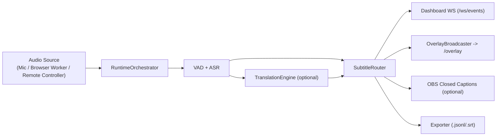
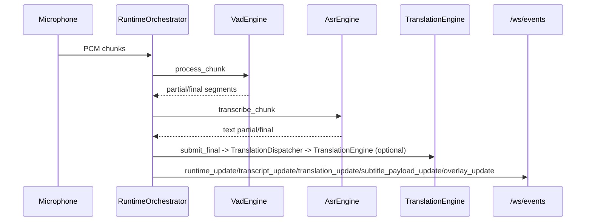
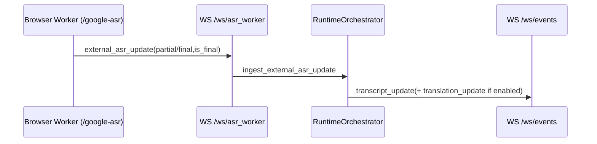
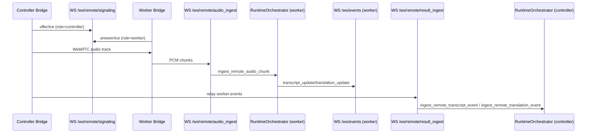

# SST Desktop 0.2.9.2 - Полная техническая документация

Актуально для кода в ветке/снимке, где `backend/versioning.py` содержит `PROJECT_VERSION = "0.2.9.2"`.

## 1. Назначение и границы системы

`stream-sub-translator` — локальное Windows-приложение для real-time субтитров:

- захват речи (локальный микрофон, browser speech worker или удаленный controller->worker канал);
- ASR (по умолчанию GPU-first, `official_eu_parakeet_realtime`);
- опциональный перевод на 0..N языков;
- единая маршрутизация субтитров в dashboard и OBS overlay;
- экспорт сессий (`.jsonl`, `.srt`) и runtime-логи.

Жесткие границы (из текущей реализации и AGENTS.md):

- local-first, single-machine backend/UI/overlay;
- без облачного backend, без auth/accounts/multi-user;
- HTTP bind по умолчанию `127.0.0.1`;
- frontend без Node.js/React/bundler (чистый HTML/CSS/JS);
- remote mode — явный LAN-сценарий, опциональный.

## 2. Технологический стек

- Python 3.11+
- FastAPI + Uvicorn
- Pydantic (контракты API/WS)
- WebSocket (runtime events + remote signaling/ingest)
- `sounddevice`, `numpy`
- `webrtcvad`
- PyTorch/NVIDIA runtime (GPU-first), fallback-провайдеры ASR
- `httpx` (proxy-запросы controller->worker)

## 3. Архитектура (верхний уровень)

Главный runtime-узел: `backend/core/subtitle_router.py::RuntimeOrchestrator`.

## 4. Структура проекта (рабочие модули)

### 4.1 Backend

- `backend/app.py` — инициализация FastAPI, app state, роуты, WS-эндпоинты.
- `backend/run.py` — CLI-стартер Uvicorn (`--open-browser`, `--allow-lan`, `--remote-role`).
- `backend/config.py` — `AppSettings`, `LocalConfigManager`, нормализация конфигурации.
- `backend/models.py` — Pydantic-модели REST/WS.
- `backend/runtime_paths.py` — вычисление runtime/data/log/cache путей.
- `backend/versioning.py` — версия проекта + scaffold release sync.

`backend/core/`:

- `audio_capture.py` — захват PCM16 mono 16kHz, ring buffer.
- `vad.py` — `VadEngine`, partial/final сегментация.
- `asr_engine.py`, `parakeet_provider.py` — выбор/инициализация ASR-провайдеров.
- `translation_engine.py` — multi-provider перевод + диагностика.
- `translation_dispatcher.py` — очередь translation jobs, per-target fan-out, timeout/error handling, structured runtime events.
- `subtitle_router.py` — orchestration, lifecycle субтитров, broadcast, export hooks.
- `obs_caption_output.py` — отправка caption в OBS websocket.
- `overlay_broadcaster.py` — отправка overlay payload в общий WS.
- `cache_manager.py` — translation cache (`source_lang::target_lang::text`).
- `profile_manager.py` — CRUD профилей.
- `session_logger.py` — канализированные логи dashboard/overlay/browser worker.
- `structured_runtime_logger.py` — JSONL runtime logging с redaction чувствительных полей.
- `remote_mode.py`, `remote_session.py`, `remote_signaling.py`, `remote_diagnostics.py` — remote foundation.

### 4.2 Frontend/Overlay/Desktop

- `frontend/index.html` + `frontend/js/*.js` — основной dashboard.
- `frontend/google_asr.html` — browser speech worker окно; содержит UI glue и wiring.
- `frontend/js/browser-asr-session-manager.js` — lifecycle browser recognition, websocket reconnect, watchdog, force-finalization, recovery logic.
- `frontend/remote_controller_bridge.html` + `remote-controller-bridge.js` — controller bridge.
- `frontend/remote_worker_bridge.html` + `remote-worker-bridge.js` — worker bridge.

Desktop Browser Speech launch invariant:
- desktop launcher must open `/google-asr` as a separate Chrome/Chromium/Edge window with a visible address bar;
- launcher must use an isolated browser profile directory for that worker window;
- there is no user-facing desktop toggle for browser window chrome here; address-bar mode is fixed;
- do not replace this with `--app`, popup-launcher pages, hidden bootstrap windows, or in-tab navigation.
- `frontend/js/remote-worker-audio-worklet.js` — AudioWorklet обработка входящего WebRTC-аудио.
- `overlay/overlay.html|css|js` — OBS browser source overlay (автореконнект, рендер payload).
- `desktop/launcher.py` — splash launcher и desktop orchestration.
- `desktop/runtime_bootstrap.py` — desktop bootstrap Python/venv/requirements.

Текущие уточнения по поведению:
- browser worker сохраняет и применяет `continuous_results` из настроек, без runtime-принуждения внутри страницы;
- legacy inline recognition/runtime helpers вынесены из `google_asr.html` в `browser-asr-session-manager.js`;
- overlay broadcast подавляет быстрые дубли идентичных payload, чтобы перевод не переотправлялся пачкой при TTL/republish гонках.

## 5. Режимы работы и роли

### 5.1 Локальные режимы ASR

- `asr.mode=local`:
  - mic capture -> VAD -> ASR -> (optional translation) -> subtitle routing.
- `asr.mode=browser_google`:
  - отдельное окно `/google-asr` использует Web Speech API;
  - в backend идут `external_asr_update` события через `WS /ws/asr_worker`.

### 5.2 Remote роли

Роли: `disabled|controller|worker` (`backend/core/remote_mode.py`).

- `controller`:
  - захватывает локальный микрофон;
  - отправляет WebRTC-аудио worker-узлу;
  - принимает от worker runtime events и применяет их локально (overlay/export/OBS).
- `worker`:
  - принимает удаленный аудио-поток;
  - выполняет VAD/ASR/translation;
  - отдает transcript/translation events.

Ограничение: worker в remote-режиме не поддерживает `browser_google` (принудительно AI runtime).

## 6. Потоки данных

### 6.1 Локальный AI pipeline

### 6.2 Browser Speech pipeline

### 6.3 Remote Controller/Worker pipeline

## 7. HTTP API (полный список)

Базовый префикс: `http://127.0.0.1:8765` (по умолчанию).

### 7.1 Service/UI

- `GET /` -> `frontend/index.html`
- `GET /google-asr` -> browser worker page
- `GET /remote/controller-bridge`
- `GET /remote/worker-bridge`
- `GET /overlay` -> overlay page
- `GET /project-fonts.css`
- `GET /favicon.ico` (204)
- `GET /.well-known/appspecific/com.chrome.devtools.json` (204)

### 7.2 Runtime/Settings/Devices/Profiles/Exports/Version/Logs

- `GET /api/health`
- `GET /api/version`
- `GET /api/settings/load`
- `POST /api/settings/save`
- `POST /api/runtime/start`
- `POST /api/runtime/stop`
- `GET /api/runtime/status`
- `GET /api/obs/url`
- `GET /api/devices/audio-inputs`
- `GET /api/profiles`
- `GET /api/profiles/{name}`
- `POST /api/profiles/{name}`
- `DELETE /api/profiles/{name}`
- `GET /api/exports`
- `POST /api/logs/client-event`

### 7.3 Remote API

- `GET /api/remote/state`
- `POST /api/remote/pair/create`
- `POST /api/remote/pair/verify`
- `POST /api/remote/heartbeat`
- `POST /api/remote/worker/settings/sync`
- `POST /api/remote/worker/runtime/start`
- `POST /api/remote/worker/runtime/stop`
- `GET /api/remote/worker/runtime/status`
- `GET /api/remote/worker/health`

## 8. WebSocket API (полный список)

- `WS /ws/events`
  - broadcast runtime/ASR/translation/subtitle/overlay событий.
- `WS /ws/asr_worker`
  - browser worker -> backend (`external_asr_update`).
- `WS /ws/remote/signaling?session_id&pair_code&role=controller|worker`
  - signaling relay offer/answer/ice + peer_state + heartbeat.
- `WS /ws/remote/audio_ingest?session_id&pair_code`
  - worker ingest удаленного PCM (binary или base64 JSON).
- `WS /ws/remote/result_ingest`
  - controller ingest worker events (transcript_update/translation_update).

## 9. Контракты runtime-событий (`/ws/events`)

Основные `type`:

- `runtime_update` -> `RuntimeState`
- `transcript_update` -> `TranscriptEvent`
- `transcript_segment_event` -> `TranscriptEvent` (lifecycle granular)
- `translation_update` -> `TranslationEvent`
- `subtitle_payload_update` -> `SubtitlePayloadEvent` (dashboard preview)
- `overlay_update` -> payload для overlay renderer

Ключевые состояния runtime:

- `idle`
- `starting`
- `listening`
- `transcribing`
- `translating`
- `error`

## 10. Конфигурация и нормализация

Основной файл: `user-data/config.json`.

`LocalConfigManager.default_config()` задает, в т.ч.:

- `profile`, `source_lang`
- `asr`:
  - `mode` (`local|browser_google`)
  - `provider_preference` (по умолчанию `official_eu_parakeet_realtime`)
  - `prefer_gpu`
  - `browser.*` (`recognition_language`, `interim_results`, `continuous_results`, `force_finalization_*`)
  - `realtime.*` (VAD/partial tuning)
- `translation`:
  - `enabled`, `provider`, `target_languages`, `provider_settings`
- `subtitle_output`:
  - `show_source`, `show_translations`, `max_translation_languages`, `display_order`
- `subtitle_style`
- `subtitle_lifecycle`
- `obs_closed_captions`
- `audio.input_device_id`
- `remote`
- `updates`

Нормализация (`_normalize`) гарантирует:

- валидные enum/типы/диапазоны;
- корректную структуру nested секций;
- принудительный запрет browser mode для remote worker role в UI/runtime логике;
- синхронизацию realtime/finalization параметров с `subtitle_lifecycle`.

## 11. Translation subsystem

`backend/core/translation_engine.py` поддерживает:

- stable/recommended:
  - `google_translate_v2` (primary)
  - `google_cloud_translation_v3`
  - `azure_translator`
  - `deepl`
  - `libretranslate`
- llm:
  - `openai`
  - `openrouter`
- local llm:
  - `lm_studio`
  - `ollama`
- experimental/emergency:
  - `google_gas_url`
  - `google_web`
  - `public_libretranslate_mirror`
  - `free_web_translate`

Уточнение по Google Cloud:
- `google_cloud_translation_v3` использует Cloud Translation - Advanced (v3) REST API;
- для него нужны `project_id` и OAuth `access_token`;
- UI/backend сохраняют именно `project_id` / `access_token` / `location` / `model`;
- API key из `google_translate_v2` для него не подходит.

`backend/core/translation_dispatcher.py`:

- принимает только finalized source segments;
- держит bounded queue и ограничение на concurrent jobs;
- запускает отдельные async target tasks на каждый target language;
- публикует `TranslationEvent(is_complete=True)` даже если target завершился timeout/error, чтобы subtitle lifecycle не зависал;
- пишет structured events:
  - `translation_job_started`
  - `translation_target_started`
  - `translation_target_done`
  - `translation_target_timeout`
  - `translation_target_error`
  - `translation_job_error`
  - `translation_publish_accepted`
  - `translation_stale_dropped`
- active jobs отслеживаются по внутреннему `job_id`, а не только по `sequence`, чтобы повторный submit того же sequence не затирал task bookkeeping.

Translation cache:

- файл: `user-data/cache/translation_cache.json`
- ключ: `source_lang::target_lang::source_text`.

## 12. Remote mode: текущая реализация и практические детали

### 12.1 Pairing/session

- manager: `backend/core/remote_session.py`
- default TTL: `12h` (`DEFAULT_TTL_SECONDS = 12 * 60 * 60`)
- heartbeat продлевает expiry активной сессии;
- online-флаги controller/worker считаются по last_seen (окно ~15 секунд).

### 12.2 Signaling

- manager: `backend/core/remote_signaling.py`
- per-session роль `controller|worker`;
- stale connection для роли закрывается при re-connect;
- relay message `type=signal` с `payload`;
- `peer_state` broadcast на обе стороны.

### 12.3 Controller bridge (frontend)

`frontend/js/remote-controller-bridge.js`:

- выбирает микрофон, строит `RTCPeerConnection`;
- отправляет offer/ICE в signaling;
- держит reconnect + heartbeat;
- пересылает worker `/ws/events` -> local `/ws/remote/result_ingest`;
- мониторит mic RMS и outbound RTP stats.

Флаги в коде:

- `WEBRTC_USE_RAW_MIC_TRACK = true`
- `DIRECT_PCM_FALLBACK_ENABLED = false` (fallback отключен по умолчанию).

### 12.4 Worker bridge (frontend)

`frontend/js/remote-worker-bridge.js`:

- получает WebRTC audio track;
- форвардит PCM в `/ws/remote/audio_ingest`;
- основной pipeline: `AudioWorkletNode` (`remote-worker-audio-worklet.js`);
- fallback: `ScriptProcessorNode`;
- логирует inbound RTP stats (энергия/concealed/jitter counters).

### 12.5 Runtime behavior в роли worker

- source: очередь remote PCM (`ingest_remote_audio_chunk`);
- device id в state: `remote_webrtc_controller`;
- status message обновляется по connect/disconnect audio ingest.

## 13. Логи, диагностика, телеметрия

Логи:

- `logs/dashboard-live-events.log`
- `logs/overlay-events.log`
- `logs/browser-recognition.log`
- `logs/translation-dispatcher.log`
- `logs/runtime-metrics.log`
- `logs/desktop-launcher.log` (desktop build)

`SessionLogManager`:

- пишет channel-aware события;
- схлопывает повторяющиеся строки (`[repeat] previous line repeated ...`).

`StructuredRuntimeLogger`:

- пишет JSONL runtime-логи по каналам `translation_dispatcher`, `browser_recognition`, `runtime_metrics`;
- редактирует чувствительные поля не только по точному имени ключа, но и по substring-match (`token`, `secret`, `password`, `authorization`, `credential`, `pair_code`, `api_key`);
- это покрывает `access_token`, `refresh_token`, `client_secret`, `credentials` и похожие payload-поля.

Runtime metrics (`RuntimeMetrics`) включают:

- `vad_ms`
- `asr_partial_ms`
- `asr_final_ms`
- `translation_ms`
- `total_ms`
- `partial_updates_emitted`
- `finals_emitted`
- `suppressed_partial_updates`
- `vad_dropped_segments`
- remote audio counters (`remote_audio_chunks_in`, `remote_audio_bytes_in`, ...).

## 14. Хранилище данных

Корневой persistent каталог: `user-data/`.

Ключевые папки:

- `user-data/config.json` — активная конфигурация
- `user-data/profiles/*.json` — профили
- `user-data/cache/translation_cache.json` — кеш перевода
- `user-data/exports/` — `*.jsonl`, `*.srt`
- `user-data/models/` — ASR-модели
- `logs/` — runtime/overlay/browser/desktop logs

## 15. Старт и bootstrap

### 15.1 `start.bat`

Реализует one-click startup:

1. подготовка локального cache/temp env;
2. проверка/автоустановка локального Python (`.python/python.exe`);
3. создание/восстановление `.venv`;
4. выбор install profile (`nvidia|cpu`) для local AI;
5. установка зависимостей:
   - `requirements.controller.txt` для lightweight controller bootstrap;
   - или torch-profile + `requirements.txt` для full local runtime;
6. preflight/model checks;
7. запуск `python -m backend.run --open-browser`.

### 15.2 Remote wrappers

- `start-remote-controller.bat`:
  - `SST_REMOTE_ROLE=controller`
  - `SST_ALLOW_LAN=0`
  - `SST_CONTROLLER_LIGHT=1`
- `start-remote-worker.bat`:
  - `SST_REMOTE_ROLE=worker`
  - `SST_ALLOW_LAN=1`

### 15.3 `update.bat`

- `git pull` (если `.git` есть),
- проверка Python/.venv,
- resolve install profile,
- обновление pip/torch profile/requirements,
- optional `--clear-cache`.

## 16. Desktop launcher (exe сборка)

Primary desktop release flow now uses a bootstrap one-file launcher.

`desktop/bootstrap_launcher.py`:

- основной публичный `Stream Subtitle Translator.exe`;
- содержит embedded managed payload;
- при первом запуске распаковывает рядом:
  - `.sst-runtime.exe`
  - `app-runtime/`
  - затем запускает legacy desktop runtime с диска;
- умеет:
  - install
  - verify
  - repair
  - reset managed runtime
- не запускает Python runtime прямо из onefile resources.

`desktop/bootstrap_payload.py`:

- строит SHA256 manifest embedded payload;
- проверяет managed runtime файлы;
- делает staged reinstall/repair `app-runtime/` и hidden runtime exe;
- не трогает `user-data/` и `logs/`.

`desktop/launcher.py`:

- legacy managed desktop runtime launcher, который запускается уже после bootstrap extraction;
- splash-экран выбора запуска:
  - Local Mode: Browser/NVIDIA/CPU
  - secondary Remote modes: Controller / Worker
- сохраняет startup-предпочтения в config/install-profile;
- запускает backend subprocess с нужными env:
  - `SST_REMOTE_ROLE`
  - `SST_ALLOW_LAN`.

`desktop/runtime_bootstrap.py`:

- bootstrap local python/venv в desktop-runtime;
- разделение base runtime и AI runtime;
- auto-detect профиля (`nvidia-smi` -> `nvidia` иначе `cpu`).

## 17. Сборка и релизы

### 17.1 Desktop build

- `build-desktop.bat`
  - собирает legacy managed desktop runtime;
  - output нужен как внутренний managed payload для bootstrap release;
  - ставит `requirements.desktop.txt`;
  - запускает PyInstaller (`Stream Subtitle Translator.spec`);
  - опционально сидирует `.python/.venv/user-data`.

- `build-bootstrap-launcher.bat`
  - сначала строит clean managed desktop runtime;
  - затем собирает embedded payload archive + manifest;
  - затем собирает основной one-file bootstrap launcher (`Stream Subtitle Translator Bootstrap.spec`).

### 17.2 Release publishing

- `publish-desktop-releases.ps1`
  - обновляет две папки релиза:
    - installed release
    - clean release
  - primary release source теперь `dist/bootstrap-launcher/`;
  - публикует один публичный `Stream Subtitle Translator.exe`;
  - clean release намеренно начинается без `app-runtime/`, чтобы runtime раскладывался bootstrap launcher-ом при первом запуске.

### 17.3 Remote lite package

- `build-remote-lite.ps1`
  - собирает облегченный пакет без `.venv/.python/cache/logs/models/git`.

## 18. Ограничения и known behavior

- Remote mode требует явной актуальной pairing session;
- при разрывах WebRTC/signaling bridge использует reconnect/backoff;
- browser speech зависит от ограничений браузера (permission/visibility/background throttling);
- release sync в `updates` сейчас scaffold-only:
  - поля и API готовы;
  - live polling GitHub releases не активирован в текущем билде.

## 19. Мини-чеклист smoke-теста

1. `GET /api/health` отвечает `status=ok`.
2. `POST /api/runtime/start` + `GET /api/runtime/status` меняет state на `listening`.
3. `WS /ws/events` получает `runtime_update` и `transcript_update`.
4. Overlay (`/overlay`) получает `overlay_update`.
5. Export появляется в `user-data/exports` после stop.
6. В remote-сценарии:
   - `api/remote/state` показывает active session;
   - controller/worker bridge соединяются;
   - worker получает non-zero inbound audio + PCM tx;
   - controller получает transcript/translation events.
