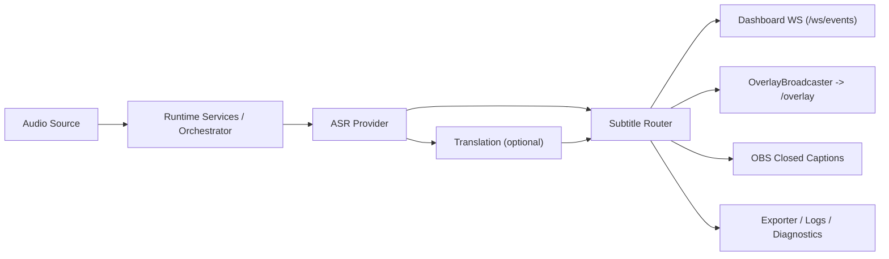

# SST Desktop 0.3.0 - Technical Architecture

Актуально для линии кода, где `backend/versioning.py` содержит `PROJECT_VERSION = "0.3.0"`, включая текущие post-release follow-up изменения в `main`.

## 1. Назначение и границы системы

`stream-sub-translator` — local-first Windows desktop application для real-time субтитров:

- захват речи:
  - локальный микрофон
  - browser speech worker
  - optional remote controller -> worker audio path
- ASR:
  - локальный AI runtime
  - browser speech worker ingestion
- optional translation на 0..N target languages;
- единая маршрутизация subtitle payload в dashboard и OBS overlay;
- экспорт сессий и локальные runtime/client diagnostics.

Жёсткие границы:

- default runtime local-first и localhost-only;
- без cloud backend, accounts, hosted database или SaaS assumptions;
- frontend без Node.js/React/bundler;
- browser pages, dashboard и overlay обслуживаются FastAPI;
- remote mode — отдельный explicit LAN scenario, а не интернет-facing deployment model.

## 2. Технологический стек

- Python 3.11+
- FastAPI + Uvicorn
- Pydantic schemas
- WebSocket for runtime events and worker/controller bridges
- `sounddevice`, `numpy`
- AI/runtime provider stack for local ASR
- plain HTML/CSS/JavaScript frontend

## 3. Верхнеуровневая архитектура

`RuntimeOrchestrator` now physically lives in `backend/core/runtime_orchestrator.py`, while `subtitle_router.py` stays focused on subtitle lifecycle/presentation routing. A small compatibility shim is still kept for legacy imports from `backend.core.subtitle_router`.

## 4. Backend Structure

### 4.1 Top-level modules

- `backend/app.py`
- `backend/run.py`
- `backend/run_controller.py`
- `backend/run_worker.py`
- `backend/config/`
- `backend/asr/`
- `backend/translation/`
- `backend/models.py`
- `backend/versioning.py`

### 4.2 API routes

Внешний HTTP surface по-прежнему организован через routes:

- `backend/api/routes_runtime.py`
- `backend/api/routes_settings.py`
- `backend/api/routes_devices.py`
- `backend/api/routes_profiles.py`
- `backend/api/routes_exports.py`
- `backend/api/routes_logs.py`
- `backend/api/routes_version.py`
- `backend/api/routes_remote.py`

Эти handlers в `0.3.0` должны быть thin transport layer и делегировать orchestration в services.

### 4.3 Services

Новый service layer:

- `backend/services/runtime_service.py`
- `backend/services/settings_service.py`
- `backend/services/config_state_service.py`
- `backend/services/asr_service.py`
- `backend/services/browser_asr_service.py`
- `backend/services/translation_service.py`
- `backend/services/diagnostics_service.py`
- `backend/services/export_service.py`
- `backend/services/overlay_service.py`
- `backend/services/model_manager_service.py`

Назначение:

- держать route-facing orchestration;
- централизовать active in-memory config state metadata;
- уменьшить объём логики внутри route handlers;
- сделать `app.state` dependencies более явными и тестируемыми.

### 4.4 Core

`backend/core/` содержит shared runtime infrastructure, subtitle lifecycle logic и совместимые entrypoints поверх новых подмодулей:

- bootstrap:
  - `app_bootstrap.py`
- runtime entrypoint and extracted controllers:
  - `runtime_orchestrator.py`
  - `runtime/asr_runtime_controller.py`
  - `runtime/audio_runtime_controller.py`
  - `runtime/output_fanout_coordinator.py`
  - `runtime/runtime_metrics_collector.py`
  - `runtime/runtime_status_builder.py`
  - `runtime/translation_runtime_coordinator.py`
- paths / logging / errors:
  - `paths.py`
  - `logging_setup.py`
  - `api_errors.py`
  - `redaction.py`
- config:
  - `config_migrations.py`
  - `config_schema_export.py`
- runtime / routing / diagnostics:
  - `subtitle_router.py`
  - `overlay_broadcaster.py`
  - `session_logger.py`
  - `structured_runtime_logger.py`
- browser ASR:
  - `browser_asr_gateway.py`
- providers:
  - `parakeet_provider.py`
- remote:
  - `remote_mode.py`
  - `remote_session.py`
  - `remote_signaling.py`
  - `remote_diagnostics.py`

Практически это означает:

- `RuntimeOrchestrator` physically lives in `backend/core/runtime_orchestrator.py`;
- `backend/core/subtitle_router.py` keeps the subtitle lifecycle state machine and a compatibility-only `RuntimeOrchestrator` import shim;
- orchestration responsibilities постепенно выносятся из одного большого runtime hub в domain-specific helpers под `backend/core/runtime/`.

### 4.5 Config package

`backend/config/` теперь содержит config loading/normalization surface:

- `__init__.py`
- `defaults.py`
- `secrets.py`
- `normalizers/asr.py`
- `normalizers/browser.py`
- `normalizers/obs.py`
- `normalizers/remote.py`
- `normalizers/subtitles.py`
- `normalizers/translation.py`

Назначение:

- убрать риск дальнейшего роста одного монолитного `backend/config.py`;
- держать defaults, secret normalization и domain normalization раздельно;
- дать `LocalConfigManager` и тестам стабильные import entrypoints.

### 4.6 ASR and Translation packages

Новые domain packages:

- `backend/asr/parakeet/`
  - `model_installer.py`
  - `runtime_loader.py`
  - `device_diagnostics.py`
  - `providers/base.py`
  - `providers/official.py`
  - `providers/realtime.py`
  - `mock_provider.py`
- `backend/translation/`
  - `engine.py`
  - `registry.py`
  - `readiness.py`
  - `providers/google_v2.py`
  - `providers/google_v3.py`
  - `providers/azure.py`
  - `providers/deepl.py`
  - `providers/libretranslate.py`
  - `providers/public_mirrors.py`
  - `providers/google_gas.py`
  - `providers/openai_compatible.py`
  - `providers/experimental_google_web.py`

Current translation package state:

- all concrete translation providers now live under `backend/translation/providers/`;
- `backend/translation/registry.py` builds the default provider registry directly from those provider modules;
- `backend/core/translation_engine.py` remains the compatibility entrypoint and request-preparation layer, but no longer owns concrete provider implementations;
- translation runtime preparation is now slot-aware: each visible translation slot carries its own `slot_id`, `target_lang`, and provider selection.

### 4.7 Schemas

`backend/schemas/` теперь содержит typed payload definitions вместо разрастания ad hoc dict contracts:

- config schemas
- runtime schemas
- ASR schemas
- diagnostics schemas
- overlay/translation-related schemas

## 5. App Bootstrap

`backend/core/app_bootstrap.py` централизованно поднимает:

- project-local paths
- config manager
- active config state service
- profile manager
- session/runtime loggers
- WebSocket manager
- remote managers
- orchestrator/runtime dependencies
- app services

Практический эффект:

- `backend/app.py` перестаёт быть местом ручной сборки всего runtime graph;
- тесты могут стабильно ожидать `app.state.*` dependencies;
- следующий этап декомпозиции не требует повторного переписывания entrypoint.

### 5.1 Desktop launcher profiles

Пакетный desktop launcher сейчас явно показывает пять профилей:

- `Quick Start (Browser Speech)`
- `NVIDIA GPU (CUDA)`
- `CPU-only`
- `Remote Controller`
- `Remote Worker`

Ожидаемое поведение:

- Browser Speech quick start intentionally skips local AI bootstrap;
- Remote Controller remains lightweight and does not force local AI model installation;
- Remote Worker enables LAN bind and keeps the worker on the local AI path only;
- default behavior remains local-first because remote roles are explicit profile choices, not implicit startup drift.

## 6. Config and Migrations

Главный config path:

- persistent config lives under `user-data/config.json`

В `0.3.0`:

- config code now lives under `backend/config/` instead of one `backend/config.py`;
- config проходит через явные migration steps;
- profiles используют тот же migration/normalization pipeline;
- generated JSON Schema lives at `backend/data/config.schema.json`.

Ключевые migration steps:

- provider rename to `official_eu_parakeet_low_latency`
- cleanup path for removed backend ASR settings so old configs fall back to supported Parakeet defaults
- translation config v6 adds `translation.lines` while preserving legacy `translation.provider` and `translation.target_languages`
- legacy `subtitle_output.display_order` language entries are migrated to stable translation slot ids such as `translation_1`

Это важно для:

- save/load stability
- desktop/runtime compatibility
- reproducible tests
- future UI evolution without legacy config drift.

Дополнительный current-branch contract:

- `LocalConfigManager.normalize_profile_payload()` используется не только для save/load, но и для runtime-start normalization of unsaved dashboard snapshots.
- active config state is tracked explicitly via `source`, `persisted`, and `hash` metadata.

## 7. HTTP Surface

Primary local endpoints:

- `/api/health`
- `/api/runtime/start`
- `/api/runtime/stop`
- `/api/runtime/status`
- `/api/settings/load`
- `/api/settings/save`
- `/api/devices/audio-inputs`
- `/api/obs/url`
- `/api/version`
- `/api/profiles`
- `/api/profiles/{name}`
- `/api/exports`
- `/api/exports/diagnostics`
- `/api/logs/client-event`

`POST /api/runtime/start` current contract:

- accepts `device_id`;
- accepts optional `config_payload`;
- normalizes that payload through the config manager when available;
- applies it to the active in-memory config state for the current runtime start only;
- may preload remote session fields from `remote.session_id` and `remote.pair_code`;
- marks active config state as `runtime_start_snapshot` with `persisted = false`;
- does not persist `user-data/config.json` unless the user later saves settings explicitly.

Remote endpoints:

- `/api/remote/state`
- `/api/remote/pair/create`
- `/api/remote/pair/verify`
- `/api/remote/heartbeat`
- `/api/remote/worker/settings/sync`
- `/api/remote/worker/runtime/start`
- `/api/remote/worker/runtime/stop`
- `/api/remote/worker/runtime/status`
- `/api/remote/worker/health`

## 8. WebSocket Surface

- `/ws/events`
- `/ws/asr_worker`
- `/ws/remote/signaling`
- `/ws/remote/audio_ingest`
- `/ws/remote/result_ingest`

## 9. WebSocket Manager and Event Resilience

`backend/ws_manager.py` в `0.3.0` отвечает за более безопасный broadcast lifecycle:

- snapshot connections before broadcast;
- remove dead sockets after failures;
- tolerate disconnect/close/send errors;
- avoid mutating connection sets while iterating;
- reduce risk that one broken websocket kills the whole broadcast path.

Runtime/event expectations:

- reconnect should not replay unbounded stale browser worker history;
- duplicate runtime status snapshots should be coalesced;
- stale worker generations should be ignored;
- dead sockets should be cleaned after failures rather than spam exceptions indefinitely.

## 10. Frontend Structure

### 10.1 Dashboard

`frontend/index.html` now boots:

- `frontend/js/main.js`

Supporting module groups:

- `frontend/js/core/`
  - store
  - API client
  - WS client
  - event helpers
- `frontend/js/dashboard/`
  - actions
  - helpers
  - logging
  - constants
- `frontend/js/panels/`
  - runtime
  - ASR
  - translation
  - overlay
  - diagnostics
  - OBS captions
  - style editor
  - profiles
  - remote
- `frontend/js/normalizers/`
  - config
  - runtime
  - diagnostics
  - translation
  - overlay
  - model status

### 10.2 Browser worker pages

- `frontend/google_asr.html`
- `frontend/google_asr_experimental.html`

### 10.3 Remote bridge pages

- `frontend/remote_controller_bridge.html`
- `frontend/remote_worker_bridge.html`

### 10.4 Overlay

- `overlay/overlay.html`
- related JS/CSS assets

## 11. Browser Speech Classic Path

Classic browser worker route:

- `/google-asr`

Core lifecycle module:

- `frontend/js/browser-asr-session-manager.js`

In `0.3.0` this manager owns the recognition FSM.

Supervisor states:

- `idle`
- `starting`
- `running`
- `stopping`
- `restarting`
- `backoff`
- `fatal`

Important behaviors:

- `start()` is ignored or deferred when lifecycle state makes duplicate `recognition.start()` unsafe;
- `stop()` is idempotent and generation-aware;
- `onend` never directly does a synchronous unsafe restart;
- `no-speech` and `network` follow separate restart policies;
- mic health and degraded states are tracked explicitly;
- duplicate partial/final and late forced-final events are suppressed.

Settings behavior:

- classic worker prioritizes its own `localStorage` values;
- backend settings are used as fallback and mirror target;
- backend is not a hard override for classic worker-local settings.

## 12. Browser Speech Experimental Path

Experimental browser worker route:

- `/google-asr-experimental`

Lifecycle module:

- `frontend/js/browser-asr-audio-track-session-manager.js`

Behavior:

- opens a live `MediaStreamTrack`;
- tries `SpeechRecognition.start(audioTrack)`;
- falls back to normal `recognition.start()` if the browser rejects the experimental path.

`0.3.0` aligns this subclass with the base FSM contract so it no longer relies on removed legacy methods from the old manager API.

## 13. Browser ASR Backend Integration

Worker websocket:

- `/ws/asr_worker`

Relevant backend pieces:

- `backend/services/browser_asr_service.py`
- `backend/core/browser_asr_gateway.py`
- `backend/services/asr_service.py`
- `backend/core/subtitle_router.py`

Responsibilities:

- track browser worker session/generation identity;
- ingest status/heartbeat/transcript updates;
- suppress stale worker generations;
- expose browser worker diagnostics into runtime status;
- feed transcript updates into the existing subtitle/translation pipeline.

## 14. Logging and Client Event Handling

Client event route:

- `POST /api/logs/client-event`

`0.3.0` requirement:

- log write failures must not crash backend routes.

`SessionLogger` and related logging path now behave as best effort:

- create directories proactively;
- tolerate `PermissionError`/`OSError`/`IOError`;
- drop and count events if file writes fail;
- avoid turning file lock problems into fatal runtime errors.

`StructuredRuntimeLogger` writes JSONL-style runtime diagnostics and applies redaction to sensitive fields.

## 15. Overlay and Translation Routing

`backend/core/subtitle_router.py` remains the main subtitle/event coordination point for subtitle lifecycle only.

Core responsibilities:

- ingest source ASR events;
- manage lifecycle for partial/final source segments;
- integrate translation results;
- publish dashboard and overlay payloads;
- coordinate diagnostics and export hooks.

`0.3.0` additionally focuses on:

- suppressing duplicate runtime noise;
- reducing stale translation/source mismatch risk;
- keeping overlay updates aligned with source segment lifecycle.

Current translation-slot invariants:

- translation identity is now `slot_id` first, not `target_lang`;
- duplicate target languages are valid as long as slots differ;
- overlay/display ordering uses stable slot ids such as `translation_1 .. translation_5`;
- provider settings remain global per provider under `translation.provider_settings`, while each slot selects which provider uses those settings.

## 16. ASR Provider Surface

Supported ASR paths:

- local Parakeet runtime through the backend audio pipeline;
- classic browser speech worker (`/google-asr`);
- experimental browser speech worker (`/google-asr-experimental`).

## 17. Remote Mode

Remote mode remains explicit opt-in.

Controller/worker artifacts are preserved:

- `backend/core/remote_mode.py`
- `backend/core/remote_session.py`
- `backend/core/remote_signaling.py`
- `frontend/js/remote.js`
- bridge pages and audio worklet files

Constraints:

- remote worker must not run browser speech mode;
- remote worker sync enforces a local AI path rather than drifting into browser worker providers.

## 18. Startup and Local Data

Expected local data roots:

- `user-data/`
- `user-data/logs/`
- models/cache/export/profile paths under that local runtime root

Default bind target:

- `127.0.0.1`

Expected local pages:

- dashboard
- overlay
- browser worker pages
- remote bridge pages

All continue to be served by the Python application.

## 19. Testing

`0.3.0` expands deterministic local test coverage for:

- backend architecture
- config migrations
- config schema export
- browser worker contract
- browser ASR service/gateway
- runtime event coalescing
- WebSocket manager cleanup
- session logger fault tolerance
- frontend modular architecture
- dashboard logging contract
- ASR provider selection and legacy-config migration cleanup
- remote flow
- versioning

Current verification command set used on the release work:

- `python -m compileall backend tests`
- `.\.venv\Scripts\python.exe -m unittest discover -s tests -p "test_*.py"`

Observed result:

- `141 tests`
- `OK`

## 20. Product Invariants Preserved in 0.3.0

- local-first desktop startup remains the default;
- Browser Speech still exists;
- `browser_google` remains selectable;
- Parakeet remains available;
- dashboard visual layout was not replaced with a wizard or a new UI stack;
- overlay remains a separate lightweight OBS page;
- no Node.js/bundler/frontend framework stack was introduced.
