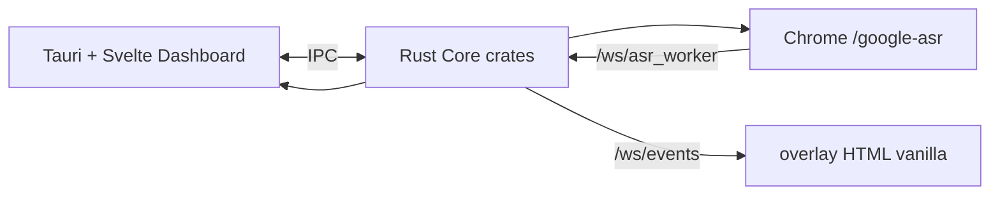
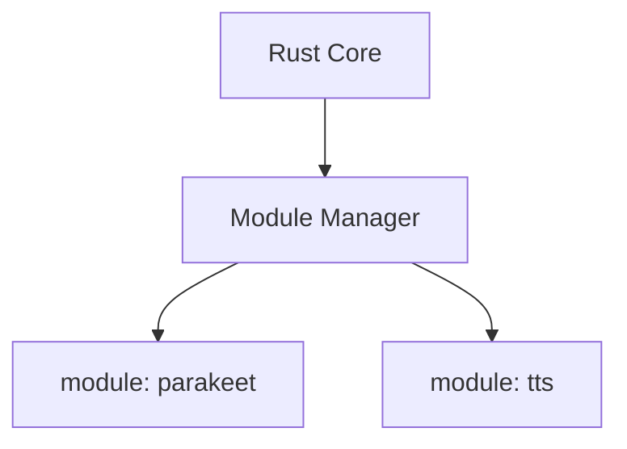

# VoiceSub 0.5.0 — план перехода на новую архитектуру

> **Текущая линия кода:** patch **`0.5.1`** — см. `docs/CHANGELOG.md` §0.5.1. Документ описывает переход **0.4.4 → 0.5.0**; patch-изменения после релиза — в CHANGELOG.

**Статус:** принятый internal roadmap (канон для `F:\AI\VoiceSub`)  
**Дата:** 2026-06-13 (обновлено)  
**Предшественник:** SST `0.4.4` — `F:\AI\stream-sub-translator`  
**Baseline:** `0.5.0` | **Текущий patch:** `0.5.1` | **Продукт:** VoiceSub  

Политика: `AGENTS.md` (локально). Техническая архитектура — `docs/TECHNICAL_ARCHITECTURE.md` (обновляется по фазам).

**Сводка выполнения (2026-06-13):** Фаза 0 закрыта (soak пройден). **NSIS installer pipeline работает** (`VoiceSub_0.5.1_x64-setup.exe`). Patch **0.5.1**: native/Sonic TTS dual-sink, Twitch multi-channel (до 5), hot-apply фильтров, сохранение цифр в чате. Golden parity, formal DoD Фазы 1 и публикация на GitHub — **отложены**. Паритет полей SST dashboard / preview=OBS / выбор default worker UI — **сняты** (свой стек и компоновка UI). Подробнее: §12.

---

## 1. Принятые решения

| Решение | Значение |
| --- | --- |
| Репозиторий | **`F:\AI\VoiceSub`** |
| Название / версия | **VoiceSub `0.5.0`** |
| ASR в core | Только **Web Speech classic** (`/google-asr`, `/google-asr-edge`) |
| Experimental browser | **Удалить из проекта целиком** (код → archive, не в runtime) |
| Remote mode | **Удалён из проекта** |
| Parakeet | **Убрать из core**; код → `legacy/modules/parakeet/` до Фазы 4 |
| Backend | **Rust** (Cargo workspace) |
| Shell | **Tauri** → **`VoiceSub.exe`**, иконка **как в SST** |
| Dashboard UI | **Svelte + Vite** (compile-time → static в бандле) |
| Overlay OBS | **Отдельная лёгкая HTML/JS страница** (vanilla, без Svelte) — максимально быстрая |
| Browser Speech worker | **Vanilla + Svelte** в repo для A/B; **default для shipping не фиксируется** (§12) |
| Запрет Node.js | **Только Node.js запрещён**; в **runtime** и **релизном NSIS installer** нет Node и никаких лишних runtime-установок |
| Dev/Release installs | Пользователь ставит **только NSIS `setup.exe`**; Chrome — system dependency для Web Speech; Python/torch/Node — **не в core** |
| Core Audio | Только в **модуле Parakeet** (Фаза 4) |
| TranslationDispatcher | **Полный перенос** — 13 providers, вся логика 1:1 |
| i18n | **Все 5 локалей** (en, ru, ja, ko, zh) — перенос/адаптация в Svelte сразу |
| OBS overlay URL | **Новый URL**; пользователи обновляют Browser Source в OBS вручную; обратная совместимость query-params **не гарантируется** |
| GitHub releases | **Отложено** (Q-G1) |
| Rust layout (Q-P1) | **Cargo workspace + `src-tauri/`** — см. §3.3 |
| Сроки | **Не фиксируются** |
| Инженерный приоритет | **Полный перенос SST без поломок** + **структура с day 1** + **тесты и детальные логи сразу** → `docs/TECHNICAL_ARCHITECTURE.md` |

---

## 2. Цель

**0.5.0:** Web Speech → опциональный перевод → лёгкий OBS overlay + Svelte dashboard → экспорт. Без Python/Parakeet/Experimental в tree.

**В core 0.5.0:** TTS-модуль уже в поставке (`bin/modules/tts/`, `/tts`). **После 0.5.0:** sidecar Parakeet.

Границы: local-first `127.0.0.1`, без cloud/SaaS, translation lifecycle non-negotiable (§7).

---

## 3. Архитектура

### 3.1 Core 0.5.0



### 3.2 Модули (Фаза 4+)



### 3.3 Rust workspace layout (Q-P1 — best practice)

**Каноническое дерево, граф зависимостей, тесты и логи:** `docs/TECHNICAL_ARCHITECTURE.md`.

Кратко — по [Tauri v2](https://v2.tauri.app/start/project-structure/), [Cargo Workspaces](https://doc.rust-lang.org/book/ch14-03-cargo-workspaces.html), layered monorepo (one-way deps, `voicesub-types` at bottom):

**Принципы:**

1. **Бизнес-логика в `crates/*` как `lib` crates** — быстрые unit-тесты без сборки всего Tauri (`cargo test -p voicesub-subtitle`).
2. **`src-tauri/` — тонкий shell**: `lib.rs` (команды IPC, `manage()` state, `run()`), `main.rs` только вызывает `voicesub_app_lib::run()`.
3. **Один virtual workspace** в корневом `Cargo.toml`; `src-tauri` — member workspace.
4. **`Cargo.lock`** коммитится (workspace root или `src-tauri/` per Tauri docs).
5. **Frontend (Svelte)** на корне рядом с `src-tauri/`; `tauri.conf.json` → `frontendDist` на `dist/` после `vite build`.
6. **Overlay** — vanilla static; **worker** — vanilla **и** опционально Svelte (отдельный Vite entry), оба как static после build; Rust HTTP server раздаёт оба для A/B тестов.

**Целевое дерево:**

```
F:\AI\VoiceSub\
├── Cargo.toml                 # [workspace] members
├── Cargo.lock
├── package.json               # vite + svelte (dev/build only; не в installer runtime)
├── vite.config.ts
├── src/                       # Svelte dashboard source
├── dist/                      # vite build output → Tauri bundle
├── overlay/                   # vanilla OBS page (lightweight)
│   ├── overlay.html
│   ├── overlay.js
│   └── (reuse subtitle-style.js from SST port)
├── src-worker/                # Svelte Web Speech worker source
│   └── ...                    # → dist-worker/ after build
├── dist-worker/               # built worker served at /google-asr
├── crates/                    # см. engineering contract §2.2 (10 crates + runtime)
├── tests/golden/              # SST fixtures, integration harness
├── xtask/                     # export-golden, migrate-config
├── src-tauri/
│   ├── Cargo.toml             # depends on workspace crates
│   ├── tauri.conf.json        # productName VoiceSub, icon from SST
│   ├── capabilities/
│   ├── icons/                 # existing SST icon set
│   └── src/
│       ├── lib.rs             # Tauri builder, invoke_handler, HTTP server mount
│       └── main.rs            # voicesub_app_lib::run()
├── legacy/                    # archived SST code removed from active tree
│   ├── experimental-browser/  # google-asr-experimental*
│   └── modules-source/        # parakeet python sources until modules/parakeet
└── modules/                   # runtime-installed optional modules (Phase 4)
```

**IPC:** Tauri `invoke` + `emit`/`listen` для dashboard; overlay подключается только через WebSocket (без Tauri).

---

## 4. Удаление из активного проекта (до Фазы 1)

Код **не выбрасывается** — переносится в `legacy/` для будущих модулей.

| Удалить из core/routes/UI | Архив | Будущее |
| --- | --- | --- |
| `browser_google_experimental` | `legacy/experimental-browser/` | не планируется в core |
| `asr.mode=local`, Parakeet in-process | `legacy/modules-source/parakeet/` | модуль `parakeet` |
| PyInstaller / pywebview launcher | reference only, затем delete | — |

**Маршруты worker:**

| URL | Стек | Назначение |
| --- | --- | --- |
| `/google-asr` | Svelte (`src-worker/` → `dist-worker/`) | основной worker launch |
| `/google-asr-edge` | тот же bundle | alias для Edge smoke (тот же WS `/ws/asr_worker`) |

---

## 5. Фазы

### Фаза 0 — PoC

Tauri workspace skeleton + Chrome launch parity + `/ws/asr_worker` ingest + translation smoke + IPC → Svelte stub + overlay WS.

**Browser worker:** Svelte entry на `/google-asr`; recognition FSM в модуле/store без пересоздания `SpeechRecognition` на re-render. Чек-лист: partial/final → core, reconnect, session rotation, soak с OBS поверх окна.

**Артефакт:** `docs/plans/voicesub_poc_report.md`.

### Фаза 1 — Rust core

| Компонент | SST reference |
| --- | --- |
| Chrome supervisor | `browser_worker_launcher.py`, `BrowserAsrService`, `BrowserSpeechSource`, `BrowserAsrGateway`, `BrowserAsrOperationalFsm` |
| WebSocket | `/ws/events`, `/ws/asr_worker` |
| Static HTTP | `/overlay`, `/google-asr`, `/project-fonts.css` |
| Config | TOML + SST `config.json` v7 import |
| Subtitle pipeline | full port `SubtitleRouter` stack |
| Translation | §6 — full port |
| HTTP API | runtime, settings, obs/url, version, exports |
| Logging | structured + rotation + session JSONL |

**Не в Фазе 1:** Core Audio, Parakeet, Python, Experimental, TTS.

### Фаза 2 — Svelte dashboard + Tauri shell

- Glass/dark UI, Lucide, Mica/Acrylic.
- **Собственная компоновка VoiceSub** (не 1:1 копия вкладок SST).
- Панели по продуктовым нуждам (translation, subtitles, style, OBS, tools, settings, …).
- **i18n: все 5 локалей** — порт ключевых каталогов из SST, адаптация под Svelte.
- State: Rust = source of truth.

**Снято с DoD (2026-06-08):** полный паритет полей SST dashboard; требование «dashboard preview = тот же payload, что OBS» как gate.

**Overlay:** остаётся в `overlay/` vanilla; контракт payload для renderer — по engineering contract §7.

### Фаза 3 — Релиз 0.5.0

**Статус: отложено** (2026-06-08). Критерии без изменений:

- Golden tests subtitle + translation на Rust.
- Tauri NSIS: **`VoiceSub_{version}_x64-setup.exe`** + **`VoiceSub.exe`**, иконка SST.
- Без Python/torch/Node в install dir.
- README + migration SST→VoiceSub.
- OBS: документировать **новый** overlay URL (localhost).

### Фаза 4 — Модули

`module.toml` + sidecar. **TTS** — уже в core 0.5.0. **Parakeet** (Python + Core Audio) — после стабилизации 0.5.0, из `legacy/`.

---

## 6. TranslationDispatcher — полный перенос

**13 providers:** `google_translate_v2`, `google_cloud_translation_v3`, `google_gas_url`, `google_web`, `azure_translator`, `deepl`, `libretranslate`, `openai`, `openrouter`, `lm_studio`, `ollama`, `public_libretranslate_mirror`, `free_web_translate`.

**1:1 алгоритмы:** slots, stale drop, preview supersession, `provider_limits`, cache, semaphores, queue/timeout, validation.

**Верификация:** каждый тест `tests/test_translation_dispatcher.py` → Rust; zero skipped.

**Crate:** `crates/voicesub-translation/`.

---

## 7. Инварианты

- Translation lifecycle (`AGENTS.md` Translation Rules)
- Overlay payload contract для vanilla renderer
- Browser worker: isolated profile, address bar, Chrome flags + EcoQoS (Приложение A)
- `127.0.0.1` default bind
- Diagnostics redaction

---

## 8. Overlay (Q4)

- **Отдельная** статическая страница для OBS Browser Source.
- **Vanilla JS** — порт `subtitle-style.js` + `overlay.js` (fast/slow path; `disposeRenderContainer` при пустом payload).
- **Без Svelte**, без Tauri webview в OBS.
- Минимальный DOM, auto-reconnect WS, presets `single|dual-line|stacked|compact`.
- **Новый URL** в документации; старые SST query-params не обязаны работать (Q-C1).

---

## 8.1 Browser Speech worker — Svelte

**Overlay остаётся vanilla HTML.** Worker — Svelte bundle на каноническом URL `/google-asr`.

### Инварианты

- Отдельное окно Chrome с address bar; isolated profile; те же Chrome flags (Приложение A).
- WebSocket `/ws/asr_worker` — контракт сообщений как в SST 0.4.4.
- `SpeechRecognition` не пересоздаётся из-за reactive lifecycle (отдельный session manager + явный start/stop).
- Микрофон через `getUserMedia` в worker (не Core Audio в core).

### Реализация

| Путь в repo | URL | Сборка |
| --- | --- | --- |
| `src-worker/` → `dist-worker/` | `/google-asr` (alias `/google-asr-edge`) | `npm run build` (включает worker) |

PoC soak (automated + manual 30 min) — **done** (§10).

---

## 9. Миграция SST

- `config.json` v7 → `config.toml`
- `asr.mode=local` → fallback `browser_google` + hint «Parakeet module»
- `asr.mode=browser_google_experimental` → `browser_google`
- SST `remote` секция → удаление при import
- models → `modules/parakeet/models/` (когда модуль появится)

---

## 10. DoD по фазам

| Фаза | Критерии | Статус (2026-06-08) |
| --- | --- | --- |
| **0** | soak 30 min на vanilla и Svelte worker; PoC report | **done** |
| **1** | runtime; WS; golden subtitle+translation; TOML; overlay + worker static paths | core largely done; **golden expansion + formal sign-off deferred** |
| **2** | Svelte dashboard; **5 локалей** | in progress; **SST field parity / preview=OBS gate removed** |
| **3** | NSIS `setup.exe`; no Python/Node; version 0.5.0 | **installer pipeline done**; public GitHub release **deferred** |
| **4** | modules install; Parakeet parity; TTS | not started |

---

## 11. Решения по вопросам (все закрыты)

| # | Решение |
| --- | --- |
| Q1 | Запрет **только Node.js**; runtime и NSIS installer self-contained; Vite/Svelte/Rust/Tauri — целевой стек |
| Q2 | VoiceSub 0.5.0 |
| Q3 / Q-R1 | LAN Remote mode **удалён** из VoiceSub (не планируется) |
| Q4 / Q-O1 | Overlay **vanilla HTML**, лёгкий, для OBS |
| Q5 | TOML + SST import |
| Q6 | 13 providers, full dispatcher port |
| Q7 | Только VoiceSub repo |
| Q8 | Parakeet Python sidecar, код в legacy/modules-source |
| Q9 / Q-B1 | Experimental browser **удалить** → `legacy/experimental-browser/` |
| Q10 | `F:\AI\VoiceSub` |
| Q-I1 | **Все 5 локалей** в Svelte сразу |
| Q-G1 | GitHub repo — **отложено** |
| Q-M1 | **`VoiceSub.exe`**, иконка из SST |
| Q-C1 | **Новый overlay URL**; пользователи меняют в OBS сами |
| Q-P1 | Cargo workspace + `crates/*` + thin `src-tauri/` (§3.3) |

**Открытых вопросов нет.**

---

## 12. Статус выполнения (2026-06-13)

Решения оператора по закрытию/пересмотру пунктов плана:

| # | Решение |
| --- | --- |
| S1 | **Manual soak 30+ min** (vanilla + Svelte, OBS overlap) — **выполнено**, Фаза 0 закрыта |
| S2 | **Golden tests → полный паритет SST `tests/`** — отложено |
| S3 | **Formal DoD sign-off Фазы 1** — отложено |
| S4 | **Полный паритет полей SST dashboard; preview payload = OBS; выбор default worker UI** — **снято** (новый стек и компоновка UI, не копия SST dashboard) |
| S5 | **Релиз 0.5.0 / NSIS installer** — pipeline готов (`build-release.ps1`); публикация на GitHub — отложено |
| S6 | **Patch 0.5.1** — native/Sonic TTS dual-sink, Twitch multi-channel + hot-apply, digit-safe chat filters, `VOICESUB_SKIP_BROWSER_WORKER` в integration tests; см. `docs/CHANGELOG.md` §0.5.1 |

PoC report: `docs/plans/voicesub_poc_report.md`.

---

## Приложение A — Chrome flags

```
--new-window
--no-first-run
--no-default-browser-check
--disable-default-apps
--user-data-dir=<isolated>
--disable-session-crashed-bubble
--disable-backgrounding-occluded-windows
--disable-renderer-backgrounding
--disable-background-timer-throttling
--disable-features=CalculateNativeWinOcclusion,HighEfficiencyModeAvailable,HeuristicMemorySaver,IntensiveWakeUpThrottling,GlobalMediaControls
--noerrdialogs
--window-size=980,860
```

+ `HIGH_PRIORITY_CLASS` + EcoQoS opt-out (Windows).

Источник: SST `desktop/browser_worker_launcher.py`.

---

*Канон VoiceSub. Зеркало: `F:\AI\stream-sub-translator\docs\plans\voicesub_roadmap.ru.md`.*
